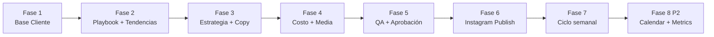

# PLAN — neuralitica-marketing

> Plan de implementación derivado de `SPEC.md`, `CONTEXT.md` y `docs/adr/`.
> Vocabulario canónico: solo términos de `CONTEXT.md`.

## Criterios de hecho del conjunto (SPEC §1)

- **SC-1:** Cliente activo recibe 3 Reels/semana listos para Aprobación, sin grabarse.
- **SC-2:** Ninguna pieza publicada sin Aprobación explícita del Cliente.
- **SC-3:** Primer lote revisable en ≤ 7 días tras completar Entrevista inicial.
- **SC-4:** Ciclo semanal ≤ 30 min de revisión del Cliente.

## Restricciones arquitectónicas (ADRs + SPEC §5–6)

| ADR / NFR | Implicación en el plan |
|-----------|------------------------|
| ADR-0001 | Ciclo semanal vía Vercel Cron; auto-avance hasta cola de Aprobación |
| ADR-0002 | Publicación Reels solo tras Aprobación; Graph API server-side |
| ADR-0003 | FFmpeg y polls largos en worker Fly.io (`iad`); Vercel solo encola |
| `neuramark_*` | Todas las tablas, enums, policies con prefijo |
| Auth | Supabase solo en servidor; `getCurrentUser()`; cookies httpOnly |
| i18n | EN + ES en UI Cliente desde V1 |
| Región | Supabase `us-east-1`; worker `iad`; assets misma región |

## Orden de fases (P1 → P2)

---

### Fase 1 — Base del Cliente (onboarding)

**Objetivo:** Cliente puede registrarse, completar Entrevista inicial, tener Ficha viva y Preferencias de producción visual.

**Módulos:** Authentication · Interview Builder · Business Profile · Avatar / Visual Mode Selector

**Flujo cubierto:** S4 #1 (parcial: sin IG aún)

**Dependencias:** ninguna (fundación app + Supabase)

**Entregable de fase:** Onboarding end-to-end hasta preferencias visuales + assets subidos; producto bloqueado si `active=false`.

---

### Fase 2 — Inteligencia de contenido (manual V1)

**Objetivo:** Operator cura Playbook de formatos y Snapshot de tendencias; sistema listo para alimentar Estrategia semanal.

**Módulos:** Content Playbook · Trend Intelligence (manual)

**Dependencias:** Fase 1 (Ficha viva y rubro del Cliente)

**Entregable de fase:** Catálogo inicial de Formatos de Reel + al menos una Táctica de tendencia semilla (`cold-open-mejor-toma`); UI Operator para CRUD.

---

### Fase 3 — Estrategia y copy

**Objetivo:** System genera Estrategia semanal (3 slots con formato + modalidad + táctica opcional), Paquetes de guion y captions.

**Módulos:** Content Strategy Agent · Video Script Agent · Caption Agent

**Dependencias:** Fase 1, Fase 2

**Entregable de fase:** Disparo manual de ciclo de contenido textual; brief + guiones + captions visibles; modalidad por slot ⊆ allowlist.

---

### Fase 4 — Costo, providers y ensamblado

**Objetivo:** Generar video crudo y Reel ensamblado 9:16 con presupuesto controlado.

**Módulos:** Cost Policy Engine · Video Provider Adapter · Media Assembly Pipeline

**Infra:** Worker Fly.io (ADR-0003); cola de jobs en Supabase

**Dependencias:** Fase 3 (guiones); Fase 1 (preferencias, consent, assets)

**Entregable de fase:** Reel ensamblado previewable; SadTalker + Wan low-tier; FFmpeg en worker; budget-before-generate.

---

### Fase 5 — QA y Aprobación

**Objetivo:** Gate de calidad y decisión del Cliente antes de publicar.

**Módulos:** QA/Compliance Agent · Approval Flow

**Flujos cubiertos:** S4 #3 · error paths parciales (S4.Q1)

**Dependencias:** Fase 4

**Entregable de fase:** Cola de Aprobación; 1 ronda de cambios; rechazo con pregunta de nueva pieza; QA legal sin override.

---

### Fase 6 — Publicación en Instagram

**Objetivo:** Conectar IG Business y publicar Reels aprobados (ahora o programado).

**Módulos:** Instagram Publish (Reels API)

**Flujo cubierto:** S4 #4

**Dependencias:** Fase 5; ADR-0002

**Entregable de fase:** Publish + schedule; permalink; reintentos; nunca sin Aprobación.

---

### Fase 7 — Ciclo semanal automatizado

**Objetivo:** Orquestar Fases 2–6 por cron sin intervención Operator en el happy path.

**Módulos:** Ciclo semanal automatizado (scheduler)

**Flujos cubiertos:** S4 #2 · S4 #5 (excepciones)

**Dependencias:** Fases 2–6 completas; ADR-0001

**Entregable de fase:** Cron semanal por Cliente activo; auto-avance hasta Aprobación; idempotencia por semana; fallos a Operator.

**Hito MVP:** SC-1, SC-2, SC-3, SC-4 verificables con 1 Cliente interno.

---

### Fase 8 — P2 (post-MVP)

**Objetivo:** Operación y aprendizaje mejorados.

**Módulos:** Content Calendar · Metrics Lite · Trend Intelligence (agente scraping)

**Dependencias:** Fase 7

**Entregable de fase:** Calendario Operator; métricas manuales → feed Estrategia; scraping con mismo schema de Táctica de tendencia.

---

## Fuera de alcance V1 (no planificar)

Stories IG, multicanal, ads, CRM, DMs automáticos, edición avanzada propietaria, RBAC UI.

## Referencias

- Spec: `SPEC.md`
- Glosario: `CONTEXT.md`
- ADRs: `docs/adr/0001`–`0003`
- Detalle de historias: `plan/USER_STORIES.md` (implementación)
