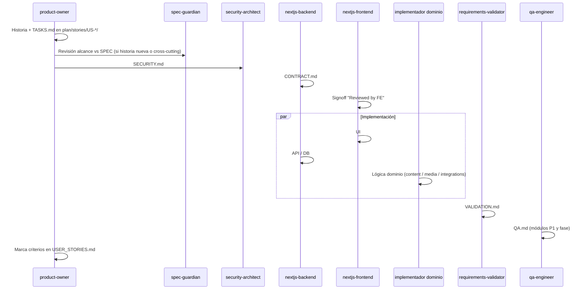

# Agent Roster — Desarrollo independiente con calidad

> Orquesta el trabajo paralelo sobre `SPEC.md`, `CONTEXT.md`, `PLAN.md`, `TASKS.md` y `plan/USER_STORIES.md`.

## Punto de entrada

**Habla solo con el [master-orchestrator](../../.cursor/agents/master-orchestrator.md).** Él delega a todos los demás, historia por historia.

En Cursor (modo Agent): escribe **`/desarrollar`** o pide *"orquesta la siguiente historia"*.

Estado persistente: [`SPRINT-STATE.md`](SPRINT-STATE.md) (incluye `feature_branch` por historia activa)

## Git (obligatorio)

- **Rama por historia:** `feature/{US-id}-{slug}` desde `main` al iniciar la historia; un solo working tree (sin worktrees).
- **Commit al terminar:** cada implementador (o el orquestador tras BUILD/fix) commitea el trabajo completado antes del siguiente gate.
- Push/PR solo si el usuario lo pide o al cerrar la historia para review.

## Principio

Cada agente tiene **alcance acotado** (archivos + fases), **entradas obligatorias** y **salidas verificables**. Ningún implementador marca una historia como hecha; eso lo hace `requirements-validator` tras `qa-engineer` en módulos críticos.

## Agentes

| Agente | Rol | Fases PLAN | Implementa código |
|--------|-----|------------|-------------------|
| **[master-orchestrator](../../.cursor/agents/master-orchestrator.md)** | **Orquesta todos; historia por historia; gates** | Todas | **No** |
| [product-owner](../../.cursor/agents/product-owner.md) | Backlog, historias, secuencia, estado | Todas | No |
| [spec-guardian](../../.cursor/agents/spec-guardian.md) | Cumplimiento SPEC / CONTEXT / ADR | Todas | No |
| [security-architect](../../.cursor/agents/security-architect.md) | Threat model + criterios seguridad por historia | Todas | No |
| [nextjs-backend](../../.cursor/agents/nextjs-backend.md) | Server Actions, Route Handlers, DB app | 1, 2, 5, 6 | Sí |
| [nextjs-frontend](../../.cursor/agents/nextjs-frontend.md) | UI App Router, PrimeReact, i18n | 1–7 | Sí |
| [content-agents-engineer](../../.cursor/agents/content-agents-engineer.md) | Playbook, tendencias, estrategia, guion, caption (LLM) | 2, 3, 5 (QA) | Sí |
| [media-pipeline-engineer](../../.cursor/agents/media-pipeline-engineer.md) | Providers video, cost policy, assembly, worker Fly | 4 | Sí |
| [integrations-engineer](../../.cursor/agents/integrations-engineer.md) | Instagram Publish, ciclo semanal, colas | 6, 7 | Sí |
| [requirements-validator](../../.cursor/agents/requirements-validator.md) | Historia vs criterios de aceptación | Por historia | No |
| [qa-engineer](../../.cursor/agents/qa-engineer.md) | Bugs, seguridad, robustez | Por historia / fase | No |
| [integration-checker](../../.cursor/agents/integration-checker.md) | Flujos E2E entre módulos (PLAN) | Cierre de fase | No |

## Flujo por historia (contract-first)

## Asignación por fase

| Fase | Implementadores principales | Gate de fase |
|------|----------------------------|--------------|
| **1** Base Cliente | nextjs-backend + nextjs-frontend | integration-checker Flujo S4.1 |
| **2** Playbook + Tendencias | nextjs-backend + nextjs-frontend + content-agents-engineer | integration-checker + spec-guardian |
| **3** Estrategia + copy | content-agents-engineer + nextjs-backend | integration-checker slot brief |
| **4** Media | media-pipeline-engineer + nextjs-backend | qa-engineer (ADR-0003) |
| **5** QA + Aprobación | content-agents-engineer + nextjs-backend + nextjs-frontend | integration-checker Flujo S4.3 |
| **6** Instagram | integrations-engineer + nextjs-backend + nextjs-frontend | spec-guardian ADR-0002 |
| **7** Ciclo semanal | integrations-engineer + content + media (wiring) | integration-checker SC-1..4 |

## Límites de propiedad (evitar conflictos en paralelo)

| Ruta | Dueño |
|------|-------|
| `app/`, `components/` | nextjs-frontend (UI); backend solo Route Handlers en `app/api/` |
| `lib/auth/`, `lib/supabase/` | nextjs-backend |
| `lib/contracts/*` (salvo subcarpetas de dominio) | nextjs-backend (autor del contrato) |
| `lib/agents/content/` | content-agents-engineer |
| `lib/providers/`, `worker/` | media-pipeline-engineer |
| `lib/instagram/`, `lib/orchestration/` | integrations-engineer |
| `supabase/migrations/` | nextjs-backend (DDL); otros agentes proponen en CONTRACT |
| `messages/en.json`, `messages/es.json` | nextjs-frontend |

## Fuentes de verdad (orden de precedencia)

1. `SPEC.md` + `CONTEXT.md` + `docs/adr/`
2. `PLAN.md` + `TASKS.md`
3. `plan/USER_STORIES.md` + `plan/SECURITY_BASELINE.md`
4. `plan/stories/US-*/CONTRACT.md` (por historia activa)

Si hay conflicto entre USER_STORIES y SPEC emitido, **SPEC gana** — escalar a product-owner + spec-guardian.

## Cómo invocar

**Recomendado:** `/desarrollar` → master-orchestrator hace el resto.

**Manual (solo si depuras un agente):** `@.cursor/agents/<nombre>.md` con alcance explícito.

Para una fase completa (el master lo hace al cerrar fase):

> integration-checker: verifica entregable Fase 2 según PLAN.md
