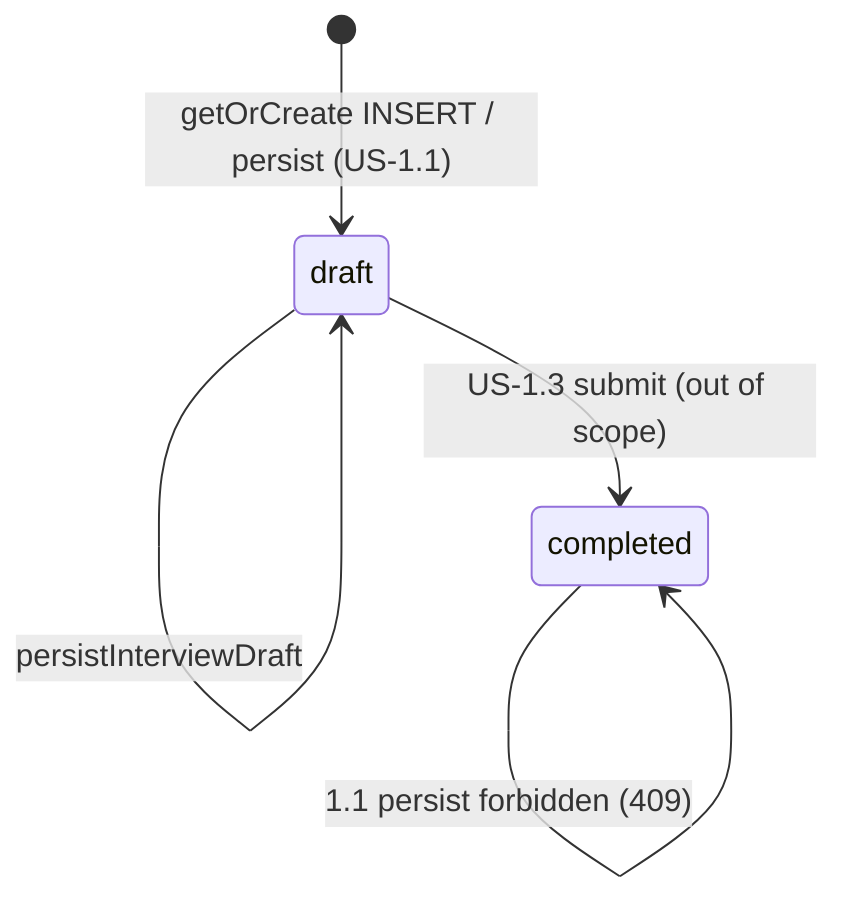

Reviewed by FE: yes — 2026-08-29

# API Contract — US-1.1 Start guided business interview

**Story:** US-1.1  
**Status:** Frozen (awaiting BUILD)  
**Security:** `plan/stories/US-1.1/SECURITY.md` (binding freeze — do not reopen)  
**Spec review:** `plan/stories/US-1.1/SPEC-REVIEW.md` (ALIGNED)  
**Identity seam:** `lib/auth/get-current-user.ts` / `requireActive()` (US-14.5 — unchanged)  
**Error envelope style:** `lib/contracts/auth.ts` (`ok: true` vs `{ ok: false, error: { code, fields? } }`)

**This document is CONTRACT ONLY.** Do not implement Server Actions, the RSC loader, migrations, or `lib/contracts/interview.ts` until FE signoff. Zod below is a documentation sketch for the future BUILD file.

**Terminology:** **Entrevista inicial** (ES) / **Initial interview** (EN). Role: **Cliente**. **Ficha viva** is out of scope (name only). Do not use CONTEXT _Evitar_ terms (cuestionario, onboarding interview, Business Profile, perfil de negocio, admin / administrador / staff) in this file, fixtures, or product copy.

---

## Overview

An authenticated, activated Cliente completes a seven-step Entrevista inicial. Answers persist as structured JSON on **one** `neuramark_interview_sessions` row per Cliente (`UNIQUE (client_id)`). This story writes `status = 'draft'` only. Refresh restores the draft. There is no submit, no `completed` write, and no Ficha viva.

**Surfaces (exactly two):**

1. **RSC load** — get-or-create the current Cliente’s draft (no session id in the URL).
2. **One persist Server Action** — validate + merge + write draft (CSRF via Next.js origin check).

No public Route Handler. No GET mutation. No interview HTTP API.

**Frontend consumers**

| Consumer | Route | Contract surface |
|----------|-------|------------------|
| Entrevista wizard | `app/(app)/interview/page.tsx` (`/interview`) | RSC calls `getOrCreateInterviewDraft`; client wizard calls `persistInterviewDraft` |
| Dashboard Start CTA | `app/(app)/dashboard/page.tsx` | **Link only** to `/interview`. No extra interview API. Copy: **Initial interview** / **Entrevista inicial** |

**Server-only modules (planned BUILD — not in client bundles)**

| Module | Purpose |
|--------|---------|
| `lib/interview/get-or-create-interview-draft.ts` | RSC get-or-create draft for `getCurrentUser().id` |
| `lib/interview/actions/persist-interview-draft.ts` | `"use server"` persist |
| `lib/interview/merge-answers.ts` (optional helper) | Copy only the seven step keys |
| `lib/supabase/server.ts` | Existing service-role client (unchanged) |
| `lib/auth/require-user.ts` | `requireActive("page" \| "handler")` (unchanged) |

---

## Frozen decisions (from SECURITY.md)

Do not reopen.

| Topic | Freeze |
|-------|--------|
| Cardinality | One row per Cliente, `UNIQUE (client_id)` |
| URL | `/interview` under `app/(app)/`. No session id in path or query. No `/interview/[id]` |
| Identity | `client_id` = `getCurrentUser().id` only |
| Status | Enum `draft` \| `completed`. 1.1 writes `draft` only. Never accept `status` from the client |
| Write | `INSERT` new draft **or** `UPDATE … WHERE client_id = $1 AND status = 'draft'`. **No blind UPSERT.** 409 if completed (0 rows). Unique race: `SELECT`; do not `UPDATE` if not draft |
| Load | RSC get-or-create draft. Minimal shape: `currentStep`, `answers`, `status` (always `draft` on first create). Prefer omit session `id` from client props |
| Persist | **One** Server Action + CSRF (Next.js origin). No public Route Handler |
| requireActive | Action calls `requireActive("handler")`. Inactive → 403, no write. Unauthenticated via existing guard |
| Answers JSON | Seven keys `.strict()`: `services`, `zone`, `tone`, `offers`, `objections`, `style`, `restrictions` |
| Tone / style | Free text (`{ description: string }`), not closed enums |
| Restrictions | `{ items: string[] }` 0–20; empty array = none |
| Oversize | After Zod, `Buffer.byteLength(JSON.stringify(answers), "utf8") > 65536` → 413 `PAYLOAD_TOO_LARGE`. Schema → 400 |
| DB CHECK | `octet_length(answers::text) <= 81920`. If CHECK fires → fail closed generic 500, not truncate |
| RLS | `ENABLE ROW LEVEL SECURITY`, **zero** policies |
| Cache | `no-store` on `/interview`; `revalidatePath('/interview')` on persist; `(app)` already `force-dynamic` |
| Rate limit | **Not** required in 1.1 |
| Auth | Do not edit `lib/auth/*` except adding `/interview` to `no-store` headers. Do **not** add `/interview` to `isPublicPath` |

### Strip vs reject (identity / privilege keys)

Top-level keys on persist input:

| Keys | Behavior |
|------|----------|
| `client_id`, `clientId`, `id`, `session_id`, `sessionId` | **Strip and ignore.** Never used in queries. Persist continues. |
| `status`, `role`, `active`, `auth_user_id`, `authUserId` | **Reject** `400 FORBIDDEN_FIELDS`. No write. |

This matches TASKS (`client_id` in body ignored) and still exposes `FORBIDDEN_FIELDS` for server-owned completeness / privilege fields.

---

## Server helper — `getOrCreateInterviewDraft`

**File (BUILD):** `lib/interview/get-or-create-interview-draft.ts` (`import "server-only"`)  
**Kind:** Server helper — **not** a Server Action, **not** a Route Handler.  
**Frontend consumer:** `app/(app)/interview/page.tsx` (RSC). Pass the returned view into the wizard **without** `id`.  
**Signature:**

```ts
export async function getOrCreateInterviewDraft(): Promise<InterviewDraftView>;
```

**Purpose:** Return the current Cliente’s Entrevista draft. If no row exists, `INSERT` a draft (`status = 'draft'`, `current_step = 'services'`, `answers = {}`) and return it. Identity is resolved inside the helper via `requireActive("page")` / `getCurrentUser().id` — callers must not pass `clientId`.

**CSRF:** N/A (RSC load). SameSite=Lax cookies. Creating an empty draft on first GET is accepted residual (bounded, one row).

**Processing order (server):**

1. `requireActive("page")` — unauthenticated → login redirect; inactive → `/pending`. Layout already gates; the helper still resolves identity itself (do not trust a passed id).
2. `SELECT` `current_step`, `answers`, `status` from `neuramark_interview_sessions` `WHERE client_id = $user.id`.
3. If a row exists → return `toInterviewDraftView(row)`. Do **not** overwrite. If `status = 'completed'` (future US-1.3), return it as-is (`status: "completed"`). 1.1 FE does not add submit/Ficha UX; it may treat unexpected `completed` as a non-editable state.
4. If no row → `INSERT` (`client_id`, `status = 'draft'`, `current_step = 'services'`, `answers = '{}'::jsonb`).
5. Unique-violation race → `SELECT` again; return that row. **Do not UPDATE** if `status <> 'draft'`.
6. Never log `answers`. Never return `id`, `client_id`, `auth_user_id`, `role`, tokens, or service-role error internals.

**Cache:** Page lives under `app/(app)/` (`dynamic = "force-dynamic"` already). Interview HTML sends `Cache-Control: no-store` (extend `next.config.ts` like `/dashboard`).

---

## Server Action — `persistInterviewDraft`

**File (BUILD):** `lib/interview/actions/persist-interview-draft.ts` (`"use server"`)  
**Frontend consumer:** Entrevista wizard Client Component (step Next / persist).  
**Signature:**

```ts
export async function persistInterviewDraft(
  input: PersistInterviewDraftInput
): Promise<PersistInterviewDraftResult>;
```

**Purpose:** Validate the step being saved, merge into the existing draft `answers`, persist `draft` only, return the updated view so the wizard can sync without a second load.

**CSRF:** Next.js Server Action built-in origin check (POST from same origin only). No GET persist. No Route Handler.

**Processing order (server):**

1. `requireActive("handler")`. Catch `AuthGuardError` and return its envelope (`UNAUTHENTICATED` / `FORBIDDEN`). Inactive → **403**, **no write**.
2. If raw input contains `status`, `role`, `active`, `auth_user_id`, or `authUserId` (any casing of those names as top-level keys) → `400 FORBIDDEN_FIELDS`.
3. Strip `client_id`, `clientId`, `id`, `session_id`, `sessionId` if present. Do not use them.
4. Zod-parse `persistInterviewDraftInputSchema` (`.strict()`). Failure → `400 VALIDATION_ERROR` + `fields`.
5. Advance rule: `input.answers` **must include** the key `input.currentStep`, and that step must satisfy the advance rule in the table below. Failure → `400 VALIDATION_ERROR` with field-level codes.
6. `SELECT` existing row `WHERE client_id = $user.id`.
7. If row exists and `status <> 'draft'` → `409 CONFLICT`. No write. No second `INSERT`.
8. Merge: start from stored `answers` (or `{}`). For each of the **seven** keys present in `input.answers`, **replace** that key. Do not deep-merge unknown nested JSON. Drop any key not in the seven.
9. Re-validate the **full merged** object with `interviewAnswersStoredSchema` (`.strict()`; missing keys allowed; every present key must match its step schema).
10. If `Buffer.byteLength(JSON.stringify(mergedAnswers), "utf8") > 65536` → `413 PAYLOAD_TOO_LARGE`. No store.
11. Compute stored `current_step` (see [Resume cursor](#resume-cursor-current_step)).
12. If no row: `INSERT` draft with merged answers + cursor. On unique violation: `SELECT`; if not draft → `CONFLICT`; if draft → continue to UPDATE.
13. If row: `UPDATE … SET answers = $merged, current_step = $cursor, updated_at = now() WHERE client_id = $1 AND status = 'draft'`. **Forbidden:** `ON CONFLICT (client_id) DO UPDATE` without `status = 'draft'`.
14. Update returns 0 rows → `409 CONFLICT`.
15. If Postgres CHECK `neuramark_interview_sessions_answers_size_check` fires (bypass of the app gate) → fail closed `500 INTERNAL_ERROR`. Do not truncate. Do not map to 413.
16. `revalidatePath('/interview')`.
17. Return `{ ok: true, draft: InterviewDraftView }` (`status` always `'draft'` here).
18. Never log `answers` or the full persist payload in production.

Parameterized jsonb writes only (`answers` bound as a JSON value).

---

## Resume cursor (`current_step`)

`input.currentStep` is the **step being saved** (advance-rule target). The value stored and returned is a **high-water resume cursor**, not a rewindable tab index.

Let `order = [services, zone, tone, offers, objections, style, restrictions]`.

| After saving step S | Stored / returned `currentStep` |
|---------------------|----------------------------------|
| `S` is not `restrictions` | `later(existingCursor, next(S))` |
| `S` is `restrictions` | `restrictions` |
| First insert (load, no persist yet) | `services` |

`later(a, b)` = whichever appears later in `order` (if no existing row, treat existing as `services`).

**FE:** After `{ ok: true }`, render `result.draft.currentStep` (typically the next step). Going back in the wizard is **local**; re-persisting an earlier step does not rewind the cursor. Server does **not** require previous steps to be filled (completeness is US-1.3). The wizard UI is sequential.

---

## Zod schemas (`lib/contracts/interview.ts` — BUILD after signoff)

FE imports **types only** from this file. Runtime parse stays server-side for persist. Client-side checks are presentation only.

### Shared enums and error codes

```ts
import { z } from "zod";

/** DB enum neuramark_interview_session_status — 1.1 writes draft only */
export const interviewSessionStatusSchema = z.enum(["draft", "completed"]);
export type InterviewSessionStatus = z.infer<typeof interviewSessionStatusSchema>;

/** DB enum neuramark_interview_step — storage keys, SPEC order */
export const interviewStepKeySchema = z.enum([
  "services",
  "zone",
  "tone",
  "offers",
  "objections",
  "style",
  "restrictions",
]);
export type InterviewStepKey = z.infer<typeof interviewStepKeySchema>;

export const INTERVIEW_STEP_ORDER: readonly InterviewStepKey[] = [
  "services",
  "zone",
  "tone",
  "offers",
  "objections",
  "style",
  "restrictions",
];

export const interviewErrorCodeSchema = z.enum([
  "VALIDATION_ERROR",
  "PAYLOAD_TOO_LARGE",
  "FORBIDDEN_FIELDS",
  "UNAUTHENTICATED",
  "FORBIDDEN",
  "CONFLICT",
  "INTERNAL_ERROR",
]);
export type InterviewErrorCode = z.infer<typeof interviewErrorCodeSchema>;
```

### Step shapes (caps frozen)

UTF-16 / Zod `.max()` on **trimmed** strings. Empty strings after trim are invalid **items**. 64 KiB is the byte backstop (4-byte UTF-8 can 413 before hitting char max).

```ts
const itemStringSchema = z.string().trim().min(1).max(500);
const descriptionSchema = z.string().trim().min(1).max(2000);

export const interviewListStepSchema = z
  .object({
    items: z.array(itemStringSchema).min(1).max(20),
  })
  .strict();

/** restrictions: array required, empty allowed (“none”) */
export const interviewRestrictionsStepSchema = z
  .object({
    items: z.array(itemStringSchema).max(20),
  })
  .strict();

export const interviewTextStepSchema = z
  .object({
    description: descriptionSchema,
  })
  .strict();

export const interviewServicesStepSchema = interviewListStepSchema;
export const interviewOffersStepSchema = interviewListStepSchema;
export const interviewObjectionsStepSchema = interviewListStepSchema;
export const interviewZoneStepSchema = interviewTextStepSchema;
export const interviewToneStepSchema = interviewTextStepSchema;   // free text
export const interviewStyleStepSchema = interviewTextStepSchema;  // free text
```

Advance rules (1.1) — applied to `input.currentStep` on persist:

| Step key | Shape | Advance rule | Caps |
|----------|-------|--------------|------|
| `services` | `{ items: string[] }` | ≥ 1 item | max 20 items; each 1–500 |
| `zone` | `{ description: string }` | non-empty | 1–2000 |
| `tone` | `{ description: string }` | non-empty | 1–2000 (free text) |
| `offers` | `{ items: string[] }` | ≥ 1 item | max 20; each 1–500 |
| `objections` | `{ items: string[] }` | ≥ 1 item | max 20; each 1–500 |
| `style` | `{ description: string }` | non-empty | 1–2000 (free text) |
| `restrictions` | `{ items: string[] }` | array required; **empty allowed** | 0–20; each present item 1–500 |

### Stored / merged answers (missing keys allowed)

```ts
export const interviewAnswersStoredSchema = z
  .object({
    services: interviewServicesStepSchema.optional(),
    zone: interviewZoneStepSchema.optional(),
    tone: interviewToneStepSchema.optional(),
    offers: interviewOffersStepSchema.optional(),
    objections: interviewObjectionsStepSchema.optional(),
    style: interviewStyleStepSchema.optional(),
    restrictions: interviewRestrictionsStepSchema.optional(),
  })
  .strict();
export type InterviewAnswers = z.infer<typeof interviewAnswersStoredSchema>;
```

First visit: `{}`. Unknown keys rejected. Merge copies only these seven keys.

### Request

```ts
export const persistInterviewDraftInputSchema = z
  .object({
    currentStep: interviewStepKeySchema,
    answers: interviewAnswersStoredSchema,
  })
  .strict()
  .superRefine((value, ctx) => {
    if (!(value.currentStep in value.answers) || value.answers[value.currentStep] == null) {
      ctx.addIssue({
        code: z.ZodIssueCode.custom,
        path: [value.currentStep],
        message: "required",
      });
    }
  });
export type PersistInterviewDraftInput = z.infer<typeof persistInterviewDraftInputSchema>;
```

Typical persist body includes **only** the `currentStep` key under `answers`. Other keys, if present, must already be valid (they are merged). Do not send empty placeholders for unfilled steps.

### Load / success view (minimal — no `id`)

```ts
export const interviewDraftViewSchema = z.object({
  currentStep: interviewStepKeySchema,
  answers: interviewAnswersStoredSchema,
  status: interviewSessionStatusSchema,
});
export type InterviewDraftView = z.infer<typeof interviewDraftViewSchema>;

export const persistInterviewDraftSuccessSchema = z.object({
  ok: z.literal(true),
  draft: interviewDraftViewSchema,
});
export type PersistInterviewDraftSuccess = z.infer<
  typeof persistInterviewDraftSuccessSchema
>;
```

Load helper returns `InterviewDraftView` directly (not wrapped in `{ ok: true }`) — it throws/redirects via `requireActive("page")` on auth failure.

### Error envelope

Same discriminant as auth. `messageKey` is an i18n key; FE maps to EN/ES. Never include `answers` bodies, tokens, `client_id`, `auth_user_id`, `role`, `active`, or Postgres internals.

```ts
export const interviewFieldErrorsSchema = z.record(z.string(), z.array(z.string()));

export const interviewErrorEnvelopeSchema = z.object({
  ok: z.literal(false),
  error: z.object({
    code: interviewErrorCodeSchema,
    messageKey: z.string(),
    fields: interviewFieldErrorsSchema.optional(),
  }),
});
export type InterviewErrorEnvelope = z.infer<typeof interviewErrorEnvelopeSchema>;

export const persistInterviewDraftResultSchema = z.discriminatedUnion("ok", [
  persistInterviewDraftSuccessSchema,
  interviewErrorEnvelopeSchema,
]);
export type PersistInterviewDraftResult = z.infer<
  typeof persistInterviewDraftResultSchema
>;
```

Unauthenticated / inactive envelopes reuse auth `messageKey`s (`auth.errors.unauthenticated`, `auth.errors.forbidden`) with interview error `code` values `UNAUTHENTICATED` / `FORBIDDEN` (same strings as `lib/contracts/auth.ts`).

---

## Field-level error codes (wizard `Message`)

`error.fields` maps **dot paths** to an array of stable codes. FE shows a `Message` on the step that owns the path prefix (`services`, `zone`, …).

### Path prefixes

| Step | Paths |
|------|--------|
| `services` | `services`, `services.items`, `services.items.<i>` |
| `zone` | `zone`, `zone.description` |
| `tone` | `tone`, `tone.description` |
| `offers` | `offers`, `offers.items`, `offers.items.<i>` |
| `objections` | `objections`, `objections.items`, `objections.items.<i>` |
| `style` | `style`, `style.description` |
| `restrictions` | `restrictions`, `restrictions.items`, `restrictions.items.<i>` |
| cursor | `currentStep` |

### Codes (enough for per-step `Message`)

| Code | Meaning | Typical copy hook |
|------|---------|-------------------|
| `required` | Step key missing while it is `currentStep` | “This step is required.” |
| `too_small` | Below min: 0 items on a list step that needs ≥1; empty string after trim; empty description | “Add at least one item” / “Enter a description” |
| `too_big` | >20 items, item >500 chars, description >2000 chars | “Too many items” / “Text is too long” |
| `invalid_type` | Wrong JSON type (string instead of array, etc.) | Generic validation |
| `unrecognized_key` | Extra key on a `.strict()` object | Generic validation |

`restrictions.items` with `[]` is **valid** (no `too_small` on the array). A present item that trims to `""` is `too_small` on `restrictions.items.<i>`.

Zod `unrecognized_keys` on the top-level persist object (e.g. `foo`) → `VALIDATION_ERROR` with `fields` for that key, **not** `FORBIDDEN_FIELDS`.

---

## HTTP semantics (Server Actions)

Server Actions do not expose REST paths; status codes are **logical** (logging / future parity). FE branches on `error.code`.

| Outcome | HTTP | Body | FE behavior |
|---------|------|------|-------------|
| Persist success | 200 | `{ ok: true, draft }` | Advance UI to `draft.currentStep`; keep `draft.answers` |
| Load first visit | 200 page | RSC props = empty draft | Wizard step 1, empty fields |
| Load existing draft | 200 page | RSC props = saved cursor + answers | Restore step + answers |
| Validation / incomplete step / unknown keys / wrong types | 400 | `VALIDATION_ERROR` + `fields` | Per-step `Message`; do not advance |
| Privilege keys (`status`, `role`, …) | 400 | `FORBIDDEN_FIELDS` | Generic error |
| Oversize merged answers (>65536 UTF-8 bytes) | 413 | `PAYLOAD_TOO_LARGE` | Oversize error; no advance |
| Unauthenticated | 401 | `UNAUTHENTICATED` | Existing guard (login) |
| Inactive | 403 | `FORBIDDEN` | Existing pending; no write |
| Row is `completed` (0-row UPDATE / unique race) | 409 | `CONFLICT` | Generic conflict; do not overwrite |
| DB CHECK / unexpected | 500 | `INTERNAL_ERROR` | Generic error |

**i18n message keys (contract):**

| Key | When |
|-----|------|
| `interview.errors.validation` | `VALIDATION_ERROR` |
| `interview.errors.forbiddenFields` | `FORBIDDEN_FIELDS` |
| `interview.errors.payloadTooLarge` | `PAYLOAD_TOO_LARGE` |
| `interview.errors.conflict` | `CONFLICT` |
| `interview.errors.internal` | `INTERNAL_ERROR` |
| `auth.errors.unauthenticated` | `UNAUTHENTICATED` (reuse) |
| `auth.errors.forbidden` | `FORBIDDEN` (reuse) |
| `interview.title` | Page title: **Entrevista inicial** / **Initial interview** |

Wizard step labels (FE copy, not API): servicios / zona / tono / ofertas / objeciones / estilo / restricciones (ES); services / zone / tone / offers / objections / style / restrictions (EN). Do not label this flow as creating a Ficha viva.

---

## Database DDL sketch

Migration file (BUILD): `supabase/migrations/YYYYMMDDHHMMSS_neuramark_interview_sessions.sql`

No `neuramark_business_profiles` in this migration.

### Enum: `neuramark_interview_session_status`

```sql
CREATE TYPE public.neuramark_interview_session_status AS ENUM ('draft', 'completed');
```

1.1 inserts `'draft'` only. `'completed'` exists for US-1.3.

### Enum: `neuramark_interview_step`

```sql
CREATE TYPE public.neuramark_interview_step AS ENUM (
  'services',
  'zone',
  'tone',
  'offers',
  'objections',
  'style',
  'restrictions'
);
```

Never interpolate `current_step` into file paths or dynamic imports.

### Function: `neuramark_set_updated_at`

```sql
CREATE OR REPLACE FUNCTION public.neuramark_set_updated_at()
RETURNS trigger
LANGUAGE plpgsql
AS $$
BEGIN
  NEW.updated_at := now();
  RETURN NEW;
END;
$$;
```

### Table: `neuramark_interview_sessions`

Logical name in stories: `interview_sessions`. Physical name: `neuramark_interview_sessions`.

```sql
CREATE TABLE public.neuramark_interview_sessions (
  id          uuid PRIMARY KEY DEFAULT gen_random_uuid(),
  client_id   uuid NOT NULL
                REFERENCES public.neuramark_clients (id) ON DELETE CASCADE,
  status      public.neuramark_interview_session_status NOT NULL DEFAULT 'draft',
  current_step public.neuramark_interview_step NOT NULL DEFAULT 'services',
  answers     jsonb NOT NULL DEFAULT '{}'::jsonb,
  created_at  timestamptz NOT NULL DEFAULT now(),
  updated_at  timestamptz NOT NULL DEFAULT now(),

  CONSTRAINT neuramark_interview_sessions_answers_size_check
    CHECK (octet_length(answers::text) <= 81920)
);

CREATE UNIQUE INDEX neuramark_interview_sessions_client_id_idx
  ON public.neuramark_interview_sessions (client_id);

CREATE TRIGGER neuramark_interview_sessions_set_updated_at
  BEFORE UPDATE ON public.neuramark_interview_sessions
  FOR EACH ROW
  EXECUTE FUNCTION public.neuramark_set_updated_at();

ALTER TABLE public.neuramark_interview_sessions ENABLE ROW LEVEL SECURITY;
-- Zero policies. Service-role Node client bypasses RLS.
-- Do not add authenticated/anon ownership policies (no browser Supabase SDK).

COMMENT ON TABLE public.neuramark_interview_sessions IS
  'Entrevista inicial draft/completed JSON; one row per Cliente. 1.1 writes draft only.';
COMMENT ON COLUMN public.neuramark_interview_sessions.answers IS
  'Structured step object (seven keys). App gate 65536 UTF-8 bytes; CHECK 81920 slack.';
COMMENT ON COLUMN public.neuramark_interview_sessions.status IS
  'Server-written. US-1.1 draft only; US-1.3 may set completed.';
```

**Application insert/update rules:**

- `client_id` — `getCurrentUser().id` only
- `status` — always `'draft'` in this story
- `current_step` — resume cursor (see above); never from a raw unvalidated string
- `answers` — Zod-validated jsonb value; never concatenated into SQL
- `id` — DB default; omitted from client props

---

## Enums and allowed state transitions

### `neuramark_interview_session_status`



| From | To | Allowed in US-1.1? | How |
|------|----|--------------------|-----|
| — | `draft` | Yes | `INSERT` on first load or first persist |
| `draft` | `draft` | Yes | `UPDATE … AND status = 'draft'` |
| `draft` | `completed` | **No** | US-1.3 only |
| `completed` | `draft` | **No** | No reopen in 1.1 |
| `completed` | `completed` | **No write** | Persist → `409 CONFLICT` |

Operator reopen of `completed` is SPEC / US-1.2 — not this story.

### `neuramark_interview_step`

Values are storage keys, not a write-once machine. Any step may be saved while `status = 'draft'`. The wizard UI is sequential. Completeness of all seven keys is **US-1.3**.

---

## Fixtures (FE mocking)

Cliente in examples is a local service provider. Copy uses **Initial interview** / **Entrevista inicial** only.

### 1. Empty first visit (RSC load)

**Server `INSERT` (conceptual)**

```sql
-- client_id from getCurrentUser().id
INSERT INTO neuramark_interview_sessions (client_id, status, current_step, answers)
VALUES ($1, 'draft', 'services', '{}'::jsonb);
```

**RSC props → wizard** (`InterviewDraftView`)

```json
{
  "currentStep": "services",
  "answers": {},
  "status": "draft"
}
```

No `id`. Wizard shows step 1 empty.

---

### 2. Persist step (services → resume on zone)

**Request** (`persistInterviewDraft`)

```json
{
  "currentStep": "services",
  "answers": {
    "services": {
      "items": ["Emergency plumbing", "Drain cleaning"]
    }
  }
}
```

**Response** `200`

```json
{
  "ok": true,
  "draft": {
    "currentStep": "zone",
    "answers": {
      "services": {
        "items": ["Emergency plumbing", "Drain cleaning"]
      }
    },
    "status": "draft"
  }
}
```

---

### 3. Persist last step (restrictions empty = none; stays draft)

**Request**

```json
{
  "currentStep": "restrictions",
  "answers": {
    "restrictions": {
      "items": []
    }
  }
}
```

**Response** `200`

```json
{
  "ok": true,
  "draft": {
    "currentStep": "restrictions",
    "answers": {
      "services": {
        "items": ["Emergency plumbing"]
      },
      "zone": { "description": "Austin, Texas and nearby ZIP codes" },
      "tone": { "description": "Warm, plain language, no slang" },
      "offers": { "items": ["Same-week visit for members"] },
      "objections": { "items": ["Price compared to big chains"] },
      "style": { "description": "Short sentences, local landmarks" },
      "restrictions": { "items": [] }
    },
    "status": "draft"
  }
}
```

No submit. No Ficha viva. Status remains `draft`.

---

### 4. 400 field errors (incomplete services)

**Request**

```json
{
  "currentStep": "services",
  "answers": {
    "services": { "items": [] }
  }
}
```

**Response** `400`

```json
{
  "ok": false,
  "error": {
    "code": "VALIDATION_ERROR",
    "messageKey": "interview.errors.validation",
    "fields": {
      "services.items": ["too_small"]
    }
  }
}
```

**Missing step key while advancing**

**Request**

```json
{
  "currentStep": "zone",
  "answers": {}
}
```

**Response** `400`

```json
{
  "ok": false,
  "error": {
    "code": "VALIDATION_ERROR",
    "messageKey": "interview.errors.validation",
    "fields": {
      "zone": ["required"]
    }
  }
}
```

**Tone too long / empty (same codes for `style.description`)**

```json
{
  "ok": false,
  "error": {
    "code": "VALIDATION_ERROR",
    "messageKey": "interview.errors.validation",
    "fields": {
      "tone.description": ["too_small"]
    }
  }
}
```

---

### 5. 413 oversize

After a valid Zod parse, merged `JSON.stringify(answers)` UTF-8 length `> 65536`.

**Response** `413`

```json
{
  "ok": false,
  "error": {
    "code": "PAYLOAD_TOO_LARGE",
    "messageKey": "interview.errors.payloadTooLarge"
  }
}
```

No `fields`. No store.

---

### 6. 409 completed

Row already `status = 'completed'` (future US-1.3). Persist attempts `UPDATE … AND status = 'draft'` → 0 rows.

**Request** (otherwise valid)

```json
{
  "currentStep": "zone",
  "answers": {
    "zone": { "description": "North Austin" }
  }
}
```

**Response** `409`

```json
{
  "ok": false,
  "error": {
    "code": "CONFLICT",
    "messageKey": "interview.errors.conflict"
  }
}
```

No second row (`UNIQUE (client_id)`).

---

### 7. Forbidden fields (`status`)

**Request**

```json
{
  "currentStep": "services",
  "answers": {
    "services": { "items": ["Lawn care"] }
  },
  "status": "completed"
}
```

**Response** `400`

```json
{
  "ok": false,
  "error": {
    "code": "FORBIDDEN_FIELDS",
    "messageKey": "interview.errors.forbiddenFields"
  }
}
```

Same for `role`, `active`, `auth_user_id`, `authUserId`. No write.

---

### 8. `client_id` ignored

**Request** (attacker supplies another Cliente’s id)

```json
{
  "currentStep": "services",
  "answers": {
    "services": { "items": ["Roof repair"] }
  },
  "client_id": "00000000-0000-0000-0000-000000000099"
}
```

**Behavior:** Strip `client_id`. Query/write uses `getCurrentUser().id` only.

**Response** `200` (same shape as persist success for the **session** Cliente)

```json
{
  "ok": true,
  "draft": {
    "currentStep": "zone",
    "answers": {
      "services": { "items": ["Roof repair"] }
    },
    "status": "draft"
  }
}
```

Same ignore behavior for `clientId`, `id`, `session_id`, `sessionId`.

---

## Caching and revalidation

| Surface | Decision |
|---------|----------|
| `app/(app)/layout.tsx` | Already `export const dynamic = "force-dynamic"` |
| `GET /interview` HTML | Add `Cache-Control: no-store` in `next.config.ts` (`source: "/interview"`), same as `/dashboard` |
| `persistInterviewDraft` | `revalidatePath('/interview')` after a successful write |
| Dashboard | 1.1 does **not** read the interview row (CTA link only). Do **not** require `revalidatePath('/dashboard')` in this story |
| Browser | Answers are not stored in `localStorage` / `sessionStorage` as the source of truth; RSC + persist are |

Do not add `/interview` to `isPublicPath`. Do not add a public GET `/api/interview`.

---

## XSS / rendering (FE + BE)

- Store answers as data. Render as React text nodes / PrimeReact children only.
- **No** `dangerouslySetInnerHTML`, markdown-to-HTML, or `innerHTML` from answers.
- Do not put answers into `href`, `src`, or CSS.
- Never interpolate answers into HTML, SQL, or shell.

---

## Explicit non-goals

| Concern | Story / owner |
|---------|----------------|
| Dashboard “incomplete interview” resume prompt | US-1.2 |
| Dedicated “Save & continue later” control | US-1.2 |
| Completed read-only UX + operator reopen | US-1.2 / SPEC |
| Submit, `status = completed`, Ficha viva, `neuramark_business_profiles`, `source_interview_id` | US-1.3 |
| Profile UI / PATCH / `getBusinessProfileForAgents` | US-2.x |
| Persist rate limit / `neuramark_auth_attempts` for product writes | Not in 1.1 |
| LLM / prompt use of answers | Later agents; delimited data then |
| Auth redesign, allowlist contents, `requireActive` implementation | US-14.5 (already shipped). Only: keep `/interview` **off** public allowlist; add `no-store` header |
| Public interview Route Handler or GET-by-UUID | Never in 1.1 |
| Operator reading another Cliente’s Entrevista | Future explicit `requireOperator()` story — not a `client_id` param here |
| Blind `ON CONFLICT DO UPDATE` | Forbidden |

---

## SECURITY.md CONTRACT.md checklist

Encoded in this document (not implementation). Leave TASKS.md / USER_STORIES AC unchecked.

- [x] One row per Cliente `UNIQUE (client_id)`; load/persist by `getCurrentUser().id`; no session UUID in URL/body
- [x] `status` omitted from request; 1.1 writes `draft` only; strip `client_id` / ids; reject `status` / `role` / `active` / `auth_user_id`
- [x] Write predicate `status = 'draft'`; 409 on completed; no blind UPSERT
- [x] Persist = Server Action + CSRF origin check; RSC load; no public interview Route Handler
- [x] Zod `.strict()` seven keys; per-field caps frozen above; empty `restrictions.items` allowed; tone/style free text
- [x] Oversize → 413 / `PAYLOAD_TOO_LARGE` at 65536 UTF-8 bytes; schema → 400 / `VALIDATION_ERROR`
- [x] App 64 KiB **and** DB CHECK 80 KiB; parameterized jsonb; RLS zero policies; `neuramark_` prefix
- [x] `/interview` under `(app)`, not public; `requireActive` on mutations; `no-store`
- [x] XSS: no `dangerouslySetInnerHTML`; answers as text nodes
- [x] Minimal response; no answers in logs
- [x] Out of scope: US-1.2 dashboard resume prompt; US-1.3 submit/`completed`/Ficha viva; auth redesign; persist rate-limit table
- [x] EN/ES: Entrevista inicial / Initial interview; no _Evitar_ synonyms

---

## FE signoff

- [x] Reviewed by FE: yes — 2026-08-29

**FE notes (non-blocking)**

- High-water rewind has no JSON fixture; BUILD FE will mock from the resume-cursor table (re-save of an earlier step does not move `draft.currentStep` backward).
- Completed-on-load has no JSON fixture; BUILD FE will use `InterviewDraftView` with `status: "completed"` as a non-editable state. Persist `409 CONFLICT` is `error.code` (logical, not fetch HTTP); show `interview.errors.conflict`. Do not invent submit.
- Dashboard `interviewCard` copy (Initial interview / Entrevista inicial) and Link to `/interview` are BUILD FE. No extra interview API.

---

## Changelog

| Date | Change |
|------|--------|
| 2026-08-29 | FE signoff — ALIGNED. Status Frozen (awaiting BUILD). |
| 2026-08-28 | Initial contract (nextjs-backend) — awaiting FE signoff |
