Reviewed by FE: yes — 2026-08-29

# API Contract — US-1.2 Save and resume interview

**Story:** US-1.2  
**Status:** Frozen  
**Security:** `plan/stories/US-1.2/SECURITY.md` (binding freeze — do not reopen)  
**Spec review:** `plan/stories/US-1.2/SPEC-REVIEW.md` (ALIGNED)  
**Depends on:** US-1.1 CONTRACT (frozen) — extend, do not rewrite  
**Identity seam:** `lib/auth/get-current-user.ts` / `requireActive()` (US-14.5 — unchanged)  
**Error envelope style:** `lib/contracts/interview.ts` / `lib/contracts/auth.ts` (`ok: true` vs `{ ok: false, error: { code, fields? } }`)

**This document is CONTRACT ONLY.** Do not implement product Server Actions, dashboard helpers, or migrations until FE signoff. Zod sketches below are for BUILD (`lib/contracts/interview.ts` extensions). Prefer documenting first; add type exports in BUILD unless FE needs them earlier.

**Terminology:** **Entrevista inicial** (ES) / **Initial interview** (EN). Role: **Cliente** / **Operator**. **Ficha viva** is out of scope (name only — US-1.3). Do not use CONTEXT _Evitar_ terms (cuestionario, onboarding interview, Business Profile, perfil de negocio, admin / administrador / staff) in this file, fixtures, or product copy.

---

## Overview

An authenticated, activated Cliente pauses the Entrevista inicial and resumes later: explicit **Save & continue later**, a dashboard incomplete / resume prompt with the server `current_step` cursor, draft continuity across refresh and new browser sessions (Postgres + auth cookie — **not** localStorage), and **completed** sessions treated as read-only (server-enforced). Operator reopen is **SQL/ops only** in V1.

**This story does not** write `status = 'completed'`, create a **Ficha viva**, or reopen completed sessions for the Cliente.

**Surfaces**

| # | Surface | Kind | New vs reused |
|---|---------|------|---------------|
| 1 | `getOrCreateInterviewDraft` | RSC helper | **Reused** (US-1.1) — still the `/interview` load path |
| 2 | `persistInterviewDraft` | Server Action | **Reused** (+ BUILD: also `revalidatePath('/dashboard')`) |
| 3 | `getInterviewDashboardSummary` | RSC helper | **New** — dashboard card only; SELECT, no get-or-create |
| 4 | Save & continue later | FE + persist | **New UX**; **same** mutation as (2) — no weaker soft-save |
| 5 | Completed read-only | Server + FE | **Harden** US-1.1 `InterviewCompletedView` + dashboard entry |

No public Route Handler. No GET mutation. No `/interview/[id]`. No interview HTTP API.

**Frontend consumers**

| Consumer | Route | Contract surface |
|----------|-------|------------------|
| Entrevista wizard | `app/(app)/interview/page.tsx` | RSC: `getOrCreateInterviewDraft`; client: `persistInterviewDraft` for Next **and** Save & continue later |
| Dashboard interview card | `app/(app)/dashboard/page.tsx` + `DashboardView` | RSC: `getInterviewDashboardSummary` → Start / Resume / completed variants |
| Completed view | `InterviewCompletedView` (extend) | Props from RSC draft with `status: "completed"` — no edit / persist / Save & continue |

**Server-only modules (planned BUILD)**

| Module | Purpose |
|--------|---------|
| `lib/interview/get-interview-dashboard-summary.ts` | **New** — SELECT-only summary for dashboard |
| `lib/interview/actions/persist-interview-draft.ts` | **Extend** — add `revalidatePath('/dashboard')` after successful write |
| `lib/interview/get-or-create-interview-draft.ts` | Unchanged load semantics (US-1.1) |
| `lib/contracts/interview.ts` | **Extend** — dashboard summary types/schemas only |
| `lib/auth/require-user.ts` | Unchanged |
| `lib/supabase/server.ts` | Unchanged |

Optional BUILD alias: a thin `"use server"` `saveInterviewAndContinueLater(input)` that **only** calls `persistInterviewDraft(input)` (identical input/result). Prefer calling `persistInterviewDraft` directly to avoid a second code path. If the alias exists, it must not bypass Zod, strip/reject, or the draft write predicate.

---

## Frozen decisions (from SECURITY.md)

Do not reopen.

| Topic | Freeze |
|-------|--------|
| Resume identity | Primary path: load by `getCurrentUser().id` only. URL `/interview` with **no** session id in path or query. One row per Cliente (`UNIQUE (client_id)`). |
| Session id / IDOR | Persist / Save & continue: **strip** `id` / `session_id` / `sessionId` / `client_id` / `clientId` (US-1.1). Prefer **omit** session UUID from all client props. Do **not** add `/interview/[id]`. If any future surface accepts an id: ownership-check (`row.client_id === user.id`); foreign → **404/empty** (not 403). |
| Save & continue later | Same advance-rule Zod as `persistInterviewDraft`. Invalid → errors, **stay on step**, no navigate. Valid → persist → `revalidatePath('/dashboard')` + `'/interview'` → FE navigates to `/dashboard`. |
| Dashboard summary | **No** `client_id` / session id parameter. **No** get-or-create. Minimal shape — **no** `answers`. |
| Meaningful progress | `hasProgress = (current_step !== 'services') OR (at least one of the seven answers keys is present)`. |
| Start vs Resume | No row **or** draft without progress → **Start**. Draft with progress → **Resume** / incomplete prompt + `currentStep` label. `completed` → read-only entry (no edit). |
| Completed writes | Every mutation: `UPDATE … AND status = 'draft'` → **409** if completed. This story **never** writes `completed`. Client cannot send `status`. |
| Operator reopen | **SQL/ops only** (documented below). No Cliente reopen UI/action. No `requireOperator()` Server Action in this story. No app path `completed` → `draft`. |
| Continuity | Draft source of truth = Postgres + auth session cookie. **Forbidden:** `localStorage` / `sessionStorage` as resume source of truth. |
| Cache | `no-store` already on `/dashboard` and `/interview`. On successful persist: `revalidatePath('/dashboard')` **and** `revalidatePath('/interview')`. |
| Auth | Do not edit signup/login/logout/reset or `isPublicPath`. Keep `/interview` and `/dashboard` off public allowlist. |
| DB | Enum + table already from US-1.1 — **no new migration**. |
| Mark `completed` | **Out of scope** — US-1.3. |

### Strip vs reject (identity / privilege keys)

Unchanged from US-1.1 — applies to Save & continue later (same action):

| Keys | Behavior |
|------|----------|
| `client_id`, `clientId`, `id`, `session_id`, `sessionId` | **Strip and ignore.** Never used in queries. Persist continues. |
| `status`, `role`, `active`, `auth_user_id`, `authUserId` | **Reject** `400 FORBIDDEN_FIELDS`. No write. |

---

## Server helper — `getInterviewDashboardSummary` (**new**)

**File (BUILD):** `lib/interview/get-interview-dashboard-summary.ts` (`import "server-only"`)  
**Kind:** Server helper — **not** a Server Action, **not** a Route Handler.  
**Frontend consumer:** `app/(app)/dashboard/page.tsx` (RSC). Map result into `interviewCard` variants (Start / Resume / completed).  
**Signature:**

```ts
export async function getInterviewDashboardSummary(): Promise<InterviewDashboardSummary>;
```

**Purpose:** Return a **minimal** interview status for the current Cliente so the dashboard can show Start, incomplete Resume, or completed read-only messaging. Identity is resolved inside via `requireActive("page")` / `getCurrentUser().id`. Callers must **not** pass `clientId`, `sessionId`, or any tenant key.

**CSRF:** N/A (RSC load).

**Processing order (server):**

1. `requireActive("page")` — unauthenticated → login redirect; inactive → `/pending`. Helper still resolves identity itself.
2. `SELECT` only `status`, `current_step`, `answers` from `neuramark_interview_sessions` `WHERE client_id = $user.id`. (Answers are used **only** to compute `hasProgress`; they are **never** returned.)
3. If **no row** → return `null` (not started → Start CTA).
4. If row → compute `hasProgress` (see below) → return `{ status, currentStep, hasProgress }` with **no** `answers`, **no** `id`, **no** `client_id`.
5. **Forbidden:** `INSERT` / get-or-create. Dashboard must not create empty drafts.
6. Never log `answers`. Never return Auth tokens, `auth_user_id`, `role`, or service-role error internals.
7. Failed load: do not crash the whole dashboard — BUILD may catch and pass a safe empty/error flag to the card; must not leak another tenant’s data.

**Meaningful progress (`hasProgress`):**

```ts
function computeHasProgress(
  currentStep: InterviewStepKey,
  answers: InterviewAnswers
): boolean {
  if (currentStep !== "services") return true;
  return (
    answers.services != null ||
    answers.zone != null ||
    answers.tone != null ||
    answers.offers != null ||
    answers.objections != null ||
    answers.style != null ||
    answers.restrictions != null
  );
}
```

Empty draft from a prior `/interview` get-or-create (`current_step = 'services'`, `answers = {}`) → `hasProgress: false` → dashboard shows **Start** (not Resume).

**Card mapping (FE):**

| Summary | Card |
|---------|------|
| `null` | **Start** → link `/interview` (US-1.1) |
| `{ status: "draft", hasProgress: false, … }` | **Start** → link `/interview` |
| `{ status: "draft", hasProgress: true, currentStep }` | **Resume** / incomplete prompt; show last progress via `currentStep` EN/ES label; CTA → `/interview` |
| `{ status: "completed", … }` | Completed / view-only entry — **no** edit. May link to read-only `/interview` **or** static badge (FE choice; both OK). **No** reopen control. |

---

## Server Action — `persistInterviewDraft` (**reused**, extended revalidation)

**File:** `lib/interview/actions/persist-interview-draft.ts` (`"use server"`)  
**Frontend consumers:**

1. Wizard step **Next** / last-step Save (US-1.1).
2. Explicit **Save & continue later** (US-1.2) — same action, same input/result.

**Signature:** unchanged from US-1.1:

```ts
export async function persistInterviewDraft(
  input: PersistInterviewDraftInput
): Promise<PersistInterviewDraftResult>;
```

**Save & continue later behavior (FE + BE):**

1. Client calls `persistInterviewDraft` with the **current** step + answers (same shape as advance).
2. Server runs the **full** US-1.1 processing order (requireActive handler, strip/reject, Zod, advance rule, merge, 64 KiB gate, `UPDATE … AND status = 'draft'`).
3. Invalid → `VALIDATION_ERROR` + `fields`; FE **stays on step**; **does not** navigate.
4. Completed row → `409 CONFLICT`; FE does not navigate; treats as read-only conflict.
5. Success → BUILD must call **both**:
   - `revalidatePath('/interview')` (already in US-1.1)
   - `revalidatePath('/dashboard')` (**new** in US-1.2)
6. FE on `{ ok: true }` for Save & continue later → `router.push('/dashboard')` (or equivalent). Do **not** invent submit / Ficha viva.

**No weaker soft-save.** Partial/invalid current-step fields must not persist via a second path.

**Auth / CSRF:** `requireActive("handler")`; Next.js Server Action origin check. Unchanged.

---

## RSC load — `getOrCreateInterviewDraft` (**reused**)

**Unchanged** from US-1.1 for `/interview`:

- Get-or-create by `getCurrentUser().id`.
- Return `InterviewDraftView` without session `id`.
- If `status = 'completed'` → return as-is; FE renders read-only (`InterviewCompletedView`), **no** persist controls, **no** Save & continue later, **no** step Next.

Primary resume URL remains `/interview` with no query/path id.

---

## Completed read-only (server + FE)

### Server (authority)

| Rule | Detail |
|------|--------|
| Write predicate | Every draft mutation keeps `UPDATE … WHERE client_id = $server AND status = 'draft'`. Zero rows → **409** / `CONFLICT`. |
| No `completed` write | US-1.2 **never** sets `status = 'completed'` (US-1.3 only). |
| No reopen write | No app action transitions `completed` → `draft`. |
| Client `status` | Rejected (`FORBIDDEN_FIELDS`) if present. |
| Coverage | BUILD adds/extends tests: persist / Save & continue later against a completed row → 409; dashboard summary for completed does not include `answers`. |

### FE expectations

| Surface | Behavior |
|---------|----------|
| `/interview` + `status: "completed"` | Extend `InterviewCompletedView`: clear read-only messaging; hide Next, Save, Save & continue later, and any edit controls. |
| Dashboard | Completed variant — no edit / resume-as-draft CTA. Optional link to read-only `/interview`. |
| Persist 409 | Show `interview.errors.conflict`; do not overwrite local wizard state as if saved. |

---

## Types for FE (`lib/contracts/interview.ts` — BUILD)

Reuse all US-1.1 exports (`InterviewDraftView`, `PersistInterviewDraftInput`, `PersistInterviewDraftResult`, step keys, error envelope, etc.).

**New (document now; implement in BUILD):**

```ts
/** Dashboard interview card — omit answers and session UUID */
export const interviewDashboardSummarySchema = z
  .object({
    status: interviewSessionStatusSchema,
    currentStep: interviewStepKeySchema,
    hasProgress: z.boolean(),
  })
  .strict();

export type InterviewDashboardSummaryRow = z.infer<
  typeof interviewDashboardSummarySchema
>;

/** `null` = no row → not started (Start CTA) */
export type InterviewDashboardSummary = InterviewDashboardSummaryRow | null;
```

FE imports **types only**. Runtime parse of dashboard rows stays server-side.

No new error codes required. Reuse `InterviewErrorCode` for persist / Save & continue later.

**i18n keys (contract additions):**

| Key | When |
|-----|------|
| `interview.title` | Existing — Entrevista inicial / Initial interview |
| `dashboard.interviewCard.*` | Extend for Start / Resume / completed copy (BUILD FE) |
| `interview.saveAndContinueLater` | Button label EN/ES |
| `interview.errors.*` | Reuse US-1.1 (`validation`, `conflict`, …) |

Step labels for resume cursor: same EN/ES step names as US-1.1 wizard (services…restrictions). Product copy may say “last progress” / “continue from …”.

---

## Database

### Verify only — **no migration required**

Already shipped in US-1.1 (`supabase/migrations/20260829010000_neuramark_interview_sessions.sql`):

| Object | Notes |
|--------|-------|
| `neuramark_interview_session_status` | ENUM `'draft' \| 'completed'` |
| `neuramark_interview_step` | ENUM seven keys |
| `neuramark_interview_sessions` | `UNIQUE (client_id)`; answers CHECK 80 KiB; RLS enable, zero policies |
| `neuramark_set_updated_at` | Trigger on update |

Dashboard read uses existing `status` + `current_step` (+ `answers` only for `hasProgress` compute). **No** new columns, indexes, audit tables, or enums.

**Migration required for US-1.2:** **no**.

Still no `neuramark_business_profiles` in this story.

---

## Enums and allowed state transitions

### `neuramark_interview_session_status` (this story)

```mermaid
stateDiagram-v2
  [*] --> draft: US-1.1 getOrCreate / persist
  draft --> draft: persistInterviewDraft / Save & continue later
  draft --> completed: US-1.3 submit (out of scope)
  completed --> completed: Cliente writes forbidden (409)
  completed --> draft: Operator SQL reopen only (ops; not app)
```



| From | To | Allowed in US-1.2? | How |
|------|----|--------------------|-----|
| — | `draft` | Yes (via US-1.1 paths only) | get-or-create on `/interview`; persist INSERT |
| `draft` | `draft` | Yes | `UPDATE … AND status = 'draft'` |
| `draft` | `completed` | **No** | US-1.3 only |
| `completed` | `draft` | **No** (app) | Operator SQL only (ops) |
| `completed` | `completed` | **No write** | Persist → `409 CONFLICT` |

---

## Operator reopen — ops note (V1)

**No Server Action. No Cliente UI.**

```sql
-- Reopen a completed Entrevista inicial for support (Operator / ops only).
-- Replace :client_id with the neuramark_clients.id UUID.
-- Confirm row ownership out-of-band before running.
UPDATE neuramark_interview_sessions
SET status = 'draft',
    updated_at = now()
WHERE client_id = :client_id
  AND status = 'completed';
```

No audit table required for SQL-only V1. Future in-app Operator reopen = separate story + SECURITY.

---

## Fixtures (FE mocking)

### 1. Dashboard — not started (`null`)

**RSC props**

```json
null
```

→ Start CTA → `/interview`.

---

### 2. Dashboard — empty draft (visited `/interview`, no progress)

**Response** (`InterviewDashboardSummary`)

```json
{
  "status": "draft",
  "currentStep": "services",
  "hasProgress": false
}
```

→ Start CTA (not Resume).

---

### 3. Dashboard — incomplete with progress (Resume)

```json
{
  "status": "draft",
  "currentStep": "tone",
  "hasProgress": true
}
```

→ Incomplete prompt; last progress = **tone**; Resume → `/interview`. **No** `answers` in payload.

---

### 4. Dashboard — completed (read-only entry)

```json
{
  "status": "completed",
  "currentStep": "restrictions",
  "hasProgress": true
}
```

→ Completed messaging; no edit / Save & continue. Optional link to read-only `/interview`.

---

### 5. Save & continue later — success

**Request** (same as persist)

```json
{
  "currentStep": "zone",
  "answers": {
    "zone": { "description": "Austin, Texas and nearby ZIP codes" }
  }
}
```

**Response** `200`

```json
{
  "ok": true,
  "draft": {
    "currentStep": "tone",
    "answers": {
      "services": { "items": ["Emergency plumbing"] },
      "zone": { "description": "Austin, Texas and nearby ZIP codes" }
    },
    "status": "draft"
  }
}
```

FE → navigate `/dashboard`. Server revalidated dashboard + interview.

---

### 6. Save & continue later — invalid (stay on step)

**Request**

```json
{
  "currentStep": "zone",
  "answers": {
    "zone": { "description": "" }
  }
}
```

**Response** `400`

```json
{
  "ok": false,
  "error": {
    "code": "VALIDATION_ERROR",
    "messageKey": "interview.errors.validation",
    "fields": {
      "zone.description": ["too_small"]
    }
  }
}
```

FE stays on zone; no dashboard navigation.

---

### 7. Save & continue later — completed session → 409

```json
{
  "ok": false,
  "error": {
    "code": "CONFLICT",
    "messageKey": "interview.errors.conflict"
  }
}
```

---

### 8. Foreign session id on persist (strip — no leak)

Same as US-1.1 fixture: attacker sends `session_id` / `id` / `client_id` → stripped; write uses `getCurrentUser().id` only. Never returns another Cliente’s draft.

---

### 9. `/interview` completed load (RSC → read-only)

```json
{
  "currentStep": "restrictions",
  "answers": {
    "services": { "items": ["Emergency plumbing"] },
    "zone": { "description": "Austin metro" },
    "tone": { "description": "Warm and plain" },
    "offers": { "items": ["Same-week visit"] },
    "objections": { "items": ["Price"] },
    "style": { "description": "Short sentences" },
    "restrictions": { "items": [] }
  },
  "status": "completed"
}
```

No `id`. FE: `InterviewCompletedView` only.

---

## Caching and revalidation

| Surface | Decision |
|---------|----------|
| `app/(app)/layout.tsx` | Already `force-dynamic` |
| `GET /dashboard`, `GET /interview` | `Cache-Control: no-store` (already) |
| `persistInterviewDraft` success | `revalidatePath('/interview')` **and** `revalidatePath('/dashboard')` |
| Dashboard summary | SELECT only; no write side effects |
| Browser storage | **Not** source of truth for drafts |

Do not add `/interview` to `isPublicPath`. Do not add a public GET `/api/interview`.

---

## Continuity (AC: draft survives refresh and new browser session)

| Mechanism | Role |
|-----------|------|
| `neuramark_interview_sessions` row | Persisted answers + `current_step` |
| Auth httpOnly cookie (`sb-*`) | Same activated Cliente → same `neuramark_clients.id` → same row |
| RSC load on `/interview` | Restores draft after refresh |
| Dashboard summary after re-login | Resume prompt when `hasProgress` |

**Forbidden:** treating `localStorage` / `sessionStorage` as the draft store. After logout, no product interview data without new login + `requireActive()`.

---

## XSS / rendering

Unchanged from US-1.1 / SECURITY:

- Dashboard progress labels and any answer-derived copy = React text nodes / PrimeReact children only.
- **No** `dangerouslySetInnerHTML`.
- Do not log `answers` bodies in production.

---

## Explicit non-goals

| Concern | Owner |
|---------|--------|
| Submit, write `status = completed`, **Ficha viva**, `source_interview_id`, `neuramark_business_profiles` | US-1.3 |
| Cliente reopen completed at will | Fuera V1 / forbidden |
| In-app Operator reopen / `requireOperator()` | Future story |
| Full US-X.1 dashboard aggregator (approvals, Reels) | US-X.1 — only interview card slice here |
| Rebuild US-1.1 wizard / Zod / migration | Done — extend only |
| `/interview/[id]` | Forbidden this story |
| Auth redesign | US-14.x — do not edit |
| Weaker soft-save on Save & continue later | Forbidden |
| Dashboard get-or-create / return `answers` | Forbidden |

---

## SECURITY.md CONTRACT checklist

Encoded in this document:

- [x] Primary load/resume by `getCurrentUser().id`; `/interview` without session id; one row per Cliente
- [x] Session id: strip on persist; prefer omit UUID from props; foreign → 404/empty if ever validated; no `/interview/[id]`
- [x] Save & continue later: same advance-rule validation; reuse `persistInterviewDraft`; then FE → dashboard; `revalidatePath` dashboard + interview
- [x] Dashboard summary: no `client_id`/session param; no get-or-create; Start vs Resume vs completed; **no `answers`**
- [x] Meaningful progress: `current_step !== 'services'` OR ≥1 answers key
- [x] Never write `completed` in this story; reject client `status`; writes only with `status = 'draft'` → 409 if completed
- [x] Operator reopen: SQL/ops note only; no Cliente reopen; no requireOperator required
- [x] Inherited floors: 64 KiB, Zod, XSS text nodes, RLS, parameterized jsonb, `requireActive`, `no-store`
- [x] Continuity: DB + auth cookie; not localStorage
- [x] Out of scope: US-1.3 submit/Ficha viva; US-2.x; full US-X.1; auth redesign
- [x] EN/ES: Entrevista inicial / Initial interview; no _Evitar_ synonyms

---

## FE signoff

- [x] Reviewed by FE: yes — 2026-08-29

**FE review focus**

1. Dashboard shape: `InterviewDashboardSummary` (`null` | `{ status, currentStep, hasProgress }`) enough for Start / Resume / completed without `answers`? **Yes.**
2. Save & continue later calling `persistInterviewDraft` then `router.push('/dashboard')` (no separate soft-save action)? **Yes.**
3. Completed dashboard: link to read-only `/interview` vs badge-only (FE choice)? **FE choice — see notes.**
4. Empty draft (`hasProgress: false`) → Start (not Resume) acceptable? **Yes.**

### FE notes (UX clarifications — do not change contract shapes)

- **Dashboard mapping:** RSC `dashboard/page.tsx` will call `getInterviewDashboardSummary()` and map to Start / Resume / completed card copy locally. Step labels reuse existing EN/ES wizard step names from US-1.1 (no answers needed).
- **Save & continue later:** Client control on `InterviewWizard` only; call `persistInterviewDraft` directly (no alias required). On `{ ok: true }` → `router.push('/dashboard')`; on validation/conflict → stay on step and show existing `interview.errors.*`. Hide the control when `status === "completed"` (same as Next / Save).
- **Completed dashboard:** Prefer a view-only CTA linking to `/interview` (read-only `InterviewCompletedView`) over badge-only, for parity with Start/Resume navigation. Badge-only remains acceptable if copy is clearer in BUILD.
- **i18n (BUILD):** Extend `dashboard.interviewCard.*` for Start / Resume (with `currentStep` interpolation) / completed; add `interview.saveAndContinueLater` (+ pending label if needed). Reuse `interview.errors.conflict` / `validation`.
- **Dashboard load failure:** Safe empty/error flag on the interview card only — do not crash the rest of the dashboard (aligned with contract § helper processing).

**Disputes:** none.

After this signoff, status is **Frozen** and BUILD may proceed (FE + BE in parallel).

---

## Changelog

| Date | Change |
|------|--------|
| 2026-08-29 | FE signoff — Frozen; FE notes added (no shape changes) |
| 2026-08-29 | Initial contract (nextjs-backend) — awaiting FE signoff |
