Reviewed by FE: yes — 2026-08-29

# API Contract — US-1.3 Submit interview for profile generation

**Story:** US-1.3  
**Status:** Frozen  
**Security:** `plan/stories/US-1.3/SECURITY.md` (binding freeze — do not reopen)  
**Spec review:** `plan/stories/US-1.3/SPEC-REVIEW.md` (ALIGNED)  
**Depends on:** US-1.1 CONTRACT (frozen) · US-1.2 CONTRACT (frozen) — extend, do not rewrite  
**Identity seam:** `lib/auth/get-current-user.ts` / `requireActive()` (US-14.5 — unchanged)  
**Error envelope style:** `lib/contracts/interview.ts` / `lib/contracts/auth.ts` (`ok: true` vs `{ ok: false, error: { code, fields? } }`)

**This document is CONTRACT ONLY.** Do not implement `submitInterview`, the stub `/profile` page, migrations, or contract schema extensions until FE signoff. Zod below is a documentation sketch for the future BUILD file (`lib/contracts/interview.ts` + optional `lib/contracts/profile.ts`).

**Terminology:** **Entrevista inicial** (ES) / **Initial interview** (EN). **Ficha viva** (ES) / **Living profile** (EN). Role: **Cliente** / **Operator**. Do not use CONTEXT _Evitar_ terms (cuestionario, onboarding interview, Business Profile, perfil de negocio, admin / administrador / staff) in this file, fixtures, or product copy.

---

## Overview

An authenticated, activated Cliente submits a complete Entrevista inicial. The server:

1. Loads the current Cliente’s interview session + **stored** `answers` (DB is source of truth).
2. Validates **completeness** (all seven steps) with Zod.
3. Upserts exactly one **Ficha viva** row in `neuramark_business_profiles`.
4. Sets interview `status = 'completed'` **only after** (or atomically with) a successful profile upsert — fail-closed.
5. Returns a minimal success payload so FE can show confirmation and redirect to the gated stub `/profile`.

**Surfaces**

| # | Surface | Kind | New vs reused |
|---|---------|------|---------------|
| 1 | `submitInterview` | Server Action | **New** — only in-app writer of `completed` |
| 2 | Stub `/profile` | RSC page under `(app)` | **New** — minimal until US-2.1 |
| 3 | `getOrCreateInterviewDraft` | RSC helper | **Reused** — completed load stays read-only |
| 4 | `persistInterviewDraft` | Server Action | **Unchanged** write predicate (`draft` only → 409) |
| 5 | `getInterviewDashboardSummary` | RSC helper | **Reused** — completed card may link to `/profile` |

No public Route Handler. No GET mutation. No profile HTTP API. No LLM / queued profile builder.

**Frontend consumers**

| Consumer | Route | Contract surface |
|----------|-------|------------------|
| Entrevista wizard **Submit** CTA | `app/(app)/interview/page.tsx` | Client calls `submitInterview` (last step / dedicated control; distinct from Next / Save & continue later) |
| Success confirmation + redirect | Wizard client → `/profile` | On `{ ok: true }` show success, then navigate to stub |
| Stub Living profile page | `app/(app)/profile/page.tsx` (`/profile`) | RSC: `requireActive("page")`; minimal confirmation / existence — **no** full field grid |
| Dashboard interview card | `app/(app)/dashboard/page.tsx` | Completed variant may link to `/profile` (replaces or supplements read-only `/interview` link from US-1.2) |
| Completed interview view | `InterviewCompletedView` | Already completed: no Submit; optional link to `/profile` / idempotent soft-success if Submit somehow fired |

**Server-only modules (planned BUILD)**

| Module | Purpose |
|--------|---------|
| `lib/interview/actions/submit-interview.ts` | `"use server"` `submitInterview` |
| `lib/interview/completeness.ts` (or colocated) | Completeness Zod helper over stored answers |
| `lib/profile/upsert-from-interview.ts` (name flexible) | Map stored answers → profile `fields`; upsert |
| `lib/profile/get-profile-stub-summary.ts` (optional) | Minimal own-profile existence for stub RSC |
| `lib/contracts/interview.ts` | **Extend** — completeness + submit input/result types |
| `lib/contracts/profile.ts` (optional split) | Profile view / fields types if preferred over interview file |
| `lib/auth/require-user.ts` | Unchanged |
| `lib/supabase/server.ts` | Unchanged |

---

## Frozen decisions (from SECURITY.md)

Do not reopen.

| Topic | Freeze |
|-------|--------|
| Answers SoT | Completeness + profile map over **DB** `answers` for `getCurrentUser().id` only. Client answers are **not** SoT. |
| Incomplete | → **400** field-level; **no** profile write; leave `draft`. |
| Ordering | Upsert profile **before/with** `status = 'completed'`. Prefer **one DB transaction**. Fail-closed. |
| Uniques | `UNIQUE (source_interview_id)` + `UNIQUE (client_id)`. Double-submit → **soft success**, one row. |
| Identity | Reject/strip `status`, `client_id`, `source_interview_id`, session ids. `requireActive` on submit + stub. |
| Stub | `/profile` under `(app)`, `no-store`, minimal until US-2.1. |
| Shape | jsonb `fields` **1:1** interview keys; **create-on-submit** (upsert if row exists). |
| Surface | **Server Action only**; migration for `neuramark_business_profiles`. |
| Already completed | Soft success (`alreadyCompleted: true`); no reopen; no incompleteness 400 that blocks idempotent success. |
| Dirty last step | Optional **persist-then-submit**: call existing `persistInterviewDraft` (US-1.1 floors), then re-SELECT DB answers, then completeness. Not a complete-by-payload path. |

### Strip vs reject (identity / privilege keys)

Extends US-1.1 / US-1.2 for submit input:

| Keys | Behavior |
|------|----------|
| `client_id`, `clientId`, `id`, `session_id`, `sessionId`, `source_interview_id`, `sourceInterviewId`, `profile_id`, `profileId` | **Strip and ignore.** Never used in queries or upserts. Submit continues. |
| `status`, `role`, `active`, `auth_user_id`, `authUserId` | **Reject** `400 FORBIDDEN_FIELDS`. No write. |
| `answers` (if present on submit body) | **Ignore for SoT.** Do not use for completeness or profile map. Prefer empty/minimal body so clients omit it. |

---

## Server Action — `submitInterview` (**new**)

**File (BUILD):** `lib/interview/actions/submit-interview.ts` (`"use server"`)  
**Frontend consumer:** Entrevista wizard **Submit** control (last step and/or dedicated CTA).  
**Signature:**

```ts
export async function submitInterview(
  input?: SubmitInterviewInput
): Promise<SubmitInterviewResult>;
```

**Purpose:** Validate stored Entrevista completeness → upsert Ficha viva → mark session `completed` (fail-closed) → return stub redirect target for FE success UX.

**Why Server Action (not Route Handler):** UI-coupled mutation; CSRF via Next.js origin check (same class as `persistInterviewDraft`). No public HTTP submit API.

**CSRF:** Next.js Server Action built-in origin check (POST from same origin only). No GET submit.

### Input

Empty / omitted body is preferred.

```ts
/** Prefer `{}` or omit. Extra unknown keys → VALIDATION_ERROR after strip/reject. */
export const submitInterviewInputSchema = z.object({}).strict();
export type SubmitInterviewInput = z.infer<typeof submitInterviewInputSchema>;
```

Optional BUILD convenience: accept `undefined` and treat as `{}`. Do **not** accept `answers`, `status`, or tenant ids as authoritative.

### Success / error result

```ts
export const submitInterviewSuccessSchema = z.object({
  ok: z.literal(true),
  /** false = first successful complete; true = idempotent re-submit */
  alreadyCompleted: z.boolean(),
  /** FE navigates here after success confirmation */
  redirectTo: z.literal("/profile"),
  /** Minimal — no raw fields dump (US-2.1 owns full render) */
  profile: z
    .object({
      exists: z.literal(true),
      version: z.number().int().positive(),
    })
    .strict(),
  /** Interview status after submit — always completed on ok: true */
  interview: z
    .object({
      status: z.literal("completed"),
    })
    .strict(),
});
export type SubmitInterviewSuccess = z.infer<typeof submitInterviewSuccessSchema>;

export const submitInterviewResultSchema = z.discriminatedUnion("ok", [
  submitInterviewSuccessSchema,
  interviewErrorEnvelopeSchema, // reuse US-1.1 envelope
]);
export type SubmitInterviewResult = z.infer<typeof submitInterviewResultSchema>;
```

Reuse existing `InterviewErrorCode` values. No new error codes required for V1.

### Auth

1. First call: `requireActive("handler")`.
2. Catch `AuthGuardError` → return envelope (`UNAUTHENTICATED` / `FORBIDDEN`).
3. Unauthenticated → **401**, **no write**.
4. Inactive → **403**, **no write**.
5. Do **not** rely on middleware/layout alone.

### Processing order (server)

1. `requireActive("handler")`.
2. If raw input contains reject keys (`status`, `role`, `active`, `auth_user_id`, `authUserId`) → `400 FORBIDDEN_FIELDS`. No write.
3. Strip identity / linkage keys (`client_id`, session ids, `source_interview_id`, `profile_id`, …). Ignore any `answers` key for SoT.
4. Zod-parse remaining input as `submitInterviewInputSchema` (`.strict()`). Failure → `400 VALIDATION_ERROR`.
5. `SELECT` own session: `id`, `status`, `answers`, `current_step` from `neuramark_interview_sessions` `WHERE client_id = $user.id`.
6. **No row** → `404`-class via envelope: prefer `CONFLICT` or `VALIDATION_ERROR` with stable `messageKey` `interview.errors.notFound` — **freeze:** use code `CONFLICT` + `messageKey: "interview.errors.notFound"` (no session to complete). No insert of empty draft on submit.
7. **Already `status = 'completed'`** → soft success path (step 12 style): ensure profile row exists for this `client_id` (SELECT; if missing, treat as fail-closed recovery upsert from stored answers **only if** completeness still holds — else `INTERNAL_ERROR`). Return `{ ok: true, alreadyCompleted: true, redirectTo: "/profile", … }`. **Do not** run incompleteness as a user-facing failure that blocks idempotent success when status is already `completed` and a profile row exists.
8. **`status = 'draft'`** → continue.
9. **Completeness Zod** over **stored** `answers` (`interviewAnswersCompleteSchema`). Failure → `400 VALIDATION_ERROR` + `fields`; **no** profile write; leave `draft`.
10. Map stored answers → profile `fields` (1:1 seven keys). Bound size consistently with interview caps (mapped object must still satisfy completeness schema / per-field caps).
11. **Single transaction (preferred):**
    ```text
    BEGIN
      UPSERT neuramark_business_profiles
        (client_id, source_interview_id, fields, version, …)
        ON CONFLICT (client_id) DO UPDATE
          SET fields = EXCLUDED.fields,
              source_interview_id = EXCLUDED.source_interview_id,
              version = neuramark_business_profiles.version + 1,
              updated_at = now();
      UPDATE neuramark_interview_sessions
        SET status = 'completed', updated_at = now()
        WHERE client_id = $server AND id = $session
          AND (status = 'draft' OR status = 'completed');
    COMMIT
    ```
    - `client_id` = `getCurrentUser().id` only.
    - `source_interview_id` = own session PK only.
    - Unique violation on either unique → treat as soft success / re-SELECT (one row).
    - **Forbidden:** set `completed` then best-effort profile.
    - If two-step is unavoidable: profile first; on status failure leave session `draft` (orphan profile recoverable via next upsert on `UNIQUE (client_id)`); user-visible outcome remains fail-closed until status write succeeds.
12. `revalidatePath('/interview')`, `revalidatePath('/dashboard')`, `revalidatePath('/profile')`.
13. Return `{ ok: true, alreadyCompleted: false, redirectTo: "/profile", profile: { exists: true, version }, interview: { status: "completed" } }`.
14. Never log full `answers` or profile `fields` free text in production.

Parameterized jsonb writes only. Service-role Node only.

### Optional dirty-step path (FE)

If the last step has unsaved local edits, FE **must** call `persistInterviewDraft` first (same Zod / 64 KiB / draft predicate), then call `submitInterview` with empty body. Submit always re-reads DB. There is **no** submit overload that accepts answers as SoT.

---

## Completeness schema

Reuse step shapes from US-1.1 (`lib/contracts/interview.ts`). Add a **complete** object where all seven keys are **required** (not optional). Empty `restrictions.items` remains allowed.

```ts
/** All seven keys required; same caps / advance rules as US-1.1 per step. */
export const interviewAnswersCompleteSchema = z
  .object({
    services: interviewServicesStepSchema,       // items min 1
    zone: interviewZoneStepSchema,               // description non-empty
    tone: interviewToneStepSchema,
    offers: interviewOffersStepSchema,
    objections: interviewObjectionsStepSchema,
    style: interviewStyleStepSchema,
    restrictions: interviewRestrictionsStepSchema, // items 0–20 OK
  })
  .strict();
export type InterviewAnswersComplete = z.infer<
  typeof interviewAnswersCompleteSchema
>;
```

| Step | Completeness rule (same as US-1.1 advance) |
|------|--------------------------------------------|
| `services` | ≥ 1 item; max 20; each 1–500 |
| `zone` | non-empty description; 1–2000 |
| `tone` | non-empty description; 1–2000 |
| `offers` | ≥ 1 item; max 20; each 1–500 |
| `objections` | ≥ 1 item; max 20; each 1–500 |
| `style` | non-empty description; 1–2000 |
| `restrictions` | array required; **empty allowed**; 0–20; each present item 1–500 |

**Field-level errors:** same path/code convention as US-1.1 (`services.items` → `too_small`, `zone` → `required`, etc.). Missing key → `required` on that step path.

Client-side “all steps filled” checks are presentation only and must not be the only gate.

---

## Profile row shape + migration outline

**Migration required:** **yes.**

**File (BUILD):** `supabase/migrations/YYYYMMDDHHMMSS_neuramark_business_profiles.sql`

Logical name: `business_profiles`. Physical: `neuramark_business_profiles`.

### Table sketch

```sql
CREATE TABLE public.neuramark_business_profiles (
  id                   uuid PRIMARY KEY DEFAULT gen_random_uuid(),
  client_id            uuid NOT NULL
                         REFERENCES public.neuramark_clients (id) ON DELETE CASCADE,
  source_interview_id  uuid NOT NULL
                         REFERENCES public.neuramark_interview_sessions (id) ON DELETE RESTRICT,
  fields               jsonb NOT NULL,
  version              integer NOT NULL DEFAULT 1,
  created_at           timestamptz NOT NULL DEFAULT now(),
  updated_at           timestamptz NOT NULL DEFAULT now(),

  CONSTRAINT neuramark_business_profiles_fields_size_check
    CHECK (octet_length(fields::text) <= 81920),
  CONSTRAINT neuramark_business_profiles_version_positive
    CHECK (version >= 1)
);

-- V1: one Ficha viva per Cliente
CREATE UNIQUE INDEX neuramark_business_profiles_client_id_idx
  ON public.neuramark_business_profiles (client_id);

-- AC [SEC]: idempotency per source Entrevista
CREATE UNIQUE INDEX neuramark_business_profiles_source_interview_id_idx
  ON public.neuramark_business_profiles (source_interview_id);

CREATE TRIGGER neuramark_business_profiles_set_updated_at
  BEFORE UPDATE ON public.neuramark_business_profiles
  FOR EACH ROW
  EXECUTE FUNCTION public.neuramark_set_updated_at();

ALTER TABLE public.neuramark_business_profiles ENABLE ROW LEVEL SECURITY;
-- Zero policies. Service-role Node only.

COMMENT ON TABLE public.neuramark_business_profiles IS
  'Ficha viva; one row per Cliente. Created/updated on Entrevista submit (US-1.3).';
COMMENT ON COLUMN public.neuramark_business_profiles.fields IS
  'jsonb mirroring interview answer keys (services…restrictions). App validates via completeness Zod.';
COMMENT ON COLUMN public.neuramark_business_profiles.source_interview_id IS
  'Server-set FK to neuramark_interview_sessions.id; UNIQUE for submit idempotency.';
```

### `fields` jsonb (V1)

1:1 with complete interview answers:

```ts
export type BusinessProfileFields = InterviewAnswersComplete;
// { services, zone, tone, offers, objections, style, restrictions }
```

No LLM rewrite. US-2.1 renders from `fields`. US-2.3 may project a narrower agent DTO later (out of scope).

### Application write rules

| Column | Rule |
|--------|------|
| `client_id` | `getCurrentUser().id` only |
| `source_interview_id` | Own session `id` only |
| `fields` | Mapped from **stored** complete answers |
| `version` | `1` on insert; `version + 1` on upsert update (Operator reopen re-submit) |
| `id` | DB default; omit from client props / stub |

### Create-on-submit

- **No** orphan draft Ficha viva before first successful submit.
- “Updates draft profile” in AC = upsert if a row already exists for `client_id` (prior experiment / Operator reopen path).
- Operator SQL reopen of interview → Cliente edits + re-submit → **same** profile row updated (`UNIQUE (client_id)`); `source_interview_id` stays the same session PK in V1 (one session per Cliente).

### Interview table

**No** alter of `neuramark_interview_sessions` schema or enums. This story owns the app transition `draft` → `completed` via `UPDATE`.

---

## Idempotency behavior

| Scenario | Behavior |
|----------|----------|
| First complete submit | Upsert profile + set `completed` → `{ ok: true, alreadyCompleted: false, redirectTo: "/profile" }` |
| Double-click / race two submits | DB uniques → one row; soft success; both may return `ok: true` (second typically `alreadyCompleted: true`) |
| Unique violation | Catch → re-SELECT own profile + session → soft success (do not 500) |
| Re-submit when already `completed` | Soft success `{ alreadyCompleted: true }`; **no** reopen to `draft`; **no** incompleteness 400 that blocks success when profile exists |
| Incomplete draft submit | `400 VALIDATION_ERROR` + `fields`; no profile; still `draft` |
| Draft persist after complete | Unchanged US-1.1/1.2: `409 CONFLICT` |

**409** remains for **draft mutations** against completed sessions — **not** for idempotent re-submit.

---

## Enums and allowed state transitions

### `neuramark_interview_session_status` (this story)

```mermaid
stateDiagram-v2
  [*] --> draft: US-1.1 / US-1.2
  draft --> draft: persistInterviewDraft
  draft --> completed: submitInterview (after profile upsert)
  completed --> completed: submitInterview soft success
  completed --> draft: Operator SQL reopen only (ops; not app)
```



| From | To | Allowed in US-1.3? | How |
|------|----|--------------------|-----|
| `draft` | `completed` | **Yes** | `submitInterview` after successful profile upsert (same txn preferred) |
| `completed` | `completed` | Soft success only | Re-submit; no second profile |
| `completed` | `draft` | **No** (app) | Operator SQL only (US-1.2 ops note) |
| `draft` | `draft` | Via persist only | Incomplete submit leaves `draft` |

This story is the **only** in-app writer of `completed`.

---

## Stub route `/profile`

| Rule | Detail |
|------|--------|
| Path | `/profile` under `app/(app)/profile/` |
| Auth | `(app)` layout + page may call `requireActive("page")`; not on `isPublicPath` |
| Cache | Add `Cache-Control: no-store` for `/profile` (+ `/profile/:path*` if needed) in `next.config.ts` |
| UI | Stub/success only — confirmation that Entrevista was submitted / Ficha viva exists. **No** full services/zone/tone/… field grid (US-2.1) |
| Load | Own profile only if needed (`EXISTS` / minimal `{ exists, version }`). **No** `client_id` / profile id query param |
| Response | Prefer omit raw full `fields` dump on stub |
| Dashboard | Completed card **may** link to `/profile` |
| US-2.1 | Replaces stub content **in place** at `/profile` |

Optional RSC helper (BUILD):

```ts
export async function getProfileStubSummary(): Promise<{
  exists: boolean;
  version: number | null;
} | null>;
```

`null` / `{ exists: false }` → stub shows “complete your Entrevista” CTA → `/interview` (no crash). After US-1.3 happy path, `{ exists: true, version }`.

---

## FE expectations

### Submit button

- Distinct control from **Next** / **Save & continue later**.
- Place on last step (`restrictions`) and/or dedicated Submit CTA.
- Pending / disabled while request in flight; optional disable when presentation-incomplete (never the only gate).
- Hide when `status === "completed"` (use completed / link-to-stub UX instead).

### Success path

1. Call `submitInterview()` (after optional `persistInterviewDraft` for dirty last step).
2. On `{ ok: true }`: show **success confirmation** (toast or inline), then `router.push(result.redirectTo)` → `/profile`.
3. Treat `alreadyCompleted: true` as success (same redirect), not an error.

### Incomplete / errors

| `error.code` | FE |
|--------------|-----|
| `VALIDATION_ERROR` + `fields` | Surface field-level Messages (EN/ES); stay on wizard; do not claim completed |
| `FORBIDDEN_FIELDS` | Generic error; no navigate |
| `UNAUTHENTICATED` / `FORBIDDEN` | Existing auth guards |
| `CONFLICT` + notFound | Rare (no session); show error; do not invent completed |
| `INTERNAL_ERROR` | Generic error; wizard must not show lying “completed” state |

### Stub `/profile`

- Minimal copy: Entrevista submitted / Ficha viva ready (Living profile). Optional “full review coming” is OK but prefer neutral success.
- EN/ES in `messages/en.json` / `es.json`.
- No Supabase in Client Components; no `client_id` in submit payload.

### Dashboard after submit

- After revalidation, card shows **completed** (US-1.2 shape still applies).
- Prefer CTA link to `/profile` (stub) when completed; US-2.1 keeps the same URL.

### i18n keys (contract additions)

| Key | When |
|-----|------|
| `interview.submit` | Submit button |
| `interview.submitPending` | Pending label (optional) |
| `interview.submitSuccess` | Success confirmation |
| `interview.errors.notFound` | No session to submit |
| `interview.errors.*` | Reuse validation / forbiddenFields / conflict / internal |
| `profile.stub.title` | Stub page — **Ficha viva** / **Living profile** |
| `profile.stub.body` | Minimal success / placeholder copy |
| `dashboard.interviewCard.*` | Extend completed → link `/profile` |

---

## HTTP semantics (Server Actions)

Logical status codes (FE branches on `error.code`):

| Outcome | HTTP | Body | FE behavior |
|---------|------|------|-------------|
| First submit success | 200 | `{ ok: true, alreadyCompleted: false, redirectTo: "/profile", … }` | Success UI → `/profile` |
| Idempotent re-submit | 200 | `{ ok: true, alreadyCompleted: true, redirectTo: "/profile", … }` | Same success → `/profile` |
| Incomplete | 400 | `VALIDATION_ERROR` + `fields` | Field Messages; stay draft UX |
| Privilege keys | 400 | `FORBIDDEN_FIELDS` | Generic error |
| Unauthenticated | 401 | `UNAUTHENTICATED` | Login |
| Inactive | 403 | `FORBIDDEN` | Pending |
| No session row | 409 | `CONFLICT` + `interview.errors.notFound` | Error; no fake complete |
| Unexpected / txn failure | 500 | `INTERNAL_ERROR` | Generic; leave draft UX |

---

## Fixtures (FE mocking)

### 1. Submit success (first complete)

**Request**

```json
{}
```

**Response** `200`

```json
{
  "ok": true,
  "alreadyCompleted": false,
  "redirectTo": "/profile",
  "profile": { "exists": true, "version": 1 },
  "interview": { "status": "completed" }
}
```

---

### 2. Double-submit / already completed (soft success)

```json
{
  "ok": true,
  "alreadyCompleted": true,
  "redirectTo": "/profile",
  "profile": { "exists": true, "version": 1 },
  "interview": { "status": "completed" }
}
```

---

### 3. Incomplete (missing zone) — stored answers incomplete

**Response** `400`

```json
{
  "ok": false,
  "error": {
    "code": "VALIDATION_ERROR",
    "messageKey": "interview.errors.validation",
    "fields": {
      "zone": ["required"]
    }
  }
}
```

No profile row created/updated; session remains `draft`.

---

### 4. Incomplete list step

```json
{
  "ok": false,
  "error": {
    "code": "VALIDATION_ERROR",
    "messageKey": "interview.errors.validation",
    "fields": {
      "services.items": ["too_small"]
    }
  }
}
```

---

### 5. Forbidden `status` on submit

**Request**

```json
{
  "status": "completed"
}
```

**Response** `400`

```json
{
  "ok": false,
  "error": {
    "code": "FORBIDDEN_FIELDS",
    "messageKey": "interview.errors.forbiddenFields"
  }
}
```

---

### 6. Stripped `client_id` / `source_interview_id` (ignored)

**Request**

```json
{
  "client_id": "00000000-0000-0000-0000-000000000099",
  "source_interview_id": "00000000-0000-0000-0000-000000000088"
}
```

**Behavior:** Strip both. Completeness/upsert use `getCurrentUser().id` + own session only. On complete stored answers → same success as fixture 1 for the **session** Cliente.

---

### 7. Client `answers` ignored as SoT

**Request** (forged complete answers; DB still incomplete)

```json
{
  "answers": {
    "services": { "items": ["Forged"] },
    "zone": { "description": "Forged" },
    "tone": { "description": "Forged" },
    "offers": { "items": ["Forged"] },
    "objections": { "items": ["Forged"] },
    "style": { "description": "Forged" },
    "restrictions": { "items": [] }
  }
}
```

**Behavior:** Ignore `answers` for SoT (after strip/reject pass, unknown key → `VALIDATION_ERROR` if body is `.strict()` empty object — **freeze:** prefer reject unknown keys including `answers` via `.strict()` on `{}` so this request is `400 VALIDATION_ERROR` on `answers`, **or** strip `answers` before parse. **Chosen freeze:** **strip `answers` then parse `{}`** so forged payloads cannot complete-by-payload and do not confuse with FORBIDDEN_FIELDS. Completeness still runs on DB → incomplete → fixture 3 style.

---

### 8. Stub RSC — profile exists (minimal)

```json
{
  "exists": true,
  "version": 1
}
```

No `fields`, no `client_id`, no `id`.

---

### 9. Stub RSC — no profile yet

```json
{
  "exists": false,
  "version": null
}
```

CTA → `/interview`.

---

## Caching and revalidation

| Surface | Decision |
|---------|----------|
| `app/(app)/layout.tsx` | Already `force-dynamic` |
| `GET /profile` | Add `Cache-Control: no-store` in `next.config.ts` |
| `submitInterview` success | `revalidatePath('/interview')`, `'/dashboard'`, `'/profile'` |
| Draft persist | Unchanged (interview + dashboard) |
| Auth allowlist | Do **not** add `/profile` to `isPublicPath` |

---

## XSS / rendering

- Stub and success copy: React text nodes / PrimeReact children only.
- **No** `dangerouslySetInnerHTML` from interview/profile text.
- Free-text in `fields` stored as data; full render deferred to US-2.1 with same XSS bar.

---

## Explicit non-goals

| Concern | Owner |
|---------|--------|
| Full Ficha viva field-grid UI | US-2.1 (replaces stub content at `/profile`) |
| PATCH / version bump for edits / consent fields | US-2.2 |
| `getBusinessProfileForAgents` | US-2.3 |
| LLM / queued profile builder | Out of V1 for this story |
| Cliente reopen completed Entrevista | Fuera V1 |
| Rebuild wizard / Save & continue later | US-1.1 / US-1.2 done |
| Auth redesign / `isPublicPath` expansion | Forbidden |
| Public Route Handler for submit/profile | Forbidden |
| `profile_versions` history table | Not in this story |
| Blind complete-by-client-payload | Forbidden (BUILD veto) |

---

## SECURITY.md CONTRACT checklist

Encoded in this document:

- [x] `submitInterview`: `requireActive("handler")`; load own session + **stored** answers; reject/strip forbidden identity/privilege/`status`/`source_interview_id` fields
- [x] Completeness Zod: all seven keys; empty `restrictions.items` allowed; incomplete → 400 fields; no profile write; leave `draft`
- [x] Upsert `neuramark_business_profiles`: server `client_id` + `source_interview_id`; jsonb `fields` 1:1 interview keys; create-on-submit / update if exists
- [x] `UNIQUE (source_interview_id)` + `UNIQUE (client_id)`; double-submit → soft success, one row
- [x] Fail-closed: completed **only after** successful profile upsert; prefer single transaction; never from request body
- [x] Already completed re-submit: soft success → stub; no reopen
- [x] Stub `/profile` under `(app)`, gated, `no-store`, minimal; dashboard may link; US-2.1 replaces content later
- [x] Inherited floors unchanged: 64 KiB on persist-then-submit, Zod caps, XSS text nodes, draft write predicate, RLS, parameterized writes, `requireActive`
- [x] Response shapes minimal; no answers/profile free text in logs
- [x] Out of scope: US-2.1 full UI; US-2.2; US-2.3; LLM builder; Cliente reopen; auth redesign
- [x] EN/ES: Entrevista inicial / Initial interview; Ficha viva / Living profile; no _Evitar_ synonyms

---

## FE signoff

- [x] Reviewed by FE: yes — 2026-08-29

**FE review focus**

1. `submitInterview()` empty body + `{ ok, alreadyCompleted, redirectTo: "/profile", profile: { exists, version }, interview: { status } }` enough for Submit + success redirect? **Yes**
2. Stub `/profile` (not `/interview/submitted`) acceptable until US-2.1 replaces content in place? **Yes**
3. Soft success on double-submit / already-completed (`alreadyCompleted: true`) vs hard 409? **Prefer soft success** (same toast + redirect)
4. Submit distinct from Save & continue later; optional persist-then-submit for dirty last step? **Yes** — matches wizard
5. Dashboard completed → link `/profile`? **Yes**

**FE notes (UX only):**
- Wire Submit on last step (`restrictions`) as a distinct CTA from Next / Save & continue later; pending while in flight.
- On dirty last step: `persistInterviewDraft` then `submitInterview({})` — never send answers as SoT.
- Success: toast/inline via `interview.submitSuccess`, then `router.push(redirectTo)` (`/profile`); treat `alreadyCompleted: true` the same.
- Incomplete: reuse existing field-path Messages mapping (`VALIDATION_ERROR` + `fields`); stay on wizard.
- Stub `/profile`: minimal Living profile / Ficha viva confirmation RSC; empty state CTA → `/interview`.
- Completed interview view: hide Submit; optional link to `/profile`.
- i18n keys listed in contract (`interview.submit*`, `profile.stub.*`, dashboard completed CTA) — add EN/ES in BUILD.

**Disputes:** none.

After FE signoff, status is **Frozen** and BUILD may proceed (FE + BE in parallel).

---

## Changelog

| Date | Change |
|------|--------|
| 2026-08-29 | FE signoff — Frozen; no disputes |
| 2026-08-29 | Initial contract (nextjs-backend) — awaiting FE signoff |
