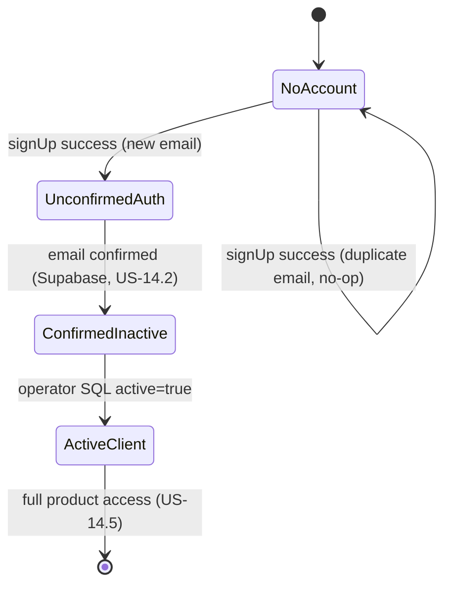

Reviewed by FE: yes — 2026-08-28

# API Contract — US-14.1 Sign up with email and password

**Story:** US-14.1  
**Status:** Draft — awaiting FE signoff  
**Security:** `plan/stories/US-14.1/SECURITY.md` (binding)  
**Identity seam:** `lib/auth/get-current-user.ts` (unchanged until US-14.5)

---

## Overview

Open signup creates a Supabase Auth user (email confirmation required) and a linked `neuramark_clients` row (`active = false`, `role = client`). The browser never receives Supabase tokens, keys, or internal IDs. All mutations are CSRF-protected Server Actions consumed by auth pages.

**Frontend consumers**

| Consumer | Route (planned) | Action |
|----------|-----------------|--------|
| Signup form | `app/(auth)/signup/page.tsx` | `signUp` |
| “Check your email” / resend link (optional V1) | `app/(auth)/signup/confirm/page.tsx` or inline on signup | `resendConfirmationEmail` |

**Server-only modules (not in contract types)**

| Module | Purpose |
|--------|---------|
| `lib/auth/password-policy.ts` | 12–128 chars, common-password denylist; shared with US-14.4 |
| `lib/auth/rate-limit.ts` | Reads/writes `neuramark_auth_attempts` |
| `lib/auth/supabase-server.ts` | Server-only Supabase client (service role / admin) |

---

## Server Actions

### `signUp`

**File:** `lib/auth/actions/sign-up.ts` (`"use server"`)  
**Signature:**

```ts
export async function signUp(
  input: SignUpInput
): Promise<SignUpResult>;
```

**Purpose:** Validate input, enforce rate limits, create Supabase Auth user with email confirmation enabled, insert `neuramark_clients` row, return enumeration-safe success. Does **not** establish a product session (preferred: no session cookie at all until post-confirmation login in US-14.2).

**Processing order (server):**

1. Reject forbidden top-level keys (`role`, `active`, `auth_user_id`, `client_id`, `confirmPassword`, …) → `400 FORBIDDEN_FIELDS`
2. Zod-parse `SignUpInput`
3. Password policy (`lib/auth/password-policy.ts`) → `400 PASSWORD_POLICY` on failure
4. Record attempt in `neuramark_auth_attempts` (`action = signup`); check IP limits (5/hour, 15/day) → `429 RATE_LIMITED` (generic body)
5. Supabase `auth.admin.createUser` / `signUp` with `email_confirm: false` (confirmation email sent by Supabase)
6. Insert `neuramark_clients` using `auth_user_id` from Supabase response only; on insert failure, compensate (delete auth user)
7. Map Supabase “user already exists” (and similar) → same success as new user (`200`, `{ ok: true }`)
8. Never log plaintext password; redact `password` key in any request logging

**CSRF:** Next.js Server Action built-in origin check (POST from same origin only).

---

### `resendConfirmationEmail`

**File:** `lib/auth/actions/resend-confirmation.ts` (`"use server"`)  
**Signature:**

```ts
export async function resendConfirmationEmail(
  input: ResendConfirmationInput
): Promise<ResendConfirmationResult>;
```

**Purpose:** Trigger Supabase resend for email confirmation. Same generic response for known and unknown emails. Only implement if FE exposes a resend control in US-14.1; contract is frozen either way so FE can mock ahead.

**Rate limits:** max **3 per email per hour** (`action = resend_confirmation` in `neuramark_auth_attempts`), plus Supabase built-in limits. Over limit → `429 RATE_LIMITED`.

**Processing order:** forbidden keys → Zod parse → record attempt + rate check → Supabase resend (swallow “user not found”) → `{ ok: true }`.

---

## Zod schemas (`lib/contracts/auth.ts`)

Implementer creates `lib/contracts/auth.ts` mirroring this contract. FE imports **types only** from this file; password policy validation stays server-side.

### Shared enums

```ts
// lib/contracts/auth.ts

import { z } from "zod";
import { supportedLocaleSchema } from "./providers";

/** DB enum neuramark_client_role — not accepted on any auth request */
export const clientRoleSchema = z.enum(["client", "operator"]);
export type ClientRole = z.infer<typeof clientRoleSchema>;

/** DB enum neuramark_auth_action — server-only writes */
export const authAttemptActionSchema = z.enum([
  "signup",
  "resend_confirmation",
  "login_failed",           // reserved for US-14.2
  "password_reset_request", // reserved for US-14.4
]);
export type AuthAttemptAction = z.infer<typeof authAttemptActionSchema>;

/** Machine-readable error codes returned to the client */
export const authErrorCodeSchema = z.enum([
  "VALIDATION_ERROR",
  "FORBIDDEN_FIELDS",
  "PASSWORD_POLICY",
  "RATE_LIMITED",
  "INTERNAL_ERROR",
]);
export type AuthErrorCode = z.infer<typeof authErrorCodeSchema>;

/** Password policy rejection detail (field-level, does not leak account existence) */
export const passwordPolicyViolationSchema = z.enum([
  "TOO_SHORT",
  "TOO_LONG",
  "COMMON_PASSWORD",
]);
export type PasswordPolicyViolation = z.infer<typeof passwordPolicyViolationSchema>;
```

### Request schemas

```ts
/** Forbidden if present on the wire: role, active, auth_user_id, client_id, confirmPassword */
export const signUpInputSchema = z
  .object({
    email: z
      .string()
      .trim()
      .min(1)
      .max(320)
      .email()
      .transform((v) => v.toLowerCase()),
    password: z.string().min(1).max(128),
    displayName: z.string().trim().min(1).max(120),
    preferredLocale: supportedLocaleSchema.optional(),
  })
  .strict();
export type SignUpInput = z.infer<typeof signUpInputSchema>;

export const resendConfirmationInputSchema = z
  .object({
    email: z
      .string()
      .trim()
      .min(1)
      .max(320)
      .email()
      .transform((v) => v.toLowerCase()),
  })
  .strict();
export type ResendConfirmationInput = z.infer<typeof resendConfirmationInputSchema>;
```

### Success schemas

```ts
/** Enumeration-safe success — new signup, duplicate email, and resend all use this shape */
export const authGenericSuccessSchema = z.object({
  ok: z.literal(true),
});
export type AuthGenericSuccess = z.infer<typeof authGenericSuccessSchema>;

export const signUpSuccessSchema = authGenericSuccessSchema;
export type SignUpSuccess = z.infer<typeof signUpSuccessSchema>;

export const resendConfirmationSuccessSchema = authGenericSuccessSchema;
export type ResendConfirmationSuccess = z.infer<typeof resendConfirmationSuccessSchema>;
```

### Error envelope

All failures use the same envelope. **Never** include passwords, Supabase tokens, `auth_user_id`, `client_id`, `active`, `role`, or hints that an email is/is not registered (except field format validation on malformed email strings).

```ts
export const authFieldErrorsSchema = z.record(
  z.string(),
  z.array(z.string())
);

export const authErrorEnvelopeSchema = z.object({
  ok: z.literal(false),
  error: z.object({
    code: authErrorCodeSchema,
    /** i18n keys under auth.errors.* — FE maps to EN/ES copy; not raw Supabase text */
    messageKey: z.string(),
    fields: authFieldErrorsSchema.optional(),
    passwordPolicy: passwordPolicyViolationSchema.optional(),
  }),
});
export type AuthErrorEnvelope = z.infer<typeof authErrorEnvelopeSchema>;
```

### Result unions (FE mocking)

```ts
export const signUpResultSchema = z.discriminatedUnion("ok", [
  signUpSuccessSchema,
  authErrorEnvelopeSchema,
]);
export type SignUpResult = z.infer<typeof signUpResultSchema>;

export const resendConfirmationResultSchema = z.discriminatedUnion("ok", [
  resendConfirmationSuccessSchema,
  authErrorEnvelopeSchema,
]);
export type ResendConfirmationResult = z.infer<typeof resendConfirmationResultSchema>;
```

### `lib/contracts/auth.ts` — implementer checklist

| Export | Kind |
|--------|------|
| `clientRoleSchema` | Zod schema |
| `ClientRole` | Type |
| `authAttemptActionSchema` | Zod schema |
| `AuthAttemptAction` | Type |
| `authErrorCodeSchema` | Zod schema |
| `AuthErrorCode` | Type |
| `passwordPolicyViolationSchema` | Zod schema |
| `PasswordPolicyViolation` | Type |
| `signUpInputSchema` | Zod schema |
| `SignUpInput` | Type |
| `resendConfirmationInputSchema` | Zod schema |
| `ResendConfirmationInput` | Type |
| `authGenericSuccessSchema` | Zod schema |
| `AuthGenericSuccess` | Type |
| `signUpSuccessSchema` | Zod schema |
| `SignUpSuccess` | Type |
| `resendConfirmationSuccessSchema` | Zod schema |
| `ResendConfirmationSuccess` | Type |
| `authFieldErrorsSchema` | Zod schema |
| `authErrorEnvelopeSchema` | Zod schema |
| `AuthErrorEnvelope` | Type |
| `signUpResultSchema` | Zod schema |
| `SignUpResult` | Type |
| `resendConfirmationResultSchema` | Zod schema |
| `ResendConfirmationResult` | Type |

Re-export `SupportedLocale` from `./providers` in action docs; signup uses `supportedLocaleSchema` for `preferredLocale`.

---

## HTTP semantics (Server Actions)

Server Actions do not expose REST paths; status codes below are the **logical** codes the action implementation maps to for logging, monitoring, and any future Route Handler parity.

| Outcome | HTTP | Body | FE behavior |
|---------|------|------|-------------|
| New email signup | 200 | `{ ok: true }` | Navigate to “check your email” |
| Duplicate email (enumeration-safe) | 200 | `{ ok: true }` | Same screen as new email |
| Resend accepted (known or unknown email) | 200 | `{ ok: true }` | Generic “check your email” copy |
| Validation error (malformed email, empty display name) | 400 | `authErrorEnvelope` `VALIDATION_ERROR` + `fields` | Show field errors |
| Forbidden extra fields (`role`, etc.) | 400 | `authErrorEnvelope` `FORBIDDEN_FIELDS` | Generic error |
| Password policy failure | 400 | `authErrorEnvelope` `PASSWORD_POLICY` + `passwordPolicy` | Show policy hint (length/common); no email leak |
| Signup rate limit (IP) | 429 | `{ ok: true }` **or** `{ ok: false, error: { code: "RATE_LIMITED", messageKey: "auth.errors.rateLimited" } }` | Generic “try again later”; **do not** branch on email existence |
| Resend rate limit (email) | 429 | Same as signup rate limit | Generic “try again later” |
| Unexpected server failure | 500 | `authErrorEnvelope` `INTERNAL_ERROR` | Generic error |

**Enumeration rule:** For signup and resend, the only responses that differ from success are `400` validation/password-policy (safe) and `429`/`500` generic. Duplicate email and unknown email on resend MUST return `{ ok: true }`.

**i18n message keys (contract):**

| Key | When |
|-----|------|
| `auth.errors.validation` | `VALIDATION_ERROR` |
| `auth.errors.forbiddenFields` | `FORBIDDEN_FIELDS` |
| `auth.errors.passwordPolicy` | `PASSWORD_POLICY` (FE may branch on `passwordPolicy` enum for hints) |
| `auth.errors.rateLimited` | `RATE_LIMITED` |
| `auth.errors.internal` | `INTERNAL_ERROR` |
| `auth.signup.success` | After `{ ok: true }` — “If an account can be created with this email, check your inbox to confirm.” |

---

## Database DDL sketch

Migration file: `supabase/migrations/YYYYMMDDHHMMSS_neuramark_auth_signup.sql`

### Enum: `neuramark_client_role`

```sql
CREATE TYPE public.neuramark_client_role AS ENUM ('client', 'operator');
```

### Enum: `neuramark_auth_action`

```sql
CREATE TYPE public.neuramark_auth_action AS ENUM (
  'signup',
  'resend_confirmation',
  'login_failed',
  'password_reset_request'
);
```

### Table: `neuramark_clients`

Logical name in stories: `clients`. Physical name: `neuramark_clients`.

```sql
CREATE TABLE public.neuramark_clients (
  id              uuid PRIMARY KEY DEFAULT gen_random_uuid(),
  auth_user_id    uuid NOT NULL UNIQUE REFERENCES auth.users (id) ON DELETE CASCADE,
  email           text NOT NULL,
  display_name    text NOT NULL,
  preferred_locale text NOT NULL DEFAULT 'en'
    CONSTRAINT neuramark_clients_preferred_locale_check
    CHECK (preferred_locale IN ('en', 'es')),
  active          boolean NOT NULL DEFAULT false,
  role            public.neuramark_client_role NOT NULL DEFAULT 'client',
  created_at      timestamptz NOT NULL DEFAULT now(),

  CONSTRAINT neuramark_clients_email_unique UNIQUE (email),
  CONSTRAINT neuramark_clients_display_name_len CHECK (char_length(display_name) BETWEEN 1 AND 120)
);

CREATE INDEX neuramark_clients_active_idx
  ON public.neuramark_clients (active);

CREATE INDEX neuramark_clients_role_idx
  ON public.neuramark_clients (role);

COMMENT ON COLUMN public.neuramark_clients.active IS
  'SQL-only activation by operator; no app UPDATE path (US-14.1/14.5).';
COMMENT ON COLUMN public.neuramark_clients.role IS
  'SQL-only promotion to operator; never accepted from auth requests.';
```

**Insert rules (application):**

- `auth_user_id` — from Supabase Auth response only
- `email`, `display_name`, `preferred_locale` — from validated signup input (`preferred_locale` defaults to `'en'` if omitted)
- `active` — always default `false` (never from request)
- `role` — always default `'client'` (never from request)

### Table: `neuramark_auth_attempts`

```sql
CREATE TABLE public.neuramark_auth_attempts (
  id           uuid PRIMARY KEY DEFAULT gen_random_uuid(),
  ip_hash      text NOT NULL,
  email_hash   text,  -- HMAC-SHA256(normalized email); nullable when not applicable
  action       public.neuramark_auth_action NOT NULL,
  attempted_at timestamptz NOT NULL DEFAULT now()
);

CREATE INDEX neuramark_auth_attempts_ip_action_time_idx
  ON public.neuramark_auth_attempts (ip_hash, action, attempted_at DESC);

CREATE INDEX neuramark_auth_attempts_email_action_time_idx
  ON public.neuramark_auth_attempts (email_hash, action, attempted_at DESC)
  WHERE email_hash IS NOT NULL;
```

**Hashing:** `ip_hash` and `email_hash` = HMAC-SHA256(value, server secret). Never store plaintext email or raw IP.

**Retention (operational):** optional cron/SQL delete of rows older than 30 days; not required for US-14.1 acceptance.

### Rate-limit queries (reference)

| Action | Window | Key | Max |
|--------|--------|-----|-----|
| `signup` | 1 hour | `ip_hash` | 5 |
| `signup` | 24 hours | `ip_hash` | 15 |
| `resend_confirmation` | 1 hour | `email_hash` | 3 |

---

## State transitions

### Account lifecycle (signup story scope)



| State | `auth.users` | `neuramark_clients` | Product session |
|-------|--------------|---------------------|-----------------|
| No account | — | — | None |
| Unconfirmed | exists, `email_confirmed_at` null | row exists, `active=false`, `role=client` | **None** after signup |
| Confirmed inactive | confirmed | `active=false`, `role=client` | Login only (US-14.2) → pending screen |
| Active | confirmed | `active=true`, `role=client` | Dashboard (US-14.5) |

### `neuramark_client_role` transitions

| From | To | Allowed via |
|------|-----|-------------|
| — | `client` | Signup INSERT default only |
| `client` | `operator` | Operator SQL only |
| `operator` | `client` | Operator SQL only |

No application UPDATE on `role` or `active` in US-14.1.

---

## Fixtures (FE mocking)

### `signUp` — happy path (new email)

**Request**

```json
{
  "email": "maria.garcia@example.com",
  "password": "correct-horse-battery-staple-2026",
  "displayName": "María García",
  "preferredLocale": "es"
}
```

**Response** `200`

```json
{ "ok": true }
```

---

### `signUp` — duplicate email (must match happy path)

**Request**

```json
{
  "email": "existing.user@example.com",
  "password": "correct-horse-battery-staple-2026",
  "displayName": "Existing User"
}
```

**Response** `200`

```json
{ "ok": true }
```

---

### `signUp` — validation error

**Request**

```json
{
  "email": "not-an-email",
  "password": "short",
  "displayName": ""
}
```

**Response** `400`

```json
{
  "ok": false,
  "error": {
    "code": "VALIDATION_ERROR",
    "messageKey": "auth.errors.validation",
    "fields": {
      "email": ["invalid_format"],
      "displayName": ["too_small"]
    }
  }
}
```

---

### `signUp` — password policy

**Request**

```json
{
  "email": "new.user@example.com",
  "password": "password1234",
  "displayName": "New User"
}
```

**Response** `400`

```json
{
  "ok": false,
  "error": {
    "code": "PASSWORD_POLICY",
    "messageKey": "auth.errors.passwordPolicy",
    "passwordPolicy": "COMMON_PASSWORD"
  }
}
```

---

### `signUp` — forbidden fields

**Request** (server rejects before Supabase)

```json
{
  "email": "attacker@example.com",
  "password": "correct-horse-battery-staple-2026",
  "displayName": "Attacker",
  "role": "operator"
}
```

**Response** `400`

```json
{
  "ok": false,
  "error": {
    "code": "FORBIDDEN_FIELDS",
    "messageKey": "auth.errors.forbiddenFields"
  }
}
```

---

### `signUp` — rate limited

**Response** `429`

```json
{
  "ok": false,
  "error": {
    "code": "RATE_LIMITED",
    "messageKey": "auth.errors.rateLimited"
  }
}
```

FE treats this like a generic throttle message; do not infer email registration state.

---

### `resendConfirmationEmail` — any email

**Request**

```json
{ "email": "maybe.registered@example.com" }
```

**Response** `200`

```json
{ "ok": true }
```

---

## Identity seam (unchanged in US-14.1)

`getCurrentUser()` in `lib/auth/get-current-user.ts` continues returning the dev hardcoded user until US-14.5. Signup still writes real `neuramark_clients` rows so the swap is additive:

```ts
export type CurrentUser = {
  id: string;              // neuramark_clients.id
  email: string;
  displayName: string;
  preferredLocale: "en" | "es";
  role: ClientRole;
  active: boolean;
};
```

`CurrentUser.role` uses the same values as `neuramark_client_role` but is resolved server-side only — never sent on signup/login requests.

---

## Out of scope (other stories)

| Concern | Story |
|---------|-------|
| Login, session cookie, post-confirmation redirect | US-14.2 |
| Route guards, `getCurrentUser()` session swap | US-14.5 |
| Email confirmation callback Route Handler | US-14.2 / US-14.5 |
| Password reset | US-14.4 |
| Operator activation UI | P1 |

---

## FE signoff

- [x] Reviewed by FE — 2026-08-28

---

## Changelog

| Date | Change |
|------|--------|
| 2026-08-28 | Initial contract (nextjs-backend) |
| 2026-08-28 | QA hardening (no request/response shape change; FE re-signoff not required): confirmation-send failure returns the same `{ ok: true }` as duplicate email; rate-limit store errors fail closed as `RATE_LIMITED`; duplicate detection no longer uses bare HTTP 422 (`weak_password` → `PASSWORD_POLICY`). |
