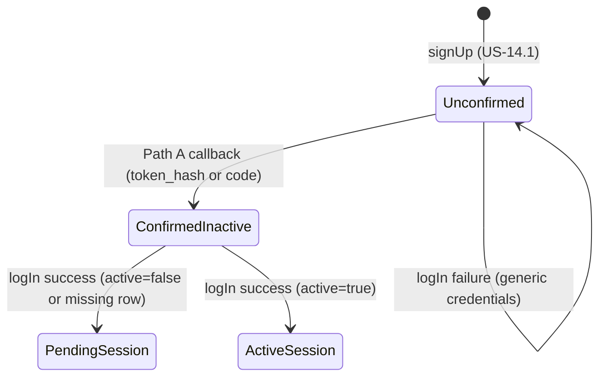

Reviewed by FE: yes — 2026-08-28

# API Contract — US-14.2 Log in with email and password

**Story:** US-14.2  
**Status:** Draft — awaiting FE signoff  
**Security:** `plan/stories/US-14.2/SECURITY.md` (binding)  
**Identity seam:** `lib/auth/get-current-user.ts` (unchanged until US-14.5)  
**Extends:** `plan/stories/US-14.1/CONTRACT.md` (error envelope, forbidden keys, `neuramark_clients`, `neuramark_auth_attempts`)

**FE notes:** pending identity from `logIn` success (`email` / `displayName`), never `?email=`; URL `next`/`redirectTo` → action field `next` only; Path A banners on `/login` (`?confirmed=1` / `?error=confirmation`), no dedicated failure page.

---

## Overview

Email/password login is a CSRF-protected Server Action wrapping Supabase Auth `signInWithPassword` on the server. On success the server mints an httpOnly session cookie and returns an opaque landing path. The browser never receives Supabase tokens, keys, `role`, `active`, `auth_user_id`, or `client_id`.

Email confirmation (carry-forward from US-14.1) is completed by `GET /auth/callback`. **Callback Path A is frozen** (see below): the handler confirms via `token_hash`+`type` (`verifyOtp`) **or** PKCE `code` (`exchangeCodeForSession`) server-side, does **not** leave a durable product session, and 302s to `/login`. Confirmed-inactive users reach pending **only after** a successful password login. No PKCE cookie is required for email confirmation.

**Frontend consumers**

| Consumer | Route (planned) | Contract surface |
|----------|-----------------|------------------|
| Login form | `app/(auth)/login/page.tsx` | Server Action `logIn` |
| Confirmation email link | `{SITE_URL}/auth/callback` (Supabase `emailRedirectTo`, already US-14.1) | Route Handler `GET /auth/callback` |
| Post-login pending | `app/(auth)/pending/page.tsx` + `PendingActivationView` | Consumes `logIn` success (`redirectTo: "/pending"` + `email` / `displayName`). **Must not** treat `?email=` as identity. |
| Post-callback banners | Login page query (`confirmed` / `error`) | Path A 302 targets only — not a JSON API |

**Server-only modules (not in contract types; BUILD)**

| Module | Purpose |
|--------|---------|
| `lib/auth/rate-limit.ts` | Extend for `login_failed` window + reset; reuse HMAC helpers |
| `lib/auth/forbidden-fields.ts` | Login forbidden-key set (same names as signup) |
| `lib/auth/errors.ts` | Reuse envelope helpers; add credentials failure helper at BUILD |
| `lib/auth/get-client-ip.ts`, `lib/auth/hash.ts` | IP + HMAC as US-14.1 |
| `@supabase/ssr` `createServerClient` | User-scoped cookie adapter for `signInWithPassword` / PKCE `exchangeCodeForSession` |
| Existing service-role client | `neuramark_clients` read + `neuramark_auth_attempts`; email-confirm `verifyOtp` (`persistSession: false` — **must not** mint cookies) |

---

## Frozen decisions

| Topic | Freeze |
|-------|--------|
| Login surface | **One** Server Action `logIn`. No login Route Handler. No `@supabase/supabase-js` in the browser. |
| Callback path | **Path A (preferred).** See [Email-confirmation callback](#email-confirmation-callback-path-a--frozen). |
| Landing discriminator | Opaque **`redirectTo`** (server-sanitized relative path). **No `active` field** on success or failure. No `role`. |
| Credentials failure | One triple for unknown email, wrong password, and unconfirmed: logical **401**, `code: "INVALID_CREDENTIALS"`, `messageKey: "auth.login.genericFailure"`. Never `EMAIL_NOT_CONFIRMED`, `USER_NOT_FOUND`, `INVALID_PASSWORD`. |
| Rate-limit copy | Logical **429**, `code: "RATE_LIMITED"`, **same** `messageKey: "auth.login.genericFailure"` (not `auth.errors.rateLimited`). FE must not show a distinct “too many attempts” string on login. |
| Cookie | Set-Cookie only — **not** a JSON field. Identity only. `@supabase/ssr` shape for US-14.5. |
| `login_success` enum | **Do not add.** Failed attempts use existing `login_failed`. |
| `getCurrentUser()` | Unchanged (hardcoded local user) until US-14.5. Landing ≠ route protection. |

---

## Server Action: `logIn`

**File (BUILD):** `lib/auth/actions/log-in.ts` (`"use server"`)  
**Signature:**

```ts
export async function logIn(input: LogInInput): Promise<LogInResult>;
```

**Purpose:** Authenticate email/password via Supabase Auth on the server, mint a fresh httpOnly session cookie, read `neuramark_clients.active` **after** a successful sign-in to choose landing, return a minimal result the login page navigates with.

**Frontend consumer:** Login form on `app/(auth)/login/` (PrimeReact). The page may read URL query `next` or `redirectTo` and pass a single `next` field into the action. FE must not navigate to an unvalidated external URL — the action result’s `redirectTo` is the only post-success destination.

**CSRF:** Next.js Server Action built-in origin check (POST from same origin only). Same pattern as `signUp`.

### Request

Allowed keys only: `email`, `password`, optional `next`.

| Field | Type | Rules |
|-------|------|--------|
| `email` | string | trim, max 320, valid email, stored/compared lowercased |
| `password` | string | min 1, max 128; **not** checked against signup password policy (wrong/short passwords follow the generic credentials path after Auth) |
| `next` | string, optional | Post-login path **candidate**. Ignored unless login succeeds **and** the account is active. Server sanitizes (see [Open redirect](#open-redirect)). Invalid / absent → `/dashboard` for active accounts. |

**Forbidden keys** (reject **before** Zod, same pattern as signup): `role`, `active`, `auth_user_id`, `authUserId`, `client_id`, `clientId`. Presence → `400 FORBIDDEN_FIELDS`. Do not process the rest of the payload.

`.strict()` on the Zod object rejects any other extra keys as `VALIDATION_ERROR` (safe; does not reveal account existence).

The URL query alias `redirectTo` is **not** a body field. FE maps `?redirectTo=` → action `next`. Sending `redirectTo` on the action payload is an extra key (`VALIDATION_ERROR` via `.strict()`).

### Processing order (server)

1. Reject forbidden top-level keys → `400 FORBIDDEN_FIELDS`
2. Zod-parse `LogInInput` → `400 VALIDATION_ERROR` + `fields` on malformed email / empty password
3. Rate-limit check for `(email_hash, ip_hash)` + `action = login_failed` in the last 15 minutes — **fail closed** (store/count errors → treat as limited) → logical `429 RATE_LIMITED` with `auth.login.genericFailure`
4. `signInWithPassword` via **user-scoped** `@supabase/ssr` client — **always called** on a valid shape, including unknown emails. No app early-return on “user not found.”
5. On Auth error (unknown email, wrong password, **unconfirmed**, or other credential-class failure): record `login_failed`; if the insert/count path errors, return 429 generic; otherwise return `INVALID_CREDENTIALS`. Unconfirmed is a **failed sign-in**, not a pending landing.
6. On Auth success:
   - Reset the 15-minute `(email_hash, ip_hash)` `login_failed` window (delete matching rows). If clear fails: log server-side; **do not** convert success into an error.
   - Discard any pre-auth session cookie (fixation); set a **fresh** cookie from this sign-in.
   - Service-role **read** `neuramark_clients` by `auth_user_id` (from the Auth response only — never from the request).
   - Choose `redirectTo` (see [Landing](#landing-after-success)).
   - Return `{ ok: true, redirectTo, email, displayName }`. **Do not** INSERT/UPDATE `neuramark_clients`. **Do not** write `active` or `role`.

7. Top-level try/catch → `INTERNAL_ERROR` only for failures that also occur for unknown users (e.g. unconfigured Supabase). **Never** return `INTERNAL_ERROR` / distinct copy solely because the Auth user exists but the client row is missing or unreadable.

Never log or echo the password; reuse `redactAuthPayload`.

### Landing after success

| Condition after successful `signInWithPassword` | `redirectTo` |
|-------------------------------------------------|--------------|
| Client row exists and `active === true` | Sanitized `next`, or `/dashboard` if `next` is absent/unsafe |
| Client row exists and `active === false` | **`/pending`** — `next` is **ignored** (must not skip pending) |
| Client row missing or unreadable | **`/pending`** — same as confirmed-inactive (closes US-14.1 High finding 1 class). No client-visible “profile missing.” |

`email` / `displayName` on success:

- If the client row exists: `neuramark_clients.email` and `neuramark_clients.display_name`.
- If the row is missing: `email` from the Auth user (the address they just authenticated); `displayName` equals that email (always a non-empty string). FE may show both on pending.

These fields appear **only** on `{ ok: true }`. Failures never include them, never include `active`, and never disclose activation state.

### Success response (JSON body)

Cookie is **not** in this body.

```ts
{
  ok: true;
  redirectTo: string; // server-sanitized relative path; FE must router.push this as-is
  email: string;
  displayName: string;
}
```

**FE rule:** After success, navigate to `result.redirectTo`. Do **not** interpret `active`, `role`, or a second client-side `next`. Do **not** put `email` on the pending URL.

### Error envelope

Reuse US-14.1 `authErrorEnvelopeSchema`. Login adds `INVALID_CREDENTIALS` to `authErrorCodeSchema` (additive; signup types unchanged).

```ts
{
  ok: false;
  error: {
    code: AuthErrorCode;
    messageKey: string;
    fields?: Record<string, string[]>;
    passwordPolicy?: never; // login does not return PASSWORD_POLICY
  };
}
```

---

## HTTP semantics (Server Actions)

Server Actions do not expose REST paths; status codes below are **logical** codes for logging, monitoring, and tests.

| Outcome | HTTP | Body | FE behavior |
|---------|------|------|-------------|
| Active account, valid credentials | 200 | `{ ok: true, redirectTo, email, displayName }` | `router.push(redirectTo)` (dashboard or sanitized `next`) |
| Confirmed inactive, or missing client row | 200 | `{ ok: true, redirectTo: "/pending", email, displayName }` | Show pending from this payload; URL `/pending` **without** `?email=` |
| Unknown email / wrong password / unconfirmed | 401 | `INVALID_CREDENTIALS` + `auth.login.genericFailure` | One generic login error; clear password field |
| Over-limit or rate-limit store failure | 429 | `RATE_LIMITED` + **`auth.login.genericFailure`** | **Same copy** as credentials failure; do not branch on email existence |
| Malformed email / empty password | 400 | `VALIDATION_ERROR` + `fields` | Field errors (format only; not account existence) |
| Forbidden extra fields | 400 | `FORBIDDEN_FIELDS` | Generic error (`auth.errors.forbiddenFields`) |
| Unexpected server failure (unknown-user-safe) | 500 | `INTERNAL_ERROR` | Generic error (`auth.errors.internal`) |

**Enumeration rule:** Unauthenticated outcomes that depend on whether the email exists (unknown, wrong password, unconfirmed, inactive-without-auth) MUST share credentials failure **or** never be observable without a successful password sign-in. Activation is disclosed only via a **successful** result’s `redirectTo` (`/dashboard` vs `/pending`).

**i18n message keys (contract)**

| Key | When |
|-----|------|
| `auth.login.genericFailure` | `INVALID_CREDENTIALS` **and** login `RATE_LIMITED` |
| `auth.errors.validation` | `VALIDATION_ERROR` |
| `auth.errors.forbiddenFields` | `FORBIDDEN_FIELDS` |
| `auth.errors.internal` | `INTERNAL_ERROR` |
| `auth.login.confirmed` | Path A success banner on `/login?confirmed=1` (FE copy; not an action result) |
| `auth.login.confirmationFailed` | Path A failure banner on `/login?error=confirmation` (FE copy; not an action result) |

Do **not** use `auth.errors.rateLimited` on the login form (that key remains for signup/resend 429 copy).

---

## Cookie semantics (not a JSON field)

On **login success only** (including inactive / missing-row pending landing):

| Attribute | Value |
|-----------|--------|
| Mechanism | `@supabase/ssr` cookie adapter (`createServerClient` get/set on the action response) |
| Name / shape | Host-only `sb-*` (or current `@supabase/ssr` chunked auth cookie names). Must be readable later by US-14.5 `getCurrentUser()` — no parallel `neuramark_session` JWT, no `client_id` cookie. |
| `HttpOnly` | true |
| `Secure` | true when `NODE_ENV === "production"` (or equivalent production check) |
| `SameSite` | `Lax` |
| `Path` | `/` |
| `Domain` | **unset** (host-only) |
| Claims | **Identity only** (Supabase Auth session). Do **not** bake `active`, `role`, or `client_id` into cookie values. |
| Rotation | Successful login always issues a **fresh** cookie value; discard any pre-auth `sb-*` identifier (fixation). |
| Body / JS | Access token, refresh token, and cookie value **never** appear in JSON, HTML, or client JS. |
| Service-role | Existing server client stays `persistSession: false` and is **not** the cookie client. |
| Max-Age | Follow `@supabase/ssr` defaults. Do not set a year-long custom cookie. Idle/refresh lifetime is specified on US-14.5. |

Until US-14.5, product pages may still resolve `getCurrentUser()` as the hardcoded local user. That is a sanctioned interim — not a US-14.2 defect. This story still mints the real cookie so the swap is additive.

---

## Email-confirmation callback (Path A — frozen)

**File (BUILD):** `app/auth/callback/route.ts`  
**Method / path:** `GET /auth/callback`  
**Frontend consumer:** Confirmation email link (`emailRedirectTo` = `{SITE_URL}/auth/callback` from `lib/auth/send-signup-confirmation.ts`). Not called from Client Component JS.

**E2E path (must prove this, not Path B):**

```text
email link → GET /auth/callback?token_hash=…&type=signup  (or type=email)
           or GET /auth/callback?code=…  (PKCE links only)
  → verifyOtp / exchangeCodeForSession server-side
  → drop any session cookies (no durable session; no PKCE cookie required)
  → 302 Location: /login?confirmed=1
password login (confirmed + inactive) → logIn success → redirectTo "/pending"
```

Stolen inbox can confirm email; it **does not** mint a session and **does not** reach product routes.

### Query params (untrusted)

| Param | Use |
|-------|-----|
| `token_hash` + `type` | Email OTP confirmation (US-14.1 `admin.createUser` + `auth.resend` links). Verified **server-side** with `verifyOtp`. `type` allowlist: `signup`, `email`, `invite`, `magiclink`, `recovery`, `email_change`. Never logged. Never copied into `Location`, HTML, JSON, or JS. Preferred when present — does **not** require a PKCE verifier cookie. |
| `code` | One-time PKCE Auth code. Exchanged **server-side** immediately when `token_hash` is absent. Never logged. Never copied into `Location`, HTML, JSON, or JS. |
| `error`, `error_description` | Provider error query. **Never echoed.** Map to the generic confirmation-failure landing. Ignored in `Location` even when present. |
| `next`, `redirect_to`, `redirectTo` | **Ignored on Path A.** Unsafe or any value still lands on the frozen callback URLs below — never an external URL, never `/dashboard` from the callback. |

Other query keys are ignored.

### Redirects (relative `Location` only)

Build **app-relative** 302 targets (leading `/`). Do not construct absolute URLs from `Host`, `X-Forwarded-Host`, or attacker-controlled origins. Reuse `SITE_URL` as the allowlisted public origin for confirmation emails (already US-14.1). If `SITE_URL` is unset, do not fall through to an open redirect.

| Outcome | Status | `Location` | Session cookie |
|---------|--------|------------|----------------|
| Valid `token_hash`+`type`, `verifyOtp` succeeds | 302 | `/login?confirmed=1` | **None left** — service-role client does not persist; expire any `sb-*` |
| Valid `code`, PKCE exchange succeeds | 302 | `/login?confirmed=1` | **None left** — sign out / delete `sb-*` if the exchange set them |
| Missing/invalid/expired/used `token_hash` or `code`; `token_hash` without a valid `type` | 302 | `/login?error=confirmation` | None |
| `error` / `error_description` present | 302 | `/login?error=confirmation` | None |
| Verify / exchange throws / provider failure | 302 | `/login?error=confirmation` | None |

All failure rows share **one** confirmation-failure page and copy (`auth.login.confirmationFailed`). No Supabase text. Same landing whether the code is missing, expired, or already used.

**Required 302 headers:** `Referrer-Policy: no-referrer` (so the `code` URL is not leaked via `Referer`).

**Not Path A:** callback must not 302 to `/pending`, `/dashboard`, or any product route — including when the operator has already set `active = true`. Active users sign in with password on `/login` and then receive `redirectTo: "/dashboard"` (or sanitized `next`) from `logIn`. Hybrid “sometimes leave a session” is a finding.

**Allowlisted login query (callback + FE):** `locale` (existing i18n), `next` / `redirectTo` (login form only), `confirmed=1`, `error=confirmation`. Never `email`, `code`, tokens, or `error_description`.

---

## Open redirect

Applies to `logIn` field `next` (and equivalently to a URL query the FE copies into `next`). Callback Path A does not honor `next`.

A path is **safe** only if **all** of:

1. Same-origin **relative** path
2. Starts with a **single** `/`
3. Does not start with `//`
4. Contains no scheme (`:` before any `/`, or `://`)
5. Contains no backslash `\`
6. After decoding at least once, still does not start with `//` and does not contain `\` (reject encoded `//` such as `%2F%2F`, encoded slashes that produce `//`, `%5C`)

Anything else (including `https://evil.example`, `//evil.example`, `/\evil`, empty, `dashboard`, `javascript:…`) → treat as **absent** → `/dashboard` for **active** success. Inactive / missing-row success **always** `/pending` (safe `next` must not skip pending).

---

## Zod schemas (`lib/contracts/auth.ts`)

Additive only. US-14.1 signup / resend exports stay unchanged. FE imports **types only**.

Sketches live in `lib/contracts/auth.ts` (this story). Full sanitizer for `next` and cookie/session I/O stay server-only at BUILD (`lib/auth/…`), not in the contracts file.

### Error code enum (extended)

```ts
export const authErrorCodeSchema = z.enum([
  "VALIDATION_ERROR",
  "FORBIDDEN_FIELDS",
  "PASSWORD_POLICY", // signup only; login never returns this
  "RATE_LIMITED",
  "INTERNAL_ERROR",
  "INVALID_CREDENTIALS", // US-14.2
]);
```

### Login request / success / result

```ts
export const logInInputSchema = z
  .object({
    email: z
      .string()
      .trim()
      .min(1)
      .max(320)
      .email()
      .transform((v) => v.toLowerCase()),
    password: z.string().min(1).max(128),
    next: z.string().max(2048).optional(),
  })
  .strict();
export type LogInInput = z.infer<typeof logInInputSchema>;

export const logInSuccessSchema = z.object({
  ok: z.literal(true),
  redirectTo: z
    .string()
    .min(1)
    .max(2048)
    .refine((value) => value.startsWith("/") && !value.startsWith("//")),
  email: z.string().min(1).max(320),
  displayName: z.string().min(1).max(120),
});
export type LogInSuccess = z.infer<typeof logInSuccessSchema>;

export const logInResultSchema = z.discriminatedUnion("ok", [
  logInSuccessSchema,
  authErrorEnvelopeSchema,
]);
export type LogInResult = z.infer<typeof logInResultSchema>;
```

`authAttemptActionSchema` already includes `login_failed` from US-14.1. **Do not** add `login_success`.

---

## Database

No new tables, columns, enums, indexes, or RLS policies.

### `neuramark_clients` (read only)

Logical name: `clients`. Physical: `neuramark_clients` (US-14.1).

After successful Auth sign-in, service-role `SELECT` by `auth_user_id`:

- `active` — landing only (`true` → dashboard/`next`; `false` or missing row → `/pending`)
- `email`, `display_name` — pending identity on the success payload

No application `INSERT`/`UPDATE`. No write to `active` or `role`. RLS remains deny-by-default (US-14.5).

### `neuramark_auth_attempts` (`login_failed` only)

Reuse US-14.1 table and enum value `login_failed` on `neuramark_auth_action`. HMAC `ip_hash` / `email_hash` as today. Never store password, raw IP, or plaintext email.

| Rule | Value |
|------|--------|
| Action written | `login_failed` only |
| Window | 15 minutes |
| Key | `(email_hash, ip_hash)` |
| Max | **5** |
| Over-limit | logical 429, generic login copy |
| Store/count error | **fail closed** → same 429 |
| On Auth success | **DELETE** matching `login_failed` rows for that `(email_hash, ip_hash)` (15-minute window or all matching pairs — BUILD choice; must reset the counter). Clear failure must not fail the login. |
| `login_success` | **Not added** |

**Indexes:** reuse

- `neuramark_auth_attempts_ip_action_time_idx` `(ip_hash, action, attempted_at DESC)`
- `neuramark_auth_attempts_email_action_time_idx` `(email_hash, action, attempted_at DESC) WHERE email_hash IS NOT NULL`

No new `neuramark_*` index in this story. Count query: `action = 'login_failed'` AND both hashes AND `attempted_at >= now() - 15 minutes`.

### Rate-limit queries (this story)

| Action | Window | Key | Max |
|--------|--------|-----|-----|
| `login_failed` | 15 minutes | `email_hash` + `ip_hash` | 5 |

Supabase Auth built-in rate limits remain the second layer.

---

## State transitions



| State | Auth | `neuramark_clients` | `logIn` / callback |
|-------|------|---------------------|--------------------|
| Unknown email | — | — | Generic credentials (`INVALID_CREDENTIALS`) |
| Unconfirmed | exists, email not confirmed | row usually exists, `active=false` | Generic credentials — **not** pending |
| Confirmed inactive | confirmed | `active=false` | Success → `/pending` + cookie |
| Confirmed, missing row | confirmed | — | Success → `/pending` + cookie (no repair write) |
| Active | confirmed | `active=true` | Success → `/dashboard` or sanitized `next` + cookie |
| Path A callback success | becomes confirmed | unchanged | **No** durable cookie; 302 `/login?confirmed=1` |
| Path A callback failure | unchanged | unchanged | 302 `/login?error=confirmation` |

### `neuramark_client_role` / `active`

No transitions in this story. Operator SQL only (US-14.1).

---

## Fixtures (FE mocking)

### `logIn` — success, active → dashboard

**Request**

```json
{
  "email": "maria.garcia@example.com",
  "password": "correct-horse-battery-staple-2026"
}
```

**Response** `200`

```json
{
  "ok": true,
  "redirectTo": "/dashboard",
  "email": "maria.garcia@example.com",
  "displayName": "María García"
}
```

Set-Cookie is present on the HTTP response (httpOnly); omitted from JSON.

---

### `logIn` — success, confirmed inactive → pending

**Request**

```json
{
  "email": "pending.user@example.com",
  "password": "correct-horse-battery-staple-2026"
}
```

**Response** `200`

```json
{
  "ok": true,
  "redirectTo": "/pending",
  "email": "pending.user@example.com",
  "displayName": "Pending User"
}
```

FE renders `PendingActivationView` with `email` / `displayName` from this body. Must **not** navigate to `/pending?email=pending.user@example.com`.

---

### `logIn` — success, missing `neuramark_clients` row (same as pending)

**Request:** valid password for a confirmed Auth user with no client row.

**Response** `200` — same shape as inactive pending (example: `displayName` falls back to email):

```json
{
  "ok": true,
  "redirectTo": "/pending",
  "email": "orphan@example.com",
  "displayName": "orphan@example.com"
}
```

Not `INTERNAL_ERROR`. Not a distinct copy.

---

### `logIn` — success, active + safe `next`

**Request**

```json
{
  "email": "maria.garcia@example.com",
  "password": "correct-horse-battery-staple-2026",
  "next": "/calendar"
}
```

**Response** `200`

```json
{
  "ok": true,
  "redirectTo": "/calendar",
  "email": "maria.garcia@example.com",
  "displayName": "María García"
}
```

---

### `logIn` — success, inactive ignores `next` (must not skip pending)

**Request**

```json
{
  "email": "pending.user@example.com",
  "password": "correct-horse-battery-staple-2026",
  "next": "/dashboard"
}
```

**Response** `200`

```json
{
  "ok": true,
  "redirectTo": "/pending",
  "email": "pending.user@example.com",
  "displayName": "Pending User"
}
```

---

### `logIn` — open-redirect fallback (active)

**Request**

```json
{
  "email": "maria.garcia@example.com",
  "password": "correct-horse-battery-staple-2026",
  "next": "https://evil.example/phish"
}
```

Also unsafe: `"//evil.example"`, `"/\\evil"`, `"/\\/evil.example"`, `"dashboard"`, `"/%2F%2Fevil.example"`.

**Response** `200`

```json
{
  "ok": true,
  "redirectTo": "/dashboard",
  "email": "maria.garcia@example.com",
  "displayName": "María García"
}
```

Not a 400. Attacker-controlled `next` never appears in `redirectTo`.

---

### `logIn` — generic credentials failure

Same response for unknown email, wrong password, and unconfirmed. Example request (unknown email):

```json
{
  "email": "nobody@example.com",
  "password": "correct-horse-battery-staple-2026"
}
```

**Response** `401`

```json
{
  "ok": false,
  "error": {
    "code": "INVALID_CREDENTIALS",
    "messageKey": "auth.login.genericFailure"
  }
}
```

Wrong password and unconfirmed use this exact status, body shape, code, and `messageKey`. No `fields` that distinguish the cause.

---

### `logIn` — validation error

**Request**

```json
{
  "email": "not-an-email",
  "password": ""
}
```

**Response** `400`

```json
{
  "ok": false,
  "error": {
    "code": "VALIDATION_ERROR",
    "messageKey": "auth.errors.validation",
    "fields": {
      "email": ["invalid_format"],
      "password": ["too_small"]
    }
  }
}
```

---

### `logIn` — forbidden fields

**Request**

```json
{
  "email": "attacker@example.com",
  "password": "correct-horse-battery-staple-2026",
  "role": "operator",
  "active": true
}
```

**Response** `400`

```json
{
  "ok": false,
  "error": {
    "code": "FORBIDDEN_FIELDS",
    "messageKey": "auth.errors.forbiddenFields"
  }
}
```

---

### `logIn` — rate limited (same user-facing copy)

**Response** `429`

```json
{
  "ok": false,
  "error": {
    "code": "RATE_LIMITED",
    "messageKey": "auth.login.genericFailure"
  }
}
```

FE displays the same string as `INVALID_CREDENTIALS`. Do not infer that the email is registered.

---

### `GET /auth/callback` — Path A success

Either confirmation param set is valid. Same 302 targets (FE signoff unchanged).

**Request (email OTP, typical US-14.1 link):** `GET /auth/callback?token_hash=…&type=signup`

**Request (PKCE):** `GET /auth/callback?code=pkce-or-auth-code-from-email`

**Response:** `302`  
**Headers:**

- `Location: /login?confirmed=1`
- `Referrer-Policy: no-referrer`
- `Set-Cookie` clearing any cookies the exchange may have set (no durable session)

No JSON body. `code`, `token_hash`, `type`, `next`, `redirect_to`, and `error_description` must not appear in `Location`.

---

### `GET /auth/callback` — generic confirmation failure

Examples that must share this landing:

- `GET /auth/callback` (no `code` and no `token_hash`)
- `GET /auth/callback?token_hash=…` (missing or unknown `type`)
- `GET /auth/callback?error=access_denied&error_description=...`
- `GET /auth/callback?code=expired-or-reused`
- `GET /auth/callback?token_hash=expired-or-reused&type=signup`

**Response:** `302`  
**Headers:**

- `Location: /login?error=confirmation`
- `Referrer-Policy: no-referrer`

FE shows `auth.login.confirmationFailed` only. Must not render `error_description`.

---

## Identity seam (unchanged in US-14.2)

`getCurrentUser()` in `lib/auth/get-current-user.ts` continues returning the hardcoded local user (`gaveho@gmail.com` / Gabriel Vega) until US-14.5.

Login/callback may read `neuramark_clients` **only** to choose landing and to pass the user’s own email/display name into the `logIn` success payload. That is **not** a second product identity API. Product pages keep using `getCurrentUser()`.

**`/pending`:** identity comes from the authenticated `logIn` result (`email`, `displayName`). Unauthenticated `?email=` (and any other query field) must not be echoed as the account (closes US-14.1 QA Low #13).

Known interim: until US-14.5, an inactive session plus hardcoded `getCurrentUser()` can still render product pages if the user **navigates** there. This story must not **redirect** inactive users into product routes. Landing ≠ every-request guard.

---

## Out of scope

| Concern | Story |
|---------|--------|
| `getCurrentUser()` session swap; every-request `active` / spend / route guards; RLS policies; deny-by-default middleware | US-14.5 |
| Logout mutation | US-14.3 |
| Password-reset request / set-password implementation (login page **links** to the future reset route only) | US-14.4 |
| Operator activation UI; app writes to `active` / `role`; RBAC | P1 / never this story |
| Path B callback (leave session, 302 `/pending` or `/dashboard`) | Not this story — Path A is frozen |
| `login_success` enum value; new tables/indexes | Not required |
| Instagram / spend-bearing endpoints | Never this story |

---

## FE questions

1. **Pending identity transport:** **Confirmed.** FE feeds `PendingActivationView` from the `logIn` success payload (`email`, `displayName`) via client navigation state or in-place render. `/pending` must not echo `?email=` (or any other query field) as identity. No pending-identity helper and no `getCurrentUser()` change in this story. Refresh of `/pending` without that client state may show generic pending copy (email optional) — that is acceptable.
2. **Login URL `next` vs `redirectTo`:** **Confirmed.** FE can pass this. The login page maps URL query `next` or `redirectTo` onto action field `next` only. Body `redirectTo` stays rejected by `.strict()`. After success, FE navigates to `result.redirectTo` as-is and never to the unsanitized query value.
3. **Callback banners on `/login`:** **Confirmed.** Prefer banners on `/login?confirmed=1` and `/login?error=confirmation` (matches Path A 302). No dedicated confirmation-failure page.

---

## FE signoff

- [x] Reviewed by FE — 2026-08-28

---

## Changelog

| Date | Change |
|------|--------|
| 2026-08-28 | Initial contract (nextjs-backend): Path A callback, opaque `redirectTo`, additive login Zod types in `lib/contracts/auth.ts` |
| 2026-08-28 | FE signoff: pending identity from action result; URL `next`/`redirectTo` → action `next`; Path A banners on `/login` |
| 2026-08-28 | Callback accepts `code` **or** `token_hash`+`type` (`verifyOtp`); still Path A (no durable session; 302 `/login?confirmed=1` / `/login?error=confirmation`). **FE signoff still valid** — same 302 targets. |
