Reviewed by FE: yes — 2026-08-28

# API Contract — US-14.3 Log out

**Story:** US-14.3  
**Status:** FE signed off — 2026-08-28  
**Security:** `plan/stories/US-14.3/SECURITY.md` (binding — do not reopen frozen picks)  
**Identity seam:** `lib/auth/get-current-user.ts` (US-14.5 — unchanged here)  
**Extends:** `plan/stories/US-14.2/CONTRACT.md` (httpOnly `sb-*` cookies, user-scoped cookie client) and `plan/stories/US-14.5/CONTRACT.md` (guards, `Cache-Control: no-store`, cookie delete flags)

**This document is CONTRACT ONLY.** Do not implement `logOut` until FE signoff. Types live in `lib/contracts/auth.ts` (additive).

**Terminology:** Client / pending user **log out**. ES product copy: **cerrar sesión**. Do not use “admin”, administrador, staff, or “sign out everywhere” as a product label in this story.

---

## Overview

Log out is **one** CSRF-protected Server Action. It revokes **this** refresh token in Supabase Auth (`signOut({ scope: "local" })`) **then** expires matching `sb-*` cookies, and returns a JSON landing of `/login`. The browser never receives tokens, keys, `role`, `active`, `auth_user_id`, or `client_id`. Cookie deletion without Auth revocation is a fail.

This is **this device / this session** (shared-device). It is not global sign-out (US-14.4 after set-password).

**Frontend consumers**

| Consumer | Route | Contract surface |
|----------|-------|------------------|
| Product header logout island | `components/layout/AppHeader.tsx` (small `"use client"` island under Server Component `AppHeader` / `AppShell`) | Server Action `logOut` |
| Pending logout control | `app/(auth)/pending/page.tsx` → `PendingActivationView` | **Same** Server Action `logOut` |

Hint copy (`auth.pending.logoutHint`) is not a control. Both consumers POST the same action. Identity stays server-passed (`CurrentUser` on the header; email + display name on pending). The client island does not call `getCurrentUser()`, read `document.cookie`, or import a Supabase SDK.

**Server-only modules (not in contract types; BUILD)**

| Module | Purpose |
|--------|---------|
| `lib/auth/supabase-cookie.ts` | `createUserScopedAuthClient`, `discardSupabaseAuthCookies` |
| `lib/auth/session-cookie-flags.ts` | `applySessionCookieFlags({ maxAge: 0 })` — do **not** clamp 0 up to 7 days |
| `lib/auth/forbidden-fields.ts` | Privilege keys (same set as login / resend). Dedicated logout alias of `findForbiddenLogInKeys` is allowed |
| `lib/auth/errors.ts` | Reuse `authErrorEnvelopeSchema` helpers (`internalError`, `forbiddenFieldsError`, `validationError`) + `redactAuthPayload` |

No new auth packages. Never import `createServerSupabaseClient` / service-role on this action.

---

## Frozen decisions

Copied from SECURITY.md. Do not reopen.

| Topic | Freeze |
|-------|--------|
| Surface | **One** Server Action `logOut`. **POST only.** Next.js built-in origin check (same CSRF class as `logIn` / `signUp`). **No** Route Handler. **No** `GET /logout`. **No** GET form. **No** `<a href="/logout">`. Do **not** add a public GET logout path to `isPublicPath` / `PUBLIC_EXACT`. A GET must not terminate a session. |
| Scope | **Local** (`signOut({ scope: "local" })`). This refresh token / this device. **Do not** call `signOut({ scope: "global" })`. No “sign out all devices” UI or copy. US-14.4 keeps global on password reset. |
| Order | **Revoke then expire.** User-scoped cookie client → local `signOut` (retry once) → `discardSupabaseAuthCookies` / `applySessionCookieFlags({ maxAge: 0 })`. Never service-role. |
| Success JSON | `{ ok: true, redirectTo: "/login" }` **only** when revoke succeeded **or** there was no session to revoke. **No** `next` of `/dashboard`, `/`, or `/pending`. **No** `?loggedOut=1`. Never `Host` / `X-Forwarded-Host`. Not Next.js `redirect()`. |
| Revoke failure | Retry local `signOut` **once**. **Still expire cookies.** **Never** `{ ok: true }`. Return `INTERNAL_ERROR`. **FE still `router.push("/login")` because cookies are gone** — do not remain on the authenticated shell. |
| Pending | Same action. **Do not** call `requireActive()` or `requireOperator()`. Idempotent if already logged out. |
| Cache | Verify US-14.5 `no-store`. Do **not** fork middleware or re-implement guards. |
| Forbidden keys | `role`, `active`, `auth_user_id` / `authUserId`, `client_id` / `clientId`. Reject **before** processing. Empty / omitted body is valid. Do **not** log out as a side effect of a malformed privilege payload. |
| `AUTH_DEV_FALLBACK` | Still expire `sb-*` and send the user to `/login`. Cannot revoke `DEV_USER`. No fake session store. Residual documented below. |
| DB | No new `neuramark_*` objects. No `logout` on `neuramark_auth_action`. No writes to `neuramark_clients`. |

---

## Server Action: `logOut`

**File (BUILD):** `lib/auth/actions/log-out.ts` (`"use server"`)  
**Signature:**

```ts
export async function logOut(input?: LogOutInput): Promise<LogOutResult>;
```

**Purpose:** End the current browser session so it cannot be reused on a shared device: revoke this refresh token in Supabase Auth, expire `sb-*` cookies with matching set flags, return an opaque login path.

**Frontend consumers:** Header logout island (`AppHeader`) and pending logout control (`PendingActivationView`). After a result that expired cookies (success **or** revoke-failure `INTERNAL_ERROR`), FE navigates to `/login`.

**CSRF:** Next.js Server Action built-in origin check (POST from same origin only). Same pattern as `signUp` / `logIn`. Reject mismatched `Origin` the same way other auth mutations do. The action POSTs to the current product or pending URL (session cookies present → middleware passes). After `Set-Cookie` expiry, the navigation target is allowlisted `/login`.

**Why a Server Action (not a Route Handler):** UI-coupled mutation from two PrimeReact controls; same CSRF class as `logIn` / `signUp`; SECURITY narrowed USER_STORIES “Route Handler / Server Action” to a Server Action only.

### Request

Empty input is the happy path. Allowed: omitted argument, `undefined`, or `{}`.

| Field | Type | Rules |
|-------|------|--------|
| *(none)* | — | `.strict()` empty object. No identity fields. No `next`. No `locale`. No `redirectTo`. |

**Forbidden keys** (reject **before** Zod, same privilege set as login / resend): `role`, `active`, `auth_user_id`, `authUserId`, `client_id`, `clientId`. Presence → `FORBIDDEN_FIELDS`. **Do not** revoke, **do not** expire cookies, **do not** treat this as logout. Session stays intact.

`.strict()` rejects any other extra keys as `VALIDATION_ERROR` (also **before** revoke / expire — session stays intact).

The client island does not send email, user id, or the page they are leaving.

### Processing order (server)

1. Reject forbidden top-level keys if a body is present → `FORBIDDEN_FIELDS` (no revoke, no cookie expiry).
2. Treat omitted / `undefined` as `{}`. Zod-parse `LogOutInput` → `VALIDATION_ERROR` on extra keys (no revoke, no cookie expiry).
3. **Do not** call `requireActive()` or `requireOperator()`.
4. If user-scoped credentials are missing: expire any `sb-*` crumbs that exist; return `INTERNAL_ERROR` (same generic failure as other auth actions). FE still leaves the shell (cookies gone if any were present).
5. `createUserScopedAuthClient()` (anon/publishable key — **never** service-role).
6. If there is **no session to revoke** (`getUser()` null / missing / already expired): skip `signOut` (no-op). Go to step 8. This is **success**, not 500.
7. Else `signOut({ scope: "local" })` (this refresh token only). On error or throw: **retry once** (same pattern as US-14.4 `tryGlobalSignOut`, but **local**). Log `code`/`status` only — no tokens, no Supabase text to the client.
8. `discardSupabaseAuthCookies()` / `applySessionCookieFlags({ maxAge: 0 })` for every `isSupabaseAuthCookieName`. **Always** on this path (success, no-session, revoke failure). Do **not** clamp `maxAge: 0` up to 7 days.
9. If revoke was required and still failed after the retry: return `INTERNAL_ERROR`. **Never** `{ ok: true }`.
10. Else return `{ ok: true, redirectTo: "/login" }`.
11. Top-level try/catch → expire `sb-*` if not already expired; `INTERNAL_ERROR` (no Supabase text). Reuse `redactAuthPayload` if any payload exists.

Cookie deletion without Auth revocation (when a session existed) is a **fail** — that is the revoke-failure branch, not success.

### Success response (JSON body)

Cookie is **not** in this body (and must not remain after this action).

```ts
{
  ok: true;
  redirectTo: "/login"; // frozen literal; FE must router.push this as-is (optional locale: see below)
}
```

**No** `email`, `displayName`, tokens, `role`, `active`, `client_id`, or `auth_user_id`.

**Landing rules**

- `redirectTo` is the literal `"/login"`. Not `/login?loggedOut=1`. Not `/login?next=…`.
- Do **not** pass `next` of `/dashboard`, `/`, or `/pending` (the user asked to leave the session).
- Never build an absolute URL from `Host` / `X-Forwarded-Host`.
- Optional `locale=en|es`: **not** in the action result. FE may append `?locale=en` or `?locale=es` when **that query param is already on the current page URL**. Do not invent locale. Do not add other query keys.
- Subsequent `GET /dashboard` without a session uses the **existing** US-14.5 guard (`/login` + safe `next`). Do not add a “logged out” middleware branch.

**FE rule (success):** `router.push(result.redirectTo)` (`/login`). Success is the login page, not a toast on dashboard. Disable the control while the action is pending (no double-submit).

### Error envelope

Reuse US-14.1 `authErrorEnvelopeSchema`. **No new error codes.** Logout does not return `INVALID_CREDENTIALS`, `PASSWORD_POLICY`, `RATE_LIMITED`, `RECOVERY_INVALID`, `UNAUTHENTICATED`, or `FORBIDDEN` (this is not a product/spend gate).

```ts
{
  ok: false;
  error: {
    code: AuthErrorCode;
    messageKey: string;
    fields?: Record<string, string[]>;
  };
}
```

| Situation | Cookies | Auth token | Result | FE must |
|-----------|---------|------------|--------|---------|
| Revoke succeeded | Expire `sb-*` | This refresh token dead | `{ ok: true, redirectTo: "/login" }` | `router.push("/login")`. Leave AppShell / pending. |
| No session to revoke (already logged out / crumbs only) | Expire `sb-*` crumbs | Already absent | `{ ok: true, redirectTo: "/login" }` (idempotent, not 500) | `router.push("/login")`. |
| Revoke failed after one retry | **Still expire `sb-*`** | **May still be live** on a captured copy | `{ ok: false, error: { code: "INTERNAL_ERROR", messageKey: "auth.errors.internal" } }` — **never** `{ ok: true }` | **Still `router.push("/login")` because cookies on this browser are gone.** Do **not** remain on the authenticated shell. Generic copy is allowed (toast on the way, or on login); staying on dashboard/pending as if still authenticated is a fail. |
| User-scoped credentials missing | Expire `sb-*` if any | Cannot revoke | Same `INTERNAL_ERROR` | Same as revoke-failure: leave the shell (`router.push("/login")`). |
| Unexpected throw after expiry started | Expire `sb-*` | Unknown | `INTERNAL_ERROR` | Leave the shell (`router.push("/login")`). |
| Forbidden keys in body | **Unchanged** | Unchanged | `FORBIDDEN_FIELDS` | Stay on the current page. Show generic forbidden copy. **Do not** navigate to login. Session intact. |
| Extra keys (`.strict()`) | **Unchanged** | Unchanged | `VALIDATION_ERROR` | Stay. Session intact. |

**FE rule (revoke-failure / credentials-missing `INTERNAL_ERROR`):** treat it as “local cookies are gone; leave the product.” Call `router.push("/login")` (preserve existing `locale=en|es` query if present). Do **not** keep rendering `AppShell` or pending as an authenticated view. A captured pre-logout cookie **copy** may still validate until the refresh token expires — the UI must not pretend revocation succeeded (`ok: true` is forbidden on this branch) and must not keep showing the app.

Generic errors only. No Supabase text.

### Logical status (JSON `ok` discriminator — Server Actions do not set HTTP status)

| Condition | Logical | `code` | `messageKey` |
|-----------|---------|--------|--------------|
| Success (revoked or already absent) | 200 | — | — |
| Extra keys | 400 | `VALIDATION_ERROR` | `auth.errors.validation` |
| Privilege keys | 400 | `FORBIDDEN_FIELDS` | `auth.errors.forbiddenFields` |
| Revoke failed after retry; credentials missing; unexpected | 500 | `INTERNAL_ERROR` | `auth.errors.internal` |

---

## Cookie semantics (not a JSON field)

Delete flags **must match** set flags (US-14.2 / US-14.5). Reuse `discardSupabaseAuthCookies` + `applySessionCookieFlags({ maxAge: 0 })`. Expire **every** `sb-*` (`isSupabaseAuthCookieName`). Leave no stale variant (`Path` mismatch, accidental `Domain`).

| Attribute | Value |
|-----------|--------|
| Name / shape | Host-only `sb-*` (`@supabase/ssr`). No `neuramark_session`. |
| `HttpOnly` | true |
| `Secure` | true when `NODE_ENV === "production"` |
| `SameSite` | `Lax` |
| `Path` | `/` |
| `Domain` | **unset** (host-only) |
| `maxAge` | **`0`** — do **not** clamp up to 7 days (`applySessionCookieFlags` already preserves 0) |
| Body / JS | Access token, refresh token, and cookie value **never** appear in JSON, HTML, logs, or client JS |
| Service-role | **Forbidden** on this action |

---

## Replay (BUILD coverage)

Automated: capture `sb-*` values → run `logOut` → replay the old `Cookie` on `getCurrentUser()` **and** `GET /dashboard` **and** `GET /pending` → unauthenticated (`null` user / login redirect), **not** dashboard or pending HTML.

`getCurrentUser()` already treats expired/**revoked** sessions as `null` (`getUser()`, not cookie presence). This story must make that true after logout. Cookie deletion without revocation is a fail of this coverage.

---

## `AUTH_DEV_FALLBACK`

Hardcoded `DEV_USER` is not a real Auth session (US-14.5 dual flag). Logout **still** expires `sb-*` and returns the success (or credentials-missing) path that sends FE to `/login`. It cannot revoke `DEV_USER` until the flag is off.

- Do **not** persist the fallback across logout (no cookie that represents `DEV_USER`).
- Do **not** invent a fake session store.
- Do **not** skip the login landing because “there is no Auth user.”
- **Residual (do not “fix” with a store):** while `NODE_ENV === "development"` **and** `AUTH_DEV_FALLBACK === "true"`, the next product GET still resolves `DEV_USER`. Production throw if the env var is set remains US-14.5.

---

## Cache-Control (verify only — US-14.5)

Authenticated product (`/`, `/dashboard`, `/dashboard/:path*`) and `/pending` already send `Cache-Control: no-store`. After logout, **Back** must not show authenticated HTML.

This story **verifies** that coverage. Only extend headers if a new gated surface is added here (none expected). Do **not** fork middleware, do **not** re-implement `requireActive()`, do **not** add a second caching scheme.

---

## Header identity (FE constraint, not a JSON field)

`AppHeader` remains a Server Component. `CurrentUser` is passed from `AppShell` after `requireActive("page")`. The client island is the interactive control only.

Pending identity stays server-passed email + display name (`loadPendingIdentity()`). No second identity API.

Confirmation is **optional** (story). It is not a CSRF control and is not a contract surface. Cancel (if a confirm exists) must not call `logOut`.

---

## Zod schemas (`lib/contracts/auth.ts`)

Additive only. US-14.1 / US-14.2 / US-14.4 / US-14.5 exports stay unchanged. FE imports **types only**. **No new** `AuthErrorCode` values. **Do not** add `logout` to `authAttemptActionSchema`.

```ts
export const logOutInputSchema = z.object({}).strict();
export type LogOutInput = z.infer<typeof logOutInputSchema>;

export const logOutSuccessSchema = z.object({
  ok: z.literal(true),
  redirectTo: z.literal("/login"),
});
export type LogOutSuccess = z.infer<typeof logOutSuccessSchema>;

export const logOutResultSchema = z.discriminatedUnion("ok", [
  logOutSuccessSchema,
  authErrorEnvelopeSchema,
]);
export type LogOutResult = z.infer<typeof logOutResultSchema>;
```

Sketches live in `lib/contracts/auth.ts` (this story). Cookie I/O and Auth `signOut` stay server-only at BUILD.

---

## Database

No schema work. Session lives in Supabase Auth + `sb-*` cookies.

| Rule | Freeze |
|------|--------|
| New tables / columns / enums / indexes / policies | **None** |
| `neuramark_auth_action` | **Do not** add `logout` (no audit row) |
| `neuramark_clients` | **No** `INSERT` / `UPDATE` / `DELETE`. `active` / `role` stay operator SQL |
| RLS | Stays enabled with **zero** policies. This action does not talk to `neuramark_*` tables |

### DDL sketch

None. No new `neuramark_*` objects.

### Enums and state transitions

`neuramark_client_role` / `neuramark_clients.active`: **no transitions**. Logout does not read them as a gate and does not write them.

Auth session (this device):

```mermaid
stateDiagram-v2
  [*] --> ProductOrPending: existing US-14.2 session (active → AppShell; inactive → /pending)
  ProductOrPending --> LoggedOutAtLogin: logOut success (local revoke + expire)
  ProductOrPending --> LoggedOutAtLogin: logOut INTERNAL_ERROR after revoke failure (cookies expired; FE still /login)
  ProductOrPending --> ProductOrPending: FORBIDDEN_FIELDS / VALIDATION_ERROR (session intact)
  LoggedOutAtLogin --> ProductOrPending: US-14.2 logIn (not this story)
```



| State | This refresh token | This browser `sb-*` | Client-visible |
|-------|--------------------|---------------------|----------------|
| Authenticated (product or pending) | Live | Present | Header / pending can call `logOut` |
| After successful `logOut` | Revoked | Expired | `{ ok: true, redirectTo: "/login" }` → FE `/login` |
| After revoke-failure `logOut` | **May still be live** (captured copy) | Expired | `INTERNAL_ERROR` → FE **still** `/login` |
| Already logged out | Absent | Crumbs expired | `{ ok: true, redirectTo: "/login" }` |
| Other devices | **Survive** | Unchanged | Out of scope (not global) |

---

## Fixtures (FE mocking)

### `logOut` — authenticated header (happy path)

**Request:** omitted / `{}`

**Response:**

```json
{
  "ok": true,
  "redirectTo": "/login"
}
```

**FE:** `router.push("/login")`. Optional: if the current URL already has `?locale=es`, navigate to `/login?locale=es`.

### `logOut` — pending (same action)

**Request:** omitted / `{}`

**Response:** identical to happy path.

**FE:** same `router.push("/login")`. Do not send `next=/pending`.

### `logOut` — already logged out (idempotent)

**Request:** omitted / `{}`

**Response:** identical success body (not 500).

### `logOut` — revoke failed after retry

**Request:** omitted / `{}`

**Response:**

```json
{
  "ok": false,
  "error": {
    "code": "INTERNAL_ERROR",
    "messageKey": "auth.errors.internal"
  }
}
```

**Cookies on this browser are already expired.** **FE still `router.push("/login")`.** Do not stay on dashboard/pending. Generic copy (`auth.errors.internal`) may show; it must not keep the authenticated shell mounted.

### `logOut` — forbidden keys (session intact)

**Request:**

```json
{
  "role": "operator"
}
```

**Response:**

```json
{
  "ok": false,
  "error": {
    "code": "FORBIDDEN_FIELDS",
    "messageKey": "auth.errors.forbiddenFields"
  }
}
```

**FE:** stay. Do **not** `router.push("/login")`.

---

## Out of scope

- US-14.5 guard / `Cache-Control: no-store` **implementation** (verify only)
- US-14.4 global sign-out (`signOut({ scope: "global" })`)
- Path A (`GET /auth/callback`) and recovery landings
- RBAC / activation UI / app writes to `active` / `role`
- Interview / Ficha / visual prefs; Instagram / spend
- New `neuramark_*` objects; `logout` on `neuramark_auth_action`
- GET logout; logout Route Handler; public allowlist for `/logout`
- `?loggedOut=1`; `next` of the page they left
- Browser Supabase SDK, tokens, or keys
- Confirmation modal (optional UX; not required to freeze BUILD)

---

## Acceptance criteria this contract enables

(Validator checks these in `plan/USER_STORIES.md`; do not tick them here.)

- Logout clears the session cookie and revokes the server-side session (local `signOut` then matching expiry).
- After logout, protected routes redirect to login (existing US-14.5 guard).
- Back button after logout does not expose authenticated data (verify US-14.5 `no-store`).
- [SEC] replay of a captured pre-logout cookie is rejected by `getCurrentUser()`.
- [SEC] POST-only Server Action; no GET can terminate a session.
- [SEC] cookie cleared with attributes matching how it was set.
- Pending + header share one action; revoke-failure still expires cookies, never `{ ok: true }`, FE still leaves the shell.

---

## FE signoff

- [x] Reviewed by FE: yes — 2026-08-28

**FE notes**

- One Server Action `logOut` from a small `"use client"` island is the right CSRF class for both `AppHeader` (Server Component + user prop) and `PendingActivationView`. No GET `/logout`, no identity fetch on the client.
- Success and `INTERNAL_ERROR` both `router.push(result.redirectTo || "/login")` because cookies are gone; `FORBIDDEN_FIELDS` / `VALIDATION_ERROR` stay. Optional `locale=en|es` only if already on the current URL.
- Confirmation is optional UX (PrimeReact `ConfirmDialog`); Cancel does not call `logOut`.
