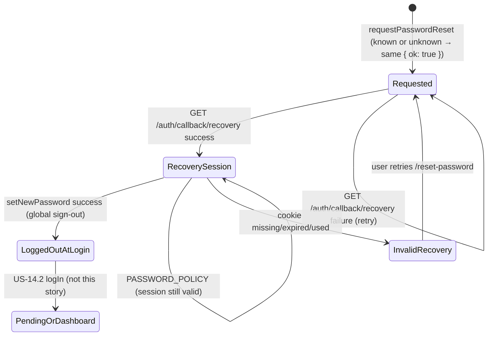

Reviewed by FE: yes — 2026-08-28

# API Contract — US-14.4 Reset forgotten password

**Story:** US-14.4  
**Status:** FE signed off  
**Security:** `plan/stories/US-14.4/SECURITY.md` (binding)  
**Identity seam:** `lib/auth/get-current-user.ts` (unchanged until US-14.5)  
**Extends:** `plan/stories/US-14.1/CONTRACT.md` (error envelope, forbidden keys, password policy types, `neuramark_auth_attempts`) and `plan/stories/US-14.2/CONTRACT.md` (cookie adapter, Path A confirmation callback)

**FE notes (frozen):** check-email stays inline on `/reset-password` after `{ ok: true }` and `RATE_LIMITED` (signup CheckEmailView pattern); set-password is `/reset-password/new` (not `/reset-password/set`); callback failure `/reset-password/new?error=invalid`; post-success `router.push(result.redirectTo)` (`/login?reset=1`, add `auth.login.resetSuccess` at BUILD); `recoveryReady: boolean` from the Server Component is enough — no session-check action.

---

## Overview

Password recovery is two CSRF-protected Server Actions plus **one** dedicated recovery Route Handler. The browser never receives Supabase tokens, keys, `token_hash`, `code`, `role`, `active`, `auth_user_id`, or `client_id`. Recovery tokens are exchanged **server-side** on `GET /auth/callback/recovery`. The set-password page is authorized by an httpOnly recovery session cookie only.

Request-reset is enumeration-safe: known and unknown emails share one success body and copy. A successful reset grants **credential access only** — never product access, never a write to `neuramark_clients.active` or `role`. After set-password: global sign-out, clear cookies, land on **`/login`**.

**Frontend consumers**

| Consumer | Route (planned) | Contract surface |
|----------|-----------------|------------------|
| Forgot-password form | `app/(auth)/reset-password/page.tsx` | Server Action `requestPasswordReset` |
| Check-email state | Same route `/reset-password` after `{ ok: true }` or request-reset `RATE_LIMITED` | Not a separate API — FE success/throttle UI |
| Recovery email link | `{SITE_URL}/auth/callback/recovery` | Route Handler `GET /auth/callback/recovery` |
| Set-new-password form | `app/(auth)/reset-password/new/page.tsx` | Server Action `setNewPassword`; Server Component prop `recoveryReady` |
| Invalid / expired token | Same set-password route (`?error=invalid` and/or `recoveryReady === false`) | Callback 302 + page render — not a JSON API |
| Post-reset banner | Login page query `reset=1` | `setNewPassword` success `redirectTo` only — not a JSON API |
| Login “Forgot your password?” | Already `LoginForm` → `/reset-password?locale=` | Implement this route; do not invent a second forgot-password URL |

**Server-only modules (not in contract types; BUILD)**

| Module | Purpose |
|--------|---------|
| `lib/auth/password-policy.ts` | Reuse `validatePassword` (12–128, common-password denylist). Do not fork. |
| `lib/auth/rate-limit.ts` | Add `isPasswordResetRateLimited` (mirror `isResendConfirmationRateLimited`). Action `password_reset_request`. |
| `lib/auth/forbidden-fields.ts` | Request-reset: same privilege keys as resend. Set-password: those keys **plus** `confirmPassword` / `confirm_password`. |
| `lib/auth/errors.ts` | Reuse envelope helpers; request-reset 429 uses **check-email** `messageKey`; add recovery-invalid helper at BUILD |
| `lib/auth/get-client-ip.ts`, `lib/auth/hash.ts` | IP + HMAC as US-14.1 |
| `lib/auth/supabase-cookie.ts` | User-scoped cookie client for `verifyOtp` / `exchangeCodeForSession` / `updateUser` / `signOut({ scope: "global" })` |
| Existing service-role client | `neuramark_auth_attempts` writes only. `persistSession: false`. **Must not** mint recovery cookies. **Must not** `verifyOtp` recovery tokens. |
| `lib/auth/send-signup-confirmation.ts` pattern | Recovery `emailRedirectTo` from server-only `SITE_URL` → `{origin}/auth/callback/recovery` |

---

## Frozen decisions

| Topic | Freeze |
|-------|--------|
| Surfaces | **Two** Server Actions (`requestPasswordReset`, `setNewPassword`) and **one** recovery Route Handler. No `@supabase/supabase-js` / tokens / keys in the browser. No second undocumented reset path. |
| Recovery callback | **`GET /auth/callback/recovery`**. `emailRedirectTo` = `{SITE_URL origin}/auth/callback/recovery` — **not** `/auth/callback`. |
| Exchange | Prefer `token_hash` + `type=recovery` via `verifyOtp` on the **user-scoped** cookie client. Also accept PKCE `code` via `exchangeCodeForSession` on the same client when `token_hash` is absent. |
| Success 302 | Token-free **`/reset-password/new`**. |
| Failure 302 | **`/reset-password/new?error=invalid`**. One failure for missing, expired, used, and provider `error` / `error_description`. Expire `sb-*` on failure. |
| Open redirect | Callback **ignores** `next` / `redirect_to` / `redirectTo`. Relative `Location` only. Never `Host` / `X-Forwarded-Host`. |
| Path A | Confirmation only. **Remove `"recovery"` from Path A’s `verifyOtp` allowlist at BUILD.** If `type=recovery` hits `/auth/callback`, **do not** consume the token; 302 to `/auth/callback/recovery` with the same query. If `token_hash` is present and `type` is **missing or unknown**, same forward (do not 302 `/login?error=confirmation`). Signup/email landings stay `/login?confirmed=1` / `/login?error=confirmation`. |
| Request-reset success | Known and unknown: `{ ok: true }`. FE always shows check-email. Never `USER_NOT_FOUND`. |
| Request-reset 429 | Logical **429**, `code: "RATE_LIMITED"`, **`messageKey: "auth.reset.checkEmail"`** (same user-facing copy as success — **not** `auth.errors.rateLimited`). |
| Set-password success | `{ ok: true, redirectTo: "/login?reset=1" }` **only after** global sign-out succeeds. Clear cookies either way. If sign-out still fails after one retry → `INTERNAL_ERROR` (not `{ ok: true }`). Never `/dashboard` or `/pending`. |
| Invalid recovery session | Logical **401**, `code: "RECOVERY_INVALID"`, `messageKey: "auth.reset.invalidToken"`. Same copy as callback failure. Retry → `/reset-password`. |
| Cookie presence | Set-password page learns the session exists via **httpOnly cookie + Server Component** (`recoveryReady: boolean`). Token never in the page URL, HTML, JSON, or client JS. |
| OTP | Single-use; expire **≤ 1 hour** (Supabase Auth project config, not a `neuramark_` migration). |
| Rate limit | **3 / email / hour AND 10 / IP / hour**, action `password_reset_request`. No new table or enum. Set-password is **not** a second attempt counter. Fail closed. |
| `getCurrentUser()` | Unchanged (hardcoded local user) until US-14.5. Recovery session ≠ product identity. Do **not** use `getCurrentUser()` to gate set-password. |

---

## Server Action: `requestPasswordReset`

**File (BUILD):** `lib/auth/actions/request-password-reset.ts` (`"use server"`)  
**Signature:**

```ts
export async function requestPasswordReset(
  input: RequestPasswordResetInput
): Promise<RequestPasswordResetResult>;
```

**Purpose:** Trigger a Supabase Auth recovery email (`resetPasswordForEmail` or equivalent) **server-side**. Always return the same generic success for known and unknown emails. Absorb “user not found” and send-failures that only occur for existing users.

**Frontend consumer:** Forgot-password form on `app/(auth)/reset-password/` (PrimeReact email field, `AuthShell`). After `{ ok: true }` **or** `RATE_LIMITED`, show the generic check-email screen **on the same route** (success state — no sibling URL that could look like an existence oracle). Link back to `/login?locale=`.

**CSRF:** Next.js Server Action built-in origin check (POST from same origin only). Same pattern as `signUp` / `logIn`. No GET can trigger a recovery email.

### Request

Allowed keys only: `email`.

| Field | Type | Rules |
|-------|------|--------|
| `email` | string | trim, max 320, valid email, stored/compared lowercased |

**Forbidden keys** (reject **before** Zod): `role`, `active`, `auth_user_id`, `authUserId`, `client_id`, `clientId`. Presence → `400 FORBIDDEN_FIELDS`. Do not process the rest of the payload.

`.strict()` on the Zod object rejects any other extra keys as `VALIDATION_ERROR` (safe; does not reveal account existence).

No password on this hop. `confirmPassword` is not a request-reset field (extra key → `VALIDATION_ERROR` via `.strict()`).

### Processing order (server)

1. Reject forbidden top-level keys → `400 FORBIDDEN_FIELDS`
2. Zod-parse `RequestPasswordResetInput` → `400 VALIDATION_ERROR` + `fields` on malformed email
3. Record `password_reset_request` in `neuramark_auth_attempts` (HMAC `ip_hash` + `email_hash`) — **fail closed** (store error → treat as limited)
4. Rate-limit check: **3 per `email_hash` per hour AND 10 per `ip_hash` per hour** — **fail closed** → logical `429 RATE_LIMITED` with **check-email** `messageKey`
5. `resetPasswordForEmail` (or equivalent) via the appropriate **server** Auth client — **always called** on a valid, not-yet-limited shape, including unknown emails, unconfirmed, inactive, and active. No app early-return on “user not found.” No `neuramark_clients` lookup to decide whether to send.
6. Absorb Auth “user not found” (and equivalent). Map provider/send failures that **only** occur for existing users to `{ ok: true }` (log server-side). **Never** return `INTERNAL_ERROR` / distinct copy solely because the auth user exists but send failed.
7. Return `{ ok: true }`.
8. Top-level try/catch → `INTERNAL_ERROR` only for failures that also occur for unknown emails (e.g. unconfigured Supabase).

**`emailRedirectTo`:** `{SITE_URL origin}/auth/callback/recovery`. Server-only `SITE_URL` as the allowlisted public origin (reuse / extend `getSignupEmailRedirectTo()`). Never copy request `Host` / `X-Forwarded-Host`. `VERCEL_URL` fallback is allowed (same as signup — not attacker Host). If origin cannot be resolved safely, **omit** `emailRedirectTo` rather than copying the request host. Document `{SITE_URL}/auth/callback/recovery` on the Supabase Auth redirect allowlist (`.env.example`).

Do **not** read or write `neuramark_clients.active` or `role`. Same observable flow for active, inactive, and unconfirmed.

Never log the email in a way that pairs it with a distinct outcome; never log tokens.

### Success response

```ts
{ ok: true }
```

FE always shows generic check-email copy (`auth.reset.checkEmail`). Do **not** show “account not found” or “email sent to X” that differs by existence.

### Error envelope

Reuse US-14.1 `authErrorEnvelopeSchema`.

---

## Server Action: `setNewPassword`

**File (BUILD):** `lib/auth/actions/set-new-password.ts` (`"use server"`)  
**Signature:**

```ts
export async function setNewPassword(
  input: SetNewPasswordInput
): Promise<SetNewPasswordResult>;
```

**Purpose:** Validate the recovery session from the httpOnly cookie, enforce the shared password policy, apply the new password via Supabase Auth, globally revoke sessions, clear cookies, return an opaque login path.

**Frontend consumer:** Set-new-password form on `app/(auth)/reset-password/new/` (PrimeReact password + confirm). Client-side match is UX only — `confirmPassword` stays **off the wire**. After `{ ok: true }`, `router.push(result.redirectTo)` (login). Clear password fields from client state after submit.

**CSRF:** Next.js Server Action built-in origin check (POST from same origin only). GET cannot change a password.

### Request

Allowed keys only: `password`.

| Field | Type | Rules |
|-------|------|--------|
| `password` | string | min 1, max 128 on the wire; **server** then runs `validatePassword` (12–128, common-password denylist). Client length/match hints are presentation only. |

**Forbidden keys** (reject **before** Zod): `role`, `active`, `auth_user_id`, `authUserId`, `client_id`, `clientId`, `confirmPassword`, `confirm_password`. Presence → `400 FORBIDDEN_FIELDS`.

`.strict()` rejects any other extra keys as `VALIDATION_ERROR`.

The client **does not** send `token_hash`, `code`, `type`, or a user id. The recovery session cookie is the capability.

### Processing order (server)

1. Reject forbidden top-level keys → `400 FORBIDDEN_FIELDS`
2. Zod-parse `SetNewPasswordInput` → `400 VALIDATION_ERROR` + `fields`
3. `validatePassword` (US-14.1 module) → `400 PASSWORD_POLICY` + `passwordPolicy` enum. Distinct from recovery-invalid — the attacker already holds the recovery session.
4. Require recovery session from cookie: `getUser()` (or equivalent) on the **user-scoped** cookie client. No request `userId`. Missing / invalid session → `RECOVERY_INVALID` (same copy as callback failure; retry to `/reset-password`).
5. `updateUser({ password })` (or equivalent) on that same user-scoped client. Password change invalidates outstanding recovery tokens (provider behavior).
6. `signOut({ scope: "global" })` (or equivalent refresh-token revocation) so a stolen session does not survive recovery. Retry once on error or throw. Log `code`/`status` only — never the password.
7. Expire `sb-*` cookies with the **same name / path / host-only attributes** used to set them — **whether or not** global sign-out succeeded.
8. Return `{ ok: true, redirectTo: "/login?reset=1" }` **only if** global sign-out succeeded. If it still fails after the retry, return `INTERNAL_ERROR` (do **not** report recovery finished while other sessions may still be live).
9. Top-level try/catch → `INTERNAL_ERROR` (no Supabase text). Never log or echo the password (`redactAuthPayload`).

Do **not** INSERT/UPDATE/DELETE `neuramark_clients`. Do **not** write `active` or `role`. Do **not** 302 or return a `redirectTo` of `/dashboard`, `/pending`, or any product route.

Unconfirmed accounts: if Supabase confirms email as a provider side effect of recovery / `verifyOtp` / `updateUser`, that is **provider behavior** — do not invent an app-side confirm write and **never** set `neuramark_clients.active`. Observable reset responses stay identical for unconfirmed vs confirmed.

### Success response

Cookie is **not** in this body (and must not remain on the client after this action).

```ts
{
  ok: true;
  redirectTo: "/login?reset=1"; // frozen relative path; FE must router.push this as-is
}
```

**FE rule:** After success, navigate to `result.redirectTo`. Do **not** send the user to dashboard or pending from this story. US-14.2 `logIn` then chooses dashboard vs pending.

### Invalid / expired token (JSON)

When the recovery cookie is missing, expired, already used, or `getUser()` fails:

```ts
{
  ok: false;
  error: {
    code: "RECOVERY_INVALID";
    messageKey: "auth.reset.invalidToken";
  };
}
```

Logical **401**. Same user-facing copy as the page-level callback failure. FE shows the error plus a retry link to `/reset-password`. Do **not** echo Supabase error text.

---

## HTTP semantics (Server Actions)

Server Actions do not expose REST paths; status codes below are **logical** codes for logging, monitoring, and tests.

### `requestPasswordReset`

| Outcome | HTTP | Body | FE behavior |
|---------|------|------|-------------|
| Known email | 200 | `{ ok: true }` | Check-email screen (same route) |
| Unknown email | 200 | `{ ok: true }` | **Same** check-email screen |
| Unconfirmed / inactive / active | 200 | `{ ok: true }` | **Same** check-email screen |
| Provider send-failure that only occurs for existing users | 200 | `{ ok: true }` | **Same** check-email screen (log server-side) |
| Over-limit or rate-limit store failure | 429 | `RATE_LIMITED` + **`auth.reset.checkEmail`** | **Same check-email copy** as success; do **not** use `auth.errors.rateLimited`; do not branch on email existence |
| Malformed email | 400 | `VALIDATION_ERROR` + `fields` | Field errors (format only) |
| Forbidden extra fields | 400 | `FORBIDDEN_FIELDS` | Generic error (`auth.errors.forbiddenFields`) |
| Unexpected server failure (unknown-user-safe) | 500 | `INTERNAL_ERROR` | Generic error (`auth.errors.internal`) |

**Enumeration rule:** The only responses that differ from generic check-email are `400` validation / forbidden fields (safe — they do not reveal existence) and `500` unknown-user-safe internal errors. Known vs unknown vs unconfirmed vs inactive MUST share `{ ok: true }`. 429 uses the **same user-facing copy** as success. Record **every** well-formed submitted email (known or unknown) so 429 vs 200 is not an existence oracle.

### `setNewPassword`

| Outcome | HTTP | Body | FE behavior |
|---------|------|------|-------------|
| Password updated, sessions revoked | 200 | `{ ok: true, redirectTo: "/login?reset=1" }` | `router.push(redirectTo)`; clear password fields |
| Password updated, global sign-out failed | 500 | `INTERNAL_ERROR` | Generic error; local cookies already discarded |
| Missing / invalid / expired recovery session | 401 | `RECOVERY_INVALID` + `auth.reset.invalidToken` | Invalid-token UI + retry to `/reset-password` |
| Password policy failure | 400 | `PASSWORD_POLICY` + `passwordPolicy` | Policy hint (length/common); session still valid until success |
| Malformed payload | 400 | `VALIDATION_ERROR` + `fields` | Field errors |
| Forbidden extra fields (`role`, `confirmPassword`, …) | 400 | `FORBIDDEN_FIELDS` | Generic error |
| Unexpected server failure | 500 | `INTERNAL_ERROR` | Generic error |

**i18n message keys (contract)**

| Key | When |
|-----|------|
| `auth.reset.checkEmail` | After `{ ok: true }` on request-reset **and** request-reset `RATE_LIMITED` |
| `auth.reset.invalidToken` | Callback failure page **and** `RECOVERY_INVALID` |
| `auth.login.resetSuccess` | Login banner on `/login?reset=1` (FE copy; not an action error) |
| `auth.errors.validation` | `VALIDATION_ERROR` |
| `auth.errors.forbiddenFields` | `FORBIDDEN_FIELDS` |
| `auth.errors.passwordPolicy` | `PASSWORD_POLICY` (FE may branch on `passwordPolicy` enum; reuse `auth.passwordPolicy.*`) |
| `auth.errors.internal` | `INTERNAL_ERROR` |

Do **not** use `auth.errors.rateLimited` on the forgot-password form (that key remains for signup/resend 429 copy). Do **not** use `auth.login.genericFailure` here.

---

## Recovery callback: `GET /auth/callback/recovery`

**File (BUILD):** `app/auth/callback/recovery/route.ts`  
**Method / path:** `GET /auth/callback/recovery`  
**Frontend consumer:** Recovery email link (`emailRedirectTo` = `{SITE_URL}/auth/callback/recovery` from `requestPasswordReset`). **Not** called from Client Component JS. Client Components must not read `token_hash`, `code`, or `type`.

**E2E path (must prove this, not Path A):**

```text
forgot-password form → requestPasswordReset
  → email link → GET /auth/callback/recovery?token_hash=…&type=recovery
              or GET /auth/callback/recovery?code=…  (PKCE when token_hash absent)
  → verifyOtp / exchangeCodeForSession on user-scoped cookie client
  → 302 Location: /reset-password/new   (token-free)
set-password form → setNewPassword → global sign-out →  { ok: true, redirectTo: "/login?reset=1" }
password login with the new password (US-14.2 logIn)
```

### Query params (untrusted)

| Param | Use |
|-------|-----|
| `token_hash` + `type=recovery` | **Preferred.** Verified **server-side** with `verifyOtp` on the **user-scoped** cookie client (mints the set-password session; does not require a PKCE verifier cookie). Never logged. Never copied into `Location`, HTML, JSON, or JS. |
| `code` | One-time PKCE Auth code. Exchanged **server-side** immediately when `token_hash` is absent. Same user-scoped client. Never logged. Never copied into `Location`, HTML, JSON, or JS. |
| `error`, `error_description` | Provider error query. **Never echoed.** Map to the generic recovery-failure landing. Ignored in `Location` even when present. |
| `next`, `redirect_to`, `redirectTo` | **Ignored.** Unsafe or any value still lands on the frozen URLs below — never an external URL, never `/dashboard` / `/pending` / `/login?confirmed=1`. |
| `type` other than `recovery` when `token_hash` is present | Do **not** `verifyOtp`. Generic recovery failure. Do not consume as confirmation. |
| `type` present and not `recovery` when only `code` is present | Do **not** `exchangeCodeForSession`. Generic recovery failure. |
| `type` absent + `code` present | Treat as recovery PKCE; `exchangeCodeForSession`. (Confirmation emails must not use this callback — see Path A.) |

Other query keys are ignored.

**Client selection:** user-scoped `@supabase/ssr` client + server-only anon/publishable key. Service-role stays `persistSession: false` and is **not** the recovery `verifyOtp` / cookie adapter. Never `verifyOtp` recovery on service-role (consumes the token, mints no user session).

**Fixation:** on successful exchange, issue a **fresh** cookie value; discard any pre-existing `sb-*` identifier.

The handler is GET (email link). CSRF origin checks do not apply the same way; the token is the capability. Limit the handler to: exchange or reject, set recovery cookies on success, 302. No other mutations. No product landing.

### Redirects (relative `Location` only)

Build **app-relative** 302 targets (leading `/`). Do not construct absolute URLs from `Host`, `X-Forwarded-Host`, or attacker-controlled origins.

| Outcome | Status | `Location` | Session cookie |
|---------|--------|------------|----------------|
| Valid `token_hash`+`type=recovery`, `verifyOtp` succeeds | 302 | `/reset-password/new` | **Set** — user-scoped recovery session (set-password only) |
| Valid `code`, PKCE exchange succeeds (`token_hash` absent) | 302 | `/reset-password/new` | **Set** — same flags |
| Missing/invalid/expired/used `token_hash` or `code`; `token_hash` without `type=recovery`; other `type` | 302 | `/reset-password/new?error=invalid` | **None left** — expire any `sb-*` |
| `error` / `error_description` present | 302 | `/reset-password/new?error=invalid` | Expire any `sb-*` |
| Verify / exchange throws / provider failure | 302 | `/reset-password/new?error=invalid` | Expire any `sb-*` |

All failure rows share **one** recovery-failure page and copy (`auth.reset.invalidToken`). No Supabase text. Same landing whether the token is missing, expired, or already used. Retry path: link to `/reset-password`.

**Required 302 headers:**

- `Referrer-Policy: no-referrer`
- `Cache-Control: private, no-cache, no-store, must-revalidate, max-age=0` (match Path A)
- `Location` is token-free: never `token_hash`, `code`, `type`, access_token, refresh_token, `error_description`, or `next`

**Allowlisted set-password query:** `locale` (existing i18n), `error=invalid`. Never `email`, `code`, tokens, or `error_description`.

**This flow never 302s to** `/dashboard`, `/pending`, `/login?confirmed=1`, or any product route.

---

## How the set-password page knows the recovery session exists (cookie-only)

There is **no** JSON “session check” API and **no** token in the page.

1. **Callback success** sets httpOnly `sb-*` cookies and 302s to **`/reset-password/new`** with a **token-free** query.
2. **`/reset-password/new` is a Server Component.** It calls a **server-only** helper (BUILD, e.g. cookie-client `getUser()` — **not** `getCurrentUser()`, which stays hardcoded until US-14.5). That helper is **not** a product identity API: it returns whether a recovery session cookie is present and valid.
3. The Server Component passes **`recoveryReady: boolean`** into the Client form. Never email, display name, user id, `active`, `role`, tokens, or cookie values.
4. **`recoveryReady === true`:** render the password + confirm form. Submit calls `setNewPassword` (cookie goes automatically; the action does not accept a token).
5. **`recoveryReady === false`:** render the same invalid/expired UI as `?error=invalid` (copy `auth.reset.invalidToken`) plus retry to `/reset-password`. Do not render an enabled set-password submit. If the Client still calls `setNewPassword`, the action returns `RECOVERY_INVALID` (same copy).
6. Callback **failure** 302s to `/reset-password/new?error=invalid` (still token-free). The page shows the same invalid UI whether the signal is the query flag, a missing cookie, or both.

**FE rules:**

- Client Components must **not** read `token_hash`, `code`, `type`, or `document.cookie` for this flow.
- The set-password page (and the callback 302) send **`Referrer-Policy: no-referrer`**.
- Set-password page: `Cache-Control: no-store` (do not cache a page that depended on a one-time recovery cookie).

Until US-14.5, a leftover recovery cookie plus hardcoded `getCurrentUser()` can still render product pages if the user **navigates** there. Sanctioned interim — not a US-14.4 defect. This flow must **not redirect** to product routes. After successful set-password the cookies are gone.

---

## Path A defense (`GET /auth/callback` — this story may change the file only for this)

**File (BUILD):** `app/auth/callback/route.ts` (existing US-14.2 Path A)

Confirmation Path A stays frozen for `type=signup` / `type=email`: landings remain `/login?confirmed=1` and `/login?error=confirmation`. **Do not** share those with reset.

**Required changes at BUILD (document now):**

1. **Remove `"recovery"` from Path A’s `verifyOtp` type allowlist** (`EMAIL_OTP_TYPES` / equivalent). Path A must not call `verifyOtp` or `exchangeCodeForSession` for `type=recovery`.
2. **If `type=recovery`** (with or without `token_hash` / `code` / provider `error`): **do not** consume the token. **302** to `/auth/callback/recovery` **preserving the query** (relative `Location`, `Referrer-Policy: no-referrer`). Never 302 `/login?confirmed=1` for recovery.
3. **If `token_hash` is present and `type` is missing or unknown** (not in Path A’s confirmation allowlist): same 302 to `/auth/callback/recovery` with the same query — do **not** 302 `/login?error=confirmation`. `type=signup` / `type=email` (and other confirmation allowlist types) stay on Path A.
4. PKCE `code` **without** `type=recovery` on `/auth/callback` remains confirmation Path A (cannot distinguish recovery PKCE). Therefore recovery emails **must not** use `/auth/callback` as `emailRedirectTo`.

Forwarding must not log the query. Strip nothing the recovery handler needs (`token_hash`, `type`, `code`, `error`, `error_description`); the recovery handler still **ignores** `next` / `redirect_to`.

---

## Cookie semantics (recovery session — not a JSON field)

On **recovery callback success only**:

| Attribute | Value |
|-----------|--------|
| Mechanism | `@supabase/ssr` cookie adapter (`createServerClient` get/set on the 302 response) |
| Name / shape | Host-only `sb-*` (same as login). Must be readable later by US-14.5 `getCurrentUser()` — no parallel `neuramark_reset` JWT, no `client_id` cookie. |
| `HttpOnly` | true |
| `Secure` | true when `NODE_ENV === "production"` |
| `SameSite` | `Lax` |
| `Path` | `/` |
| `Domain` | **unset** (host-only) |
| Claims | **Identity only** (Supabase Auth session). Do **not** bake `active`, `role`, or `client_id` into cookie values. |
| Rotation | Successful exchange always issues a **fresh** cookie value; discard any pre-existing `sb-*` identifier (fixation). |
| Authorization | **Set-password only.** This flow never 302s to product routes. |
| Body / JS | Access token, refresh token, `token_hash`, `code`, and cookie value **never** appear in JSON, HTML, `Location`, logs, or client JS. |
| Service-role | Existing server client stays `persistSession: false` and is **not** the cookie client. |
| After `setNewPassword` success | `signOut({ scope: "global" })` **then** expire cookies with matching name/path/host attributes. Cookies must not remain. If global sign-out fails after one retry, still expire cookies and return `INTERNAL_ERROR` — never `{ ok: true }`. |
| After callback failure | Expire any `sb-*`. |
| Max-Age | Follow `@supabase/ssr` defaults. |

---

## Zod schemas (`lib/contracts/auth.ts`)

Additive only. US-14.1 signup / resend and US-14.2 login exports stay unchanged. FE imports **types only**. Password policy validation stays server-side.

### Error code enum (extended)

```ts
export const authErrorCodeSchema = z.enum([
  "VALIDATION_ERROR",
  "FORBIDDEN_FIELDS",
  "PASSWORD_POLICY",
  "RATE_LIMITED",
  "INTERNAL_ERROR",
  "INVALID_CREDENTIALS", // US-14.2 login only
  "RECOVERY_INVALID",    // US-14.4 set-password / missing recovery session
]);
```

`authAttemptActionSchema` already includes `password_reset_request` from US-14.1. **Do not** add a set-password / `password_reset` enum value.

`passwordPolicyViolationSchema` is unchanged (`TOO_SHORT` | `TOO_LONG` | `COMMON_PASSWORD`). Reuse on set-password.

### Request / success / result

```ts
export const requestPasswordResetInputSchema = z
  .object({
    email: z
      .string()
      .trim()
      .min(1)
      .max(320)
      .email()
      .transform((v) => v.toLowerCase()),
  })
  .strict();
export type RequestPasswordResetInput = z.infer<
  typeof requestPasswordResetInputSchema
>;

export const requestPasswordResetSuccessSchema = authGenericSuccessSchema;
export type RequestPasswordResetSuccess = z.infer<
  typeof requestPasswordResetSuccessSchema
>;

export const requestPasswordResetResultSchema = z.discriminatedUnion("ok", [
  requestPasswordResetSuccessSchema,
  authErrorEnvelopeSchema,
]);
export type RequestPasswordResetResult = z.infer<
  typeof requestPasswordResetResultSchema
>;

export const setNewPasswordInputSchema = z
  .object({
    password: z.string().min(1).max(128),
  })
  .strict();
export type SetNewPasswordInput = z.infer<typeof setNewPasswordInputSchema>;

export const setNewPasswordSuccessSchema = z.object({
  ok: z.literal(true),
  redirectTo: z.literal("/login?reset=1"),
});
export type SetNewPasswordSuccess = z.infer<typeof setNewPasswordSuccessSchema>;

export const setNewPasswordResultSchema = z.discriminatedUnion("ok", [
  setNewPasswordSuccessSchema,
  authErrorEnvelopeSchema,
]);
export type SetNewPasswordResult = z.infer<typeof setNewPasswordResultSchema>;
```

Sketches live in `lib/contracts/auth.ts` (this story). Cookie/session I/O, `SITE_URL` resolution, and `validatePassword` stay server-only at BUILD.

---

## Database

No new tables, columns, enums, indexes, or RLS policies.

Recovery tokens are owned by **Supabase Auth**. Rate limits reuse `neuramark_auth_attempts`.

### `neuramark_auth_attempts` (`password_reset_request` only)

Reuse US-14.1 table and enum value `password_reset_request` on `public.neuramark_auth_action` (reserved in US-14.1 for this story). HMAC `ip_hash` / `email_hash` as today. Never store password, raw IP, plaintext email, or recovery tokens in `neuramark_*`.

| Rule | Value |
|------|--------|
| Action written | `password_reset_request` only |
| Window | 1 hour |
| Email cap | **3** per `email_hash` |
| IP cap | **10** per `ip_hash` |
| Over-limit | logical 429, **check-email copy** |
| Store/count error | **fail closed** → same 429 |
| Record | **Every** well-formed submitted email (known or unknown) |
| Set-password attempts | **Not** written (token-gated; no new enum) |

**Indexes (existing — sufficient; do not add objects unless measured):**

- `neuramark_auth_attempts_ip_action_time_idx` `(ip_hash, action, attempted_at DESC)` — covers 10/IP/hour
- `neuramark_auth_attempts_email_action_time_idx` `(email_hash, action, attempted_at DESC) WHERE email_hash IS NOT NULL` — covers 3/email/hour

Count query: `action = 'password_reset_request'` AND hash AND `attempted_at >= now() - 1 hour`.

### Rate-limit queries (this story)

| Action | Window | Key | Max |
|--------|--------|-----|-----|
| `password_reset_request` | 1 hour | `email_hash` | 3 |
| `password_reset_request` | 1 hour | `ip_hash` | 10 |

Either cap exceeded → limited. Supabase Auth built-in rate limits remain the second layer.

### `neuramark_clients`

**No app read for branching. No app write.** Reset does not create or delete client rows. Reset never `UPDATE`s `active` or `role`. RLS stays deny-by-default (US-14.5). Attempts writes use the service-role client only.

### OTP / recovery token config (ops — not a migration)

Document in `.env.example` / ops notes (BUILD):

| Setting | Freeze |
|---------|--------|
| Supabase Auth email OTP / recovery token expiry | **≤ 1 hour** (e.g. Mailer OTP expiry ≤ 3600 seconds) |
| Token use | **Single-use** |
| Password change | Invalidates outstanding recovery tokens (provider behavior) |
| Used or expired token | Cannot set a password |

Not a `neuramark_` table or trigger. **BUILD:** documented in `.env.example` (redirect allowlist `{SITE_URL}/auth/callback/recovery` + Mailer OTP expiry ≤ 3600s). Configure in the Supabase dashboard (Authentication → URL configuration / Emails).

---

## State transitions



| State | Auth | `neuramark_clients` | This story |
|-------|------|---------------------|------------|
| Unknown email | — | — | `{ ok: true }` check-email (no email sent by provider) |
| Unconfirmed | exists, email not confirmed | row usually exists, `active=false` | Same request-reset + set-password flow. Provider may confirm email as a side effect — **never** set `active` |
| Confirmed inactive | confirmed | `active=false` | Same flow. Success → `/login`, not `/pending` |
| Active | confirmed | `active=true` | Same flow. Success → `/login`, not `/dashboard` |
| Recovery session | recovery cookie set | unchanged | Authorizes `setNewPassword` only |
| After successful reset | new password; all sessions revoked | **unchanged** (`active` / `role` untouched) | Cookies cleared; land `/login?reset=1` |

Old password no longer works after success; login with the new password is proven against US-14.2 `logIn`, not a new login path.

### `neuramark_client_role` / `active`

No transitions in this story. Operator SQL only (US-14.1).

---

## Fixtures (FE mocking)

### `requestPasswordReset` — known email (happy path)

**Request**

```json
{ "email": "maria.garcia@example.com" }
```

**Response** `200`

```json
{ "ok": true }
```

FE shows check-email (`auth.reset.checkEmail`).

---

### `requestPasswordReset` — unknown email (must match known)

**Request**

```json
{ "email": "nobody@example.com" }
```

**Response** `200`

```json
{ "ok": true }
```

Identical status, body shape, and copy.

---

### `requestPasswordReset` — unconfirmed or inactive (must match known)

Same `{ ok: true }`. FE cannot tell confirmation or activation state from this action.

---

### `requestPasswordReset` — validation error

**Request**

```json
{ "email": "not-an-email" }
```

**Response** `400`

```json
{
  "ok": false,
  "error": {
    "code": "VALIDATION_ERROR",
    "messageKey": "auth.errors.validation",
    "fields": {
      "email": ["invalid_format"]
    }
  }
}
```

---

### `requestPasswordReset` — forbidden fields

**Request**

```json
{
  "email": "attacker@example.com",
  "role": "operator",
  "active": true
}
```

**Response** `400`

```json
{
  "ok": false,
  "error": {
    "code": "FORBIDDEN_FIELDS",
    "messageKey": "auth.errors.forbiddenFields"
  }
}
```

---

### `requestPasswordReset` — rate limited (same user-facing copy as success)

**Response** `429`

```json
{
  "ok": false,
  "error": {
    "code": "RATE_LIMITED",
    "messageKey": "auth.reset.checkEmail"
  }
}
```

FE displays the **same check-email screen** as `{ ok: true }`. Do not infer that the email is registered. Do not show `auth.errors.rateLimited`.

---

### `GET /auth/callback/recovery` — success (preferred OTP)

**Request:** `GET /auth/callback/recovery?token_hash=…&type=recovery`

**Response:** `302`  
**Headers:**

- `Location: /reset-password/new`
- `Referrer-Policy: no-referrer`
- `Cache-Control: private, no-cache, no-store, must-revalidate, max-age=0`
- `Set-Cookie` for host-only `sb-*` (httpOnly recovery session)

No JSON body. `token_hash`, `code`, `type`, `next`, and `error_description` must not appear in `Location`.

---

### `GET /auth/callback/recovery` — success (PKCE)

**Request:** `GET /auth/callback/recovery?code=pkce-or-auth-code-from-email` (`token_hash` absent)

**Response:** same 302 as OTP success (`Location: /reset-password/new`, no-referrer, session cookies).

---

### `GET /auth/callback/recovery` — generic recovery failure

Examples that must share this landing:

- `GET /auth/callback/recovery` (no `code` and no `token_hash`)
- `GET /auth/callback/recovery?token_hash=…` (missing or non-`recovery` `type`)
- `GET /auth/callback/recovery?error=access_denied&error_description=...`
- `GET /auth/callback/recovery?code=expired-or-reused`
- `GET /auth/callback/recovery?token_hash=expired-or-reused&type=recovery`

**Response:** `302`  
**Headers:**

- `Location: /reset-password/new?error=invalid`
- `Referrer-Policy: no-referrer`
- `Set-Cookie` clearing any `sb-*`

FE shows `auth.reset.invalidToken` plus retry to `/reset-password`. Must not render `error_description`.

---

### `GET /auth/callback` — Path A must not consume recovery (BUILD)

**Request:** `GET /auth/callback?token_hash=…&type=recovery`

**Response:** `302`  
**Headers:**

- `Location: /auth/callback/recovery?token_hash=…&type=recovery` (same query, relative)
- `Referrer-Policy: no-referrer`

**Must not** call `verifyOtp` / `exchangeCodeForSession`. **Must not** land on `/login?confirmed=1`.

Signup/email Path A is unchanged: `type=signup` / `type=email` still 302 `/login?confirmed=1` or `/login?error=confirmation`.

**Request (token_hash, missing/unknown type):** `GET /auth/callback?token_hash=…` (no `type`, or `type` not in the confirmation allowlist)

**Response:** `302`  
**Headers:**

- `Location: /auth/callback/recovery?token_hash=…` (same query, relative)
- `Referrer-Policy: no-referrer`

**Must not** call `verifyOtp`. **Must not** land on `/login?error=confirmation`.

---

### Set-password page — recovery ready (no action call yet)

Server Component → Client form:

```ts
{ recoveryReady: true }
```

Render password + confirm. No token in props, URL, or HTML.

---

### Set-password page — invalid / expired (no action call yet)

Either:

- URL `/reset-password/new?error=invalid`, or
- `{ recoveryReady: false }`

Same UI: `auth.reset.invalidToken` + link to `/reset-password`.

---

### `setNewPassword` — success

**Request**

```json
{
  "password": "correct-horse-battery-staple-2026"
}
```

`confirmPassword` is **not** sent.

**Response** `200`

```json
{
  "ok": true,
  "redirectTo": "/login?reset=1"
}
```

Cookies are cleared on this response. FE `router.push("/login?reset=1")` and shows `auth.login.resetSuccess` (login page already handles banners via searchParams — extend with `reset=1`).

---

### `setNewPassword` — password policy

**Request**

```json
{ "password": "password1234" }
```

**Response** `400`

```json
{
  "ok": false,
  "error": {
    "code": "PASSWORD_POLICY",
    "messageKey": "auth.errors.passwordPolicy",
    "passwordPolicy": "COMMON_PASSWORD"
  }
}
```

Recovery session remains until a successful set-password (or expiry). FE may use `auth.passwordPolicy.COMMON_PASSWORD`.

---

### `setNewPassword` — missing / expired recovery session

**Request** (valid password shape, no recovery cookie)

```json
{
  "password": "correct-horse-battery-staple-2026"
}
```

**Response** `401`

```json
{
  "ok": false,
  "error": {
    "code": "RECOVERY_INVALID",
    "messageKey": "auth.reset.invalidToken"
  }
}
```

Same copy as callback failure. Retry: `/reset-password`.

---

### `setNewPassword` — forbidden `confirmPassword` on the wire

**Request**

```json
{
  "password": "correct-horse-battery-staple-2026",
  "confirmPassword": "correct-horse-battery-staple-2026"
}
```

**Response** `400`

```json
{
  "ok": false,
  "error": {
    "code": "FORBIDDEN_FIELDS",
    "messageKey": "auth.errors.forbiddenFields"
  }
}
```

Same for `confirm_password`, `role`, `active`, `auth_user_id`, `client_id`.

---

### `setNewPassword` — validation error

**Request**

```json
{ "password": "" }
```

**Response** `400`

```json
{
  "ok": false,
  "error": {
    "code": "VALIDATION_ERROR",
    "messageKey": "auth.errors.validation",
    "fields": {
      "password": ["too_small"]
    }
  }
}
```

---

## Identity seam (unchanged in US-14.4)

`getCurrentUser()` in `lib/auth/get-current-user.ts` continues returning the hardcoded local user (`gaveho@gmail.com` / Gabriel Vega) until US-14.5.

This story must **not** introduce a second product identity API. The recovery cookie check on `/reset-password/new` is set-password gating only (`recoveryReady`). Product pages keep using `getCurrentUser()`.

Known interim: until US-14.5, a recovery session plus hardcoded `getCurrentUser()` can still render product pages if the user **navigates** there. This story must not **redirect** into product routes. Landing ≠ every-request guard.

---

## Out of scope

| Concern | Story |
|---------|--------|
| `getCurrentUser()` session swap; every-request `active` / spend / route guards; RLS policies; deny-by-default middleware; auth-route allowlist | US-14.5 |
| Logout UI (header/user menu) | US-14.3 — **global sign-out on successful reset is in scope here** |
| Path A landing changes for `type=signup` / `type=email` | Frozen — do not change |
| Operator activation UI; app writes to `active` / `role`; RBAC | Never this story |
| New `neuramark_auth_action` value for set-password; new tables/indexes | Not required |
| Instagram / spend-bearing / generation endpoints | Never this story |
| `AUTH_DEV_FALLBACK` or header/query identity | Do not add |

---

## FE questions

1. **Check-email placement:** **Confirmed.** Stay on **`/reset-password`** with a success state after `{ ok: true }` and after `RATE_LIMITED` (same copy). No `/reset-password/sent` sibling. Matches signup `CheckEmailView`.
2. **Set-password path:** **Confirmed.** **`/reset-password/new`**, callback success 302 there (token-free), failure **`/reset-password/new?error=invalid`**. Not `/reset-password/set`.
3. **Post-reset login banner:** **Confirmed.** `setNewPassword` returns `redirectTo: "/login?reset=1"`; login page extends existing banner handling (`confirmed` / `confirmationFailed`) with `reset=1` → `auth.login.resetSuccess` (add key at BUILD).
4. **Recovery-ready signal:** **Confirmed.** Server Component passes **`recoveryReady: boolean`** only — no session-check Server Action, no email on the page.

---

## FE signoff

- [x] Reviewed by FE: yes — 2026-08-28

---

## Changelog

| Date | Change |
|------|--------|
| 2026-08-28 | QA Medium #1: `{ ok: true }` only after global `signOut` succeeds; discard cookies either way; retry once then `INTERNAL_ERROR`. Low: Path A forwards `token_hash` with missing/unknown `type` to `/auth/callback/recovery` (signup/email Path A unchanged). FE re-signoff not required — success JSON shape and signup/email 302s unchanged. |
| 2026-08-28 | BUILD: OTP ≤ 1 hour and recovery redirect URL documented in `.env.example` (Supabase dashboard config; no migration) |
| 2026-08-28 | FE signoff: freeze check-email on `/reset-password`, set-password `/reset-password/new`, login `?reset=1` banner, `recoveryReady` from Server Component |
| 2026-08-28 | Initial contract (nextjs-backend): dedicated `GET /auth/callback/recovery`, request/set-password Server Actions, additive Zod types in `lib/contracts/auth.ts` |
