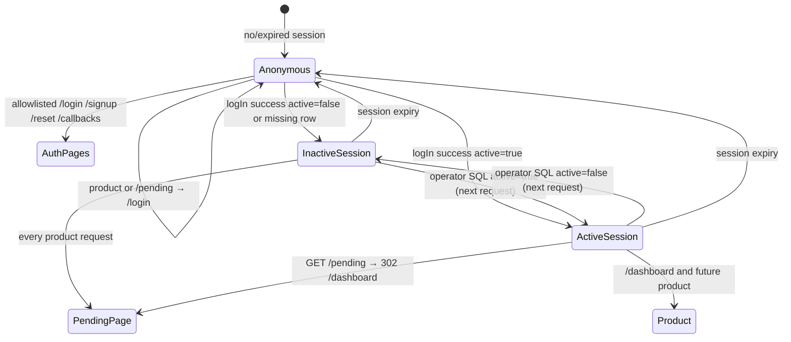

Reviewed by FE: yes — 2026-08-28

# API Contract — US-14.5 Session-backed identity and route protection

**Story:** US-14.5  
**Status:** FE signed off — 2026-08-28  
**Security:** `plan/stories/US-14.5/SECURITY.md` (binding — do not reopen frozen picks)  
**Identity seam:** `lib/auth/get-current-user.ts` (this story swaps internals; `CurrentUser` fields stay compatible)  
**Extends:** `plan/stories/US-14.2/CONTRACT.md` (httpOnly `sb-*` cookies, `logIn` landing, Path A) and `plan/stories/US-14.4/CONTRACT.md` (cookie adapter, recovery callback, `isRecoverySessionReady`)

**This document is CONTRACT ONLY.** Do not implement middleware, the `getCurrentUser()` swap, helpers, or the seed migration until FE signoff.

**Terminology:** Operator / operator SQL / service-role lookup. Do not use admin, administrador, or staff in this file, product copy, or examples.

---

## Overview

This story is the **authorization boundary** for the app. It does **not** add a login/signup/reset API. `logIn`, `signUp`, Path A, and recovery landings stay frozen.

What changes:

1. **`getCurrentUser()`** reads the httpOnly Auth session (`getUser()`) then `neuramark_clients` by `auth_user_id`. Default path no longer returns the hardcoded user.
2. **Every-request `active` gate** — pages → `/pending`; product Server Actions / Route Handlers → **403**, no side effects.
3. **Deny-by-default routing** — middleware is convenience (allowlist + cookie presence). Node `getCurrentUser()` / `requireActive()` / `requireOperator()` is the boundary.
4. **Seed** the local operator `neuramark_clients` row (lookup Auth by email; skip if missing; never write `auth.users`).
5. **Cookie idle ≤ 7 days** in `applySessionCookieFlags`.

**Frontend consumers**

| Consumer | Route | Contract surface |
|----------|-------|------------------|
| Dashboard + header | `app/(app)/layout.tsx` + `app/(app)/dashboard/layout.tsx` + `app/(app)/dashboard/page.tsx`, `components/layout/AppHeader.tsx` | Product **route group** layout calls `requireActive("page")` so new product pages inherit the gate. Nested dashboard layout may call it again for AppShell (idempotent via React `cache()`). URLs unchanged (`/dashboard`). AppHeader stays a Server Component under AppShell. Do **not** put the gate on root `app/layout.tsx` (wraps auth). |
| Home | `app/(app)/page.tsx` (`/`) | Under the product group (URL still `/`). Parent layout gates; page `redirect("/dashboard")`. See [Redirect table](#redirect-table). |
| Pending activation | `app/(auth)/pending/page.tsx` | **Not public.** Server Component loads identity via `loadPendingIdentity()` (at most `email` + `displayName`). No `sessionStorage` / `?email=`. |
| Auth pages | `/login`, `/signup`, `/reset-password`, `/reset-password/new` | Stay public. Live `sb-*` cookies must **not** 302 these to product. No “already signed in” bounce this story. |
| Auth callbacks | `GET /auth/callback`, `GET /auth/callback/recovery` | Stay public. Landings **frozen** (US-14.2 / US-14.4). |
| Auth Server Actions | `signUp`, `logIn`, `requestPasswordReset`, `setNewPassword`, `resendConfirmationEmail` | Stay callable **without** a product session. Do **not** call `requireActive()`. |

**No new JSON mutation for FE this story.** Product Server Actions / Route Handlers do not exist yet; `requireActive()` / `requireOperator()` are shipped so later handlers cannot skip the gate.

---

## Frozen decisions

Copied from SECURITY.md. Do not reopen.

| Topic | Freeze |
|-------|--------|
| Identity | **One** seam: `getCurrentUser()`. No `client_id` cookie, no `neuramark_session` JWT, no header/query identity. Cookie does **not** carry `active`, `role`, or `client_id`. Client Components never import `getCurrentUser()`. |
| `CurrentUser` fields | Unchanged: `id`, `email`, `displayName`, `preferredLocale`, `role`, `active`. `id` is always `neuramark_clients.id` when an object is returned. Return type becomes `CurrentUser \| null`. |
| Allowlist | Exact table below. **`/pending` is not public.** Do not allowlist locale prefixes, `/api/*`, or “anything under `(auth)`” (`(auth)` includes `/pending`). |
| Middleware | Convenience only. Cookie **presence** (`sb-*`) for the anon 302 shortcut — not the authorization boundary. **Required:** Edge refresh with the user-scoped anon/publishable key (`createServerClient` + `getUser()`) so rotated `sb-*` cookies are written on the document GET. **Do not** 302 from `getUser()` result. **Do not** read `neuramark_clients`. **No** identity headers. **No** service-role on Edge. RSC cookie adapter is **read-only** (`setAll` no-op). |
| Helpers | `requireActive()` before `requireOperator()`. Inactive operator has **no** access. Role never from the request. |
| Missing client row | Do **not** invent `CurrentUser`. Treat as not-active: pages → `/pending` (email from `getUser()` at most); handlers → 403. No repair `INSERT` from the seam. Same pending copy as inactive — no “profile missing.” |
| Dev fallback | `NODE_ENV === "development"` **AND** `AUTH_DEV_FALLBACK === "true"` (exact). Identity **fixed in code**. Production: throw at module evaluation if `AUTH_DEV_FALLBACK` is **any non-empty string** (including `"false"`). |
| Cookies | Clamp idle ≤ **7 days** (604800s) in `applySessionCookieFlags`. `maxAge: 0` / delete unchanged. Refresh server-side. Tokens never in JS/HTML/JSON. |
| Recovery leftover | **Real session + `active` gate** on product paths. `/reset-password` and `/reset-password/new` stay public. `isRecoverySessionReady()` stays boolean-only. Path A / recovery **landings frozen**. US-14.4 global sign-out after set-password still applies. |
| Seed | Lookup `auth.users` by `gaveho@gmail.com`. **If missing: NOTICE and skip** (do not fail closed on missing Auth user). Never write `auth.users`. Upsert error → fail the migration. Then operator SQL only. |
| RLS | Enabled, **zero** policies. No new named `neuramark_*` policies. |
| Writes | No application `UPDATE` of `neuramark_clients.active` or `role` after the seed. Forbidden keys still stripped on auth contracts. |
| Out of scope | US-14.3 logout UI/mutation; Path A / recovery landing changes; RBAC / activation UI; Interview / Ficha / visual prefs; Instagram / spend / generation (only the **gate**). |

---

## `getCurrentUser()` — return shape

**File (BUILD):** `lib/auth/get-current-user.ts` (`import "server-only"`)  
**Frontend consumer:** Server Components only (product layout / AppShell / AppHeader behind the active guard; pending uses `loadPendingIdentity()`). **Never** imported from Client Components. AppHeader does not call this helper after the layout gate — it receives `CurrentUser` as a prop.

### `CurrentUser` (fields unchanged — compatible)

```ts
export type UserRole = "client" | "operator";

export type CurrentUser = {
  id: string;                 // neuramark_clients.id — never auth.users.id
  email: string;
  displayName: string;
  preferredLocale: "en" | "es";
  role: UserRole;             // fresh from neuramark_clients every request
  active: boolean;            // fresh from neuramark_clients every request
};
```

`role` and `active` are **already on the type** (US-X.3). This story does not add fields.

**Additive nullability (BUILD):**

```ts
export async function getCurrentUser(): Promise<CurrentUser | null>;
```

| Result | When |
|--------|------|
| `CurrentUser` (`active` true or false) | Valid Auth session **and** a `neuramark_clients` row for that `auth_user_id` |
| `null` | No / expired / revoked session, **or** valid session with **missing** client row |
| Never invents | No fabricated `id` / `role` / `active`. No repair write. |

Call sites that assume a non-null user (`AppHeader`, `dashboard/page.tsx`) **must** sit behind `requireActive()` (page mode) so they never render for `null` / inactive. **FE freeze (updated QA):** that gate lives on the product route group (`app/(app)/layout.tsx`). Nested `app/(app)/dashboard/layout.tsx` wrapping AppShell may call `requireActive("page")` again for the user prop (React `cache()`). AppHeader receives `CurrentUser` as a Server Component prop from AppShell after the layout gate — it does not call `getCurrentUser()` / `requireActive()` on its own. The dashboard page does not independently gate; it may keep `isSupabaseConfigured()` for `setupBanner` without re-resolving identity. Request-caching `getCurrentUser()` / `requireActive()` (React `cache()`) is a BUILD choice for parallel RSC safety, not a second identity API. Do **not** put `requireActive()` on root `app/layout.tsx`. `/` is inside the product group (URL unchanged) and redirects to `/dashboard` after the parent gate.

### Processing order (BUILD — Node only)

1. **Production throw (module evaluation, once):** if `NODE_ENV === "production"` and `AUTH_DEV_FALLBACK` is any non-empty string → **throw**. Do not honor `"false"` / `"0"` as a disable switch.
2. **Dev fallback:** if `NODE_ENV === "development"` **AND** `AUTH_DEV_FALLBACK === "true"` (exact) → return `DEV_USER` (short-circuit; skip session). Identity is **fixed in code**, not env-configurable:
   - `id`: `00000000-0000-4000-8000-000000000001`
   - `email`: `gaveho@gmail.com`
   - `displayName`: `Gabriel Vega`
   - `preferredLocale`: `"en"`
   - `role`: `"operator"`
   - `active`: `true`
3. Else: user-scoped **read-only** cookie client `auth.getUser()` (signature / expiry — **not** cookie presence). `setAll` is a no-op in RSC so a refresh cannot throw or be mapped to `null`. Fail / null → return `null`. Session cookie persistence on GET is middleware (rule 6).
4. Service-role (Node, `persistSession: false`) `SELECT` `neuramark_clients` where `auth_user_id` = Auth user id. No row → return `null`.
5. Return `CurrentUser` mapped from the row (`id`, `email`, `display_name`, `preferred_locale`, `role`, `active`). **No module-level cache** of `active` / `role`.

Default path **must not** return `DEV_USER`.

### Mapping

| `CurrentUser` | Source |
|---------------|--------|
| `id` | `neuramark_clients.id` |
| `email` | `neuramark_clients.email` |
| `displayName` | `neuramark_clients.display_name` |
| `preferredLocale` | `neuramark_clients.preferred_locale` (`en` \| `es`) |
| `role` | `neuramark_clients.role` |
| `active` | `neuramark_clients.active` |

Clients: user-scoped anon/publishable key for `getUser()` / cookie refresh (`lib/auth/supabase-cookie.ts`). Service-role for the `neuramark_clients` read (`lib/supabase/server.ts`). Never mix: no service-role in the cookie client; no service-role in middleware.

---

## `requireActive` / `requireOperator`

**Files (BUILD):** server-only module e.g. `lib/auth/require-user.ts` (name is BUILD). Not Route Handlers. Not imported from Client Components.

**Frontend consumer:** Product layouts / Server Components (page mode). Future product Server Actions / Route Handlers (handler mode). No product handlers exist yet; ship both modes now.

Both helpers take an explicit mode so page redirects are never used as the action gate:

```ts
type GuardMode = "page" | "handler";

export async function requireActive(mode: GuardMode): Promise<CurrentUser>;
export async function requireOperator(mode: GuardMode): Promise<CurrentUser>;
```

Returned `CurrentUser` always has `active === true`. `requireOperator()` additionally has `role === "operator"`.

`requireOperator()` **must** call `requireActive()` first (`active` before `role`). Inactive operator → pending / 403; `role` never bypasses activation.

Role is never read from header, cookie, body, query, or middleware-injected fields.

### Behavior

Evaluate in this order. **No side effects** (no DB writes, no LLM/video/TTS/storage, no cookie mint except incidental `@supabase/ssr` refresh on the user-scoped client) until a `CurrentUser` is returned.

| Condition | Page / layout (`mode: "page"`) | Server Action / Route Handler (`mode: "handler"`) |
|-----------|--------------------------------|---------------------------------------------------|
| No valid session (`getUser()` fail / expired / revoked) | **302** `/login` with safe `next` (see [Open redirect](#open-redirect-on-login-next)) | Logical **401**, `code: "UNAUTHENTICATED"`, `messageKey: "auth.errors.unauthenticated"`. **No redirect.** |
| Valid session + missing `neuramark_clients` row | **302** `/pending` | Logical **403**, `code: "FORBIDDEN"`, `messageKey: "auth.errors.forbidden"`. **No redirect.** No “profile missing” copy. |
| Valid session + row with `active === false` | **302** `/pending` | Logical **403**, same envelope as missing row. **No redirect.** |
| Valid session + `active === true` | Return `CurrentUser` | Return `CurrentUser` |
| `requireOperator()` after active + `role !== "operator"` | Logical **403** page is acceptable (no operator pages yet). Prefer **403** rather than pending. | Logical **403**, same `FORBIDDEN` envelope (do **not** distinguish “inactive” vs “not operator” in JSON). |

Handler failures reuse US-14.1 `authErrorEnvelopeSchema`:

```ts
{
  ok: false;
  error: {
    code: "UNAUTHENTICATED" | "FORBIDDEN";
    messageKey: string;
  };
}
```

Pages never return this JSON; they `redirect()`. Session expiry mid-use → login redirect, **not** a 500 / blank page.

**Auth allowlisted actions must not call these helpers** (login/signup/reset would 401 the form).

### `loadPendingIdentity()` (pending page only)

**Frontend consumer:** `app/(auth)/pending/page.tsx` Server Component.

```ts
export async function loadPendingIdentity(): Promise<{
  email: string;
  displayName: string;
}>;
```

| Condition | Behavior |
|-----------|----------|
| No valid session | **302** `/login` **without** `next` (same class as other protected pages — not an oracle). Ignore `?email=`. Do **not** send `next=/pending`. |
| Valid session + `active === true` | **302** `/dashboard` |
| Valid session + `active === false` | Return `{ email, displayName }` from `neuramark_clients` |
| Valid session + missing row | Return `{ email, displayName }` from `getUser()`; `displayName` equals email if Auth has no name. Same pending copy as inactive. |

Pass **at most** those two fields into the pending view. Strip untrusted query keys (`email`, `displayName`, `client_id`, `role`, `active`, …). Remove `components/auth/pending-identity.ts` as product identity; stop `storePendingIdentity` in `LoginForm`.

No anonymous “check my activation status” endpoint. Activation state is only this screen for the authenticated owner.

---

## Middleware matchers + allowlist

**File (BUILD):** `middleware.ts` at the app root. **Do not implement in this CONTRACT step.**

Middleware is **convenience**. Handlers must not trust it. Prefer cookie-presence redirects; full validation stays in Node.

### `config.matcher`

Run on navigations and POSTs that are not Next internals or static files. Sketch (BUILD may tune the static extension list; the **public path table** is the security-relevant freeze):

```ts
export const config = {
  matcher: [
    "/((?!_next/static|_next/image|favicon.ico|.*\\.(?:svg|png|jpg|jpeg|gif|webp|ico|txt|xml|woff2?)$).*)",
  ],
};
```

`/_next/static/*`, `/_next/image`, `/favicon.ico`, and other `public/` assets are public by matcher exclusion. Do **not** rely on matcher exclusion for `/pending` or product routes.

### Public allowlist (exact pathname, no query)

Deny-by-default: every route is protected unless listed. New routes are protected without opt-in. Match **pathname only** (ignore `?locale=` / `?next=`). Treat trailing-slash aliases as the same path (`/login/` → `/login`).

| Kind | Paths (exact unless noted) |
|------|----------------------------|
| Auth pages | `/login`, `/signup`, `/reset-password`, `/reset-password/new` |
| Auth callbacks | `/auth/callback`, `/auth/callback/recovery` |
| Static / framework | `/_next/static/*` (prefix), `/_next/image`, `/favicon.ico`, other files served from `public/` |
| Auth Server Actions | `signUp`, `logIn`, `requestPasswordReset`, `setNewPassword`, `resendConfirmationEmail` — bound to the auth pages above; callable **without** a product session; keep existing CSRF / enumeration contracts |

**Not public**

- `/` (today 302 → `/dashboard`) and `/dashboard` — product.
- **`/pending`** — authenticated-but-inactive only.
- Every future product page, Server Action, and Route Handler.

Do not add locale prefixes, `/api/*` wildcards, or the `(auth)` group.

### Middleware rules (Edge)

1. **If pathname is public:** do **not** redirect to product/pending **even when `sb-*` cookies are present**. Required so US-14.4 set-password is not 302’d to dashboard, and so login/signup stay reachable while logged in.
2. **If pathname is not public and no `sb-*` cookie is present:** 302 `/login` with a safe `next` (`isSafeRelativePath` / `sanitizeLoginNext`) equal to the requested product path. Preserve `locale` if already on the request as a query param (do not invent locale from `Accept-Language` as an identity signal). **Exception:** `/pending` → `/login` **without** `next` (keep `locale` if present). Never `next=/pending`.
3. **If pathname is not public and an `sb-*` cookie is present:** pass through after Edge session refresh (rule 6). **Do not** 302 based on `getUser()` success/failure. **Do not** read `neuramark_clients`. **Do not** branch on `active` / `role`. Node layout / `requireActive()` / `loadPendingIdentity()` apply the real gate (inactive → pending, expired cookie → login, active on `/pending` → dashboard).
4. **Must not** set `x-user-id`, `x-role`, `x-active`, or any other identity header.
5. **Must not** import the service-role client or `SUPABASE_SERVICE_ROLE_KEY` / `SUPABASE_SECRET_KEY`.
6. **Required (QA High):** refresh session cookies on Edge with the **user-scoped anon/publishable key only** (`createServerClient` + `getUser()`). Write rotated `sb-*` on the **response** (`Set-Cookie`, still clamped by `applySessionCookieFlags`) and forward them on the request so RSC sees the new access token. Still no `neuramark_clients` on Edge. Server Components **cannot** persist refreshed cookies (`cookies().set` throws outside Server Actions); RSC `setAll` must be a no-op and must **not** map that path to `null` if `getUser()` succeeded.

Cookie **presence** = any request cookie whose name starts with `sb-` (`isSupabaseAuthCookieName`). Presence is **not** a valid session.

---

## Redirect table

All `Location` values are **same-origin relative** paths. Never copy `Host` / `X-Forwarded-Host` into an absolute redirect. Node (layout / helpers) is the source of truth for rows that need `getUser()` + `neuramark_clients`. Middleware only implements the **no-cookie** shortcut.

| Visitor | Path | Who 302s | `Location` |
|---------|------|----------|------------|
| Anonymous (no valid session / no `sb-*`) | Product: `/`, `/dashboard`, any future product page | Middleware if no `sb-*`; else Node `requireActive("page")` | `/login` + safe `next` (requested path). **Do not** 302 `/` → `/dashboard` then bounce. |
| Anonymous | `/pending` | Middleware if no `sb-*`; else `loadPendingIdentity()` | `/login` **without** `next` (same class as other protected pages — **not** an activation oracle). Never `Location: /login?next=/pending`. |
| Anonymous | Allowlisted auth page or callback | — | **No product redirect.** Serve the page / existing callback landing. |
| Authenticated, `active === false` (or missing client row) | Product: `/`, `/dashboard`, … | Node `requireActive("page")` (middleware passes if cookie present) | `/pending` |
| Authenticated, `active === false` (or missing client row) | `/pending` | — | **200** pending screen. Identity from `loadPendingIdentity()`. |
| Authenticated, `active === true` | `/pending` | `loadPendingIdentity()` | `/dashboard` |
| Authenticated, `active === true` | `/` | Node (replace today’s unconditional dashboard redirect) | `/dashboard` |
| Authenticated, `active === true` | `/dashboard` (and future product pages) | — | **200** product. `Cache-Control: no-store`. |
| Authenticated (any `active`) | `/login`, `/signup`, `/reset-password`, `/reset-password/new` | — | **No 302 to product/pending.** Serve the auth page. |
| Leftover recovery cookie on a **product** path | `/`, `/dashboard`, … | Node seam | Same as a normal session: inactive → `/pending`; active → product; expired → `/login`. **Not isolated.** |
| Leftover recovery cookie | `/reset-password`, `/reset-password/new` | — | Stay on allowlist. Middleware **must not** 302 to dashboard/pending. `isRecoverySessionReady()` remains boolean-only. |
| Session expiry mid-use (expired/revoked) | Product or `/pending` | Node (`getUser()` null) | `/login` (+ safe `next` for **product** only). `/pending` expiry → `/login` **without** `next`. Not a crash or blank page. |

**Handler (non-page) counterpart** — not redirects:

| Caller | No session | Inactive / missing row | Active non-operator on `requireOperator` |
|--------|------------|------------------------|------------------------------------------|
| Product Server Action / Route Handler | **401** `UNAUTHENTICATED` | **403** `FORBIDDEN` | **403** `FORBIDDEN` |

`logIn` landings are **unchanged** (US-14.2): active → sanitized `next` or `/dashboard`; inactive / missing row → `/pending` (`next` ignored). Inactive login still ignores `next`.

Authenticated product and pending responses send **`Cache-Control: no-store`**.

---

## Open redirect on login `next`

Reuse `lib/auth/safe-next-path.ts` (`isSafeRelativePath` / `sanitizeLoginNext`). Middleware and `requireActive("page")` unauthenticated redirects use the same sanitizer.

- `next` is the requested **relative** pathname (e.g. `/dashboard`, `/`).
- Unsafe / absent → `/dashboard` (existing sanitizer default).
- Never copy `Host` / `X-Forwarded-Host` into an absolute `Location`.
- Inactive `logIn` still **ignores** `next` (US-14.2).
- **Do not** set `next=/pending` (or `next` of `/pending`) on unauthenticated `/pending` redirects. Login still maps URL `next` / `redirectTo` onto `logIn` field `next` only (existing `app/(auth)/login/page.tsx` + `LoginForm`).

Allowlisted login query (unchanged + `next` from guards): `locale`, `next` / `redirectTo` (login form maps both onto action field `next`), `confirmed=1`, `error=confirmation`, `reset=1`. Never `email`, `code`, tokens, or `error_description`.

---

## Cookie idle ≤ 7 days (US-14.2 / US-14.4 carry-forward)

**File (BUILD):** `lib/auth/supabase-cookie.ts` → `applySessionCookieFlags`. Every `sb-*` write (login, recovery, refresh) inherits this clamp.

| Attribute | Value |
|-----------|--------|
| `HttpOnly` | true |
| `Secure` | true when `NODE_ENV === "production"` |
| `SameSite` | `Lax` |
| `Path` | `/` |
| `Domain` | **unset** (host-only) |
| Claims | Identity only. **Not** `active` / `role` / `client_id`. |
| Idle `maxAge` / `expires` | **≤ 7 days** (604800 seconds). If `@supabase/ssr` supplies a larger `maxAge` (~400 days), **clamp down**. If it supplies none, set 7 days. |
| `maxAge: 0` / delete | **Unchanged** (logout/expiry/fixation). Do not clamp 0 up to 7 days. |
| Rolling idle | Each server-side refresh may reset the 7-day clock via `Set-Cookie`. |
| Body / JS | Access token, refresh token, and cookie value **never** appear in JSON, HTML, or client JS. |

No parallel session cookie. Shape remains host-only `sb-*` so this story’s `getCurrentUser()` can read what `logIn` minted.

---

## Auth Server Actions / callbacks (unchanged)

No request/response shape changes for `signUp`, `logIn`, `requestPasswordReset`, `setNewPassword`, `resendConfirmationEmail`, `GET /auth/callback`, or `GET /auth/callback/recovery`.

Forbidden keys still rejected: `role`, `active`, `auth_user_id`, `authUserId`, `client_id`, `clientId`.

---

## Zod schemas (`lib/contracts/auth.ts`)

**Additive only at BUILD** — not in this CONTRACT step. FE imports **types only**. Existing signup / login / reset schemas stay unchanged.

`CurrentUser` remains defined next to `getCurrentUser()` (server-only). Do **not** duplicate it as a wire schema; it is not a JSON response FE validates. Optional: re-export the type from `lib/contracts/auth.ts` for Server Component imports — BUILD choice; fields must match the table above.

### Error code enum (additive)

```ts
export const authErrorCodeSchema = z.enum([
  "VALIDATION_ERROR",
  "FORBIDDEN_FIELDS",
  "PASSWORD_POLICY",
  "RATE_LIMITED",
  "INTERNAL_ERROR",
  "INVALID_CREDENTIALS",
  "RECOVERY_INVALID",
  "UNAUTHENTICATED", // US-14.5 handler 401
  "FORBIDDEN",       // US-14.5 handler 403 (inactive, missing row, or non-operator)
]);
```

Do **not** add `INACTIVE`, `NOT_OPERATOR`, or `PROFILE_MISSING` (oracles / extra branches). Pages use redirects, not these codes.

### i18n message keys (contract)

| Key | When |
|-----|------|
| `auth.errors.unauthenticated` | Handler 401 `UNAUTHENTICATED` (no FE consumer yet) |
| `auth.errors.forbidden` | Handler 403 `FORBIDDEN` (no FE consumer yet) |

FE still owns EN/ES for session-expired → login (the login page itself), pending (already exists), and dashboard `setupBanner` (must **not** say “hardcoded dev user”).

---

## Database

No new tables, columns, enums, indexes, or RLS policies.

### `neuramark_clients` (read every request; one seed write)

Logical name: `clients`. Physical: `neuramark_clients` (US-14.1).

`getCurrentUser()` / guards: service-role `SELECT` by `auth_user_id`. RLS stays **enabled with zero policies** (deny anon/authenticated; service-role bypasses). Do **not** add browser-facing ownership policies.

After the seed, **no** application `INSERT`/`UPDATE`/`DELETE` on `active` or `role`. Operator SQL only, e.g.

```sql
UPDATE public.neuramark_clients SET active = true WHERE email = '<email>';
UPDATE public.neuramark_clients SET role = 'operator' WHERE email = '<email>';
-- inverse for deactivate / demote
```

### Seed migration sketch (BUILD)

**Ops first (not app SQL):** ensure `gaveho@gmail.com` exists in Supabase Auth (Dashboard “Add user”, Auth Admin API, or existing confirmed signup), password known to the operator, email **confirmed**. **Never** `INSERT`/`UPDATE`/`DELETE` `auth.users` from a `neuramark_` migration.

**Filename:** continue the timestamp series, e.g. `supabase/migrations/20260828160000_neuramark_clients_seed_operator.sql`.

**Idempotent. Skip if Auth user missing** (migration still records as applied). Upsert errors **fail the migration**.

```sql
-- US-14.5: seed local operator neuramark_clients row.
-- Lookup auth.users by email only. NEVER write auth.users.
-- If Auth user is missing: NOTICE and skip (create the user via Dashboard
-- or Auth Admin API, then rerun the upsert in this COMMENT).

COMMENT ON TABLE public.neuramark_clients IS
  'US-14.5: active/role are operator-SQL only after this seed.
   Rerunnable upsert when auth.users exists for gaveho@gmail.com:
   INSERT ... id = 00000000-0000-4000-8000-000000000001 on first insert;
   UPDATE active, role, display_name, auth_user_id; never rewrite id.';

DO $$
DECLARE
  found_auth_id uuid;
BEGIN
  SELECT id INTO found_auth_id
  FROM auth.users
  WHERE email = 'gaveho@gmail.com'
  LIMIT 1;

  IF found_auth_id IS NULL THEN
    RAISE NOTICE
      'US-14.5 seed skipped: no auth.users row for gaveho@gmail.com. Create the Auth user (Dashboard or Auth Admin API, email confirmed), then rerun the upsert documented on neuramark_clients.';
    RETURN;
  END IF;

  INSERT INTO public.neuramark_clients (
    id,
    auth_user_id,
    email,
    display_name,
    preferred_locale,
    active,
    role
  ) VALUES (
    '00000000-0000-4000-8000-000000000001',
    found_auth_id,
    'gaveho@gmail.com',
    'Gabriel Vega',
    'en',
    true,
    'operator'
  )
  ON CONFLICT (email) DO UPDATE
    SET
      auth_user_id = EXCLUDED.auth_user_id,
      display_name = EXCLUDED.display_name,
      active = true,
      role = 'operator';
      -- do NOT set id (preserve existing PK / future FKs)
END $$;
```

| Case | Behavior |
|------|----------|
| Auth user missing | `RAISE NOTICE`; skip; **no** `neuramark_clients` row without `auth_user_id` |
| Auth user present, no client row | `INSERT` with id `00000000-0000-4000-8000-000000000001` (US-X.3 `DEV_USER_ID`) |
| Auth user present, row already exists (e.g. signup) | `UPDATE` `active`, `role`, `display_name`, `auth_user_id`; **do not** rewrite `id` if it differs; do not overwrite `preferred_locale` |
| Upsert errors (constraint, etc.) | **Fail the migration** |

The seed’s initial `active` / `role` is the only sanctioned **app-repo** write of those columns.

### Existing data

There are **no** `client_id` child rows yet. After the swap, `getCurrentUser().id` is the session user’s `neuramark_clients.id` (seeded operator keeps the US-X.3 UUID when inserted fresh).

---

## State transitions



`role` demotion (`operator` → `client`) takes effect on the **next** request (fresh read). It does not bypass `active`.

No application transitions for `active` / `role` except the one-time seed.

---

## Fixtures (FE mocking)

These are **navigation / helper** fixtures, not new JSON APIs. Auth action fixtures stay in US-14.2 / US-14.4.

### `getCurrentUser()` — active session

Returns (shape only; not a REST body):

```json
{
  "id": "3b2c1a09-7e4f-4d11-9c0a-aaaaaaaaaaa1",
  "email": "maria.garcia@example.com",
  "displayName": "María García",
  "preferredLocale": "es",
  "role": "client",
  "active": true
}
```

### `getCurrentUser()` — inactive session (row exists)

```json
{
  "id": "3b2c1a09-7e4f-4d11-9c0a-aaaaaaaaaaa2",
  "email": "pending.user@example.com",
  "displayName": "Pending User",
  "preferredLocale": "en",
  "role": "client",
  "active": false
}
```

Dashboard / `AppHeader` must not render this; `requireActive("page")` 302s `/pending`.

### `getCurrentUser()` — no session or missing row

`null`. Pending page uses `loadPendingIdentity()` (login redirect vs pending with Auth email), not this null alone.

### Anonymous → product

`GET /dashboard` (no `sb-*`)

**Response:** `302`  
`Location: /login?next=%2Fdashboard`  
(plus `locale` if already present)

`GET /` (no `sb-*`)

**Response:** `302`  
`Location: /login?next=%2F`  
**Not** `Location: /dashboard`.

### Anonymous → `/pending`

`GET /pending` (no session)

**Response:** `302`  
`Location: /login`  
**Not** `/login?next=%2Fpending`. Same login page as other protected routes; omit `next` so a later **active** login cannot be steered to `/pending`. Keep `locale` if already present (`/login?locale=es`).

### Inactive → product

Valid session, `active === false`, `GET /dashboard`

**Response:** `302`  
`Location: /pending`  
`Cache-Control: no-store` on the pending 200 that follows.

### Active → `/pending`

Valid session, `active === true`, `GET /pending`

**Response:** `302`  
`Location: /dashboard`

### Handler 401 (future product action; no FE consumer this story)

```json
{
  "ok": false,
  "error": {
    "code": "UNAUTHENTICATED",
    "messageKey": "auth.errors.unauthenticated"
  }
}
```

### Handler 403 — inactive or missing row or non-operator

Same body for all three (no oracle):

```json
{
  "ok": false,
  "error": {
    "code": "FORBIDDEN",
    "messageKey": "auth.errors.forbidden"
  }
}
```

### Dev fallback (local only)

`NODE_ENV=development` and `AUTH_DEV_FALLBACK=true` → `getCurrentUser()` returns the fixed `DEV_USER` (operator, active). Production with the env var set → process **throws at startup** (no HTML, no silent ignore).

---

## Caching / revalidation

| Surface | Policy |
|---------|--------|
| Authenticated product pages (`/dashboard`, `/`, future product) | `Cache-Control: no-store` |
| `/pending` | `Cache-Control: no-store` |
| Auth pages / callbacks | Unchanged from US-14.2 / US-14.4 |
| `getCurrentUser()` | Per-request. No module cache of `active` / `role`. |

---

## Out of scope

| Concern | Story |
|---------|--------|
| Logout control / logout Server Action | US-14.3 (pending logout *hint* copy may remain) |
| Path A 302 targets; recovery callback 302 targets | Frozen US-14.2 / US-14.4 |
| Isolation of recovery sessions (second cookie / AMR) | **Rejected** — real session + `active` |
| Activation / role UI; RBAC; permission tables | Never this story |
| App writes to `active` / `role` after seed | Never |
| RLS ownership policies | Never this story |
| Interview / Ficha / visual prefs / Instagram / spend | Gate only (`requireActive`) |
| Implementing middleware / seed / helper code | After FE signoff |

---

## FE questions (frozen 2026-08-28)

1. **Active-guard call sites:** **Confirm layout once (updated).** Product route group (`app/(app)/layout.tsx`) calls `requireActive("page")` so new product pages inherit the gate. Nested dashboard layout wrapping AppShell may call it again for the user prop (idempotent). AppHeader is only used under AppShell. Header and dashboard page do **not** each call the gate independently. AppHeader stays a Server Component and receives `CurrentUser` as props from AppShell. Do **not** gate root `app/layout.tsx` (auth pages live under it). `/` is inside the product group — session-aware via the parent layout, then `redirect("/dashboard")`.
2. **Pending identity:** **Confirm.** Server Component → view props are **only** `email` + `displayName` from `loadPendingIdentity()`. Drop `sessionStorage` / `components/auth/pending-identity.ts` / `LoginForm.storePendingIdentity`. Refresh of `/pending` shows the session user’s email. Untrusted `?email=` (and related) still stripped. Identity comes from the server seam only — not client `getCurrentUser()` (`import "server-only"`).
3. **Login `next` from guards:** **Confirm.** Login page still maps URL `next` / `redirectTo` onto `logIn` field `next` only (existing `pickNextCandidate` + `LoginForm`). Inactive `logIn` still ignores `next`. Product unauthenticated visits keep `/login?next=<sanitized path>` (+ `locale` if present).
4. **Auth pages with a live session:** **Confirm.** No “already signed in” redirect this story. `/login` `/signup` `/reset-password` `/reset-password/new` stay reachable with live `sb-*` cookies (required for US-14.4 set-password).
5. **Home `/`:** **Confirm.** Replace today’s unconditional `redirect("/dashboard")` with session-aware routing (middleware + Node): anon → `/login?next=/`, inactive / missing row → `/pending`, active → `/dashboard`. Server redirects only; no client-side bounce.
6. **`setupBanner`:** **Confirm.** Rewrite EN/ES to a Supabase-credentials / connection message only. Drop hardcoded-dev-user / “usuario local de desarrollo” identity wording.
7. **Handler 401/403:** **Confirm.** No UI for `UNAUTHENTICATED` / `FORBIDDEN` this story. Pages are redirect-only. FE may add EN/ES keys `auth.errors.unauthenticated` / `auth.errors.forbidden` with no consumer.
8. **Anonymous `/pending` `Location`:** **Confirm omit `next`.** Always `/login` (optional `locale` only). Never `next=/pending`. Middleware cookie-absence and `loadPendingIdentity()` both omit `next`. Session expiry on `/pending` also omits `next`.

---

## FE signoff

- [x] Reviewed by FE: yes — 2026-08-28

**FE notes**

- Current consumers match the contract: `app/dashboard/page.tsx` and `AppHeader` both call `getCurrentUser()` and assume non-null; `AppShell` is dashboard-only; root layout must stay ungated. `app/page.tsx` is an unconditional dashboard redirect today — this story replaces it.
- Pending today is client `sessionStorage` via `PendingActivationClient` / `pending-identity.ts` / `LoginForm.storePendingIdentity`. This story moves identity to `loadPendingIdentity()` on the Server Component (at most email + displayName). TASKS.md FE checklist still says “via `getCurrentUser()`”; CONTRACT helper `loadPendingIdentity()` is the agreed pending consumer.
- Login already passes URL `next` / `redirectTo` into `logIn`. Auth pages already sit outside AppShell. No handler-401/403 UI exists or is needed. `setupBanner` EN/ES still mention the hardcoded / local dev user — copy-only rewrite at BUILD.
- No CONTRACT blockers. Frozen answers above; Q8 fixture and middleware `/pending` exception are now freeze (not BUILD-optional).

---

## Changelog

| Date | Change |
|------|--------|
| 2026-08-28 | Initial contract (nextjs-backend): session-backed `getCurrentUser()`, allowlist, redirect table, `requireActive` / `requireOperator`, seed skip-if-missing. No implementation. |
| 2026-08-28 | FE signoff: layout-once `requireActive("page")`; pending identity from `loadPendingIdentity()` (drop sessionStorage); login still maps URL `next`; auth pages stay reachable with a live session; `/` becomes session-aware; setupBanner drops identity wording; no handler 401/403 UI; anon `/pending` → `/login` without `next`. |
| 2026-08-28 | QA High: Edge refresh is **required** (RSC cannot persist `sb-*`). RSC cookie adapter is read-only. Product pages moved under `app/(app)/` (URLs unchanged) so new pages inherit `requireActive("page")`. Allowlist and no-service-role-on-Edge unchanged. |
